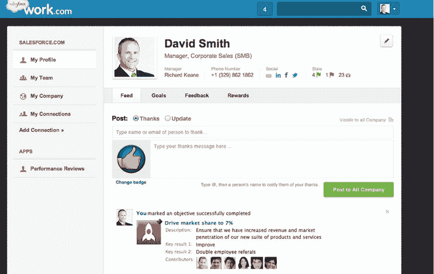
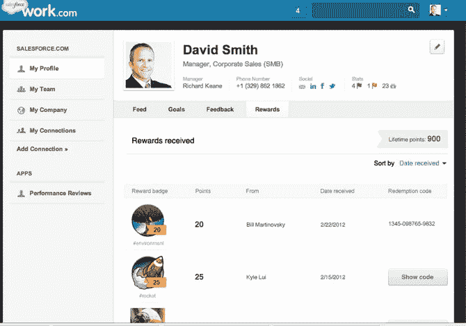

# Salesforce 与脸书 TechCrunch 合作，首次推出 ryple-Powered Work.com，帮助公司管理人才

> 原文：<https://web.archive.org/web/https://techcrunch.com/2012/09/19/salesforce-debuts-rypple-powered-work-com-to-help-companies-manage-talent/>

# Salesforce 与脸书合作，首次推出 ryple-Powered Work.com，帮助公司管理人才

近一年前，Salesforce [收购了社交绩效平台 Rypple，](https://web.archive.org/web/20230121232512/https://techcrunch.com/2011/12/15/salesforce-acquires-social-performance-platform-rypple-will-launch-human-capital-management-unit-successforce/)和[透露](https://web.archive.org/web/20230121232512/https://techcrunch.com/2011/12/16/why-salesforce-wants-in-on-the-6-billion-talent-management-software-market/)将进入人力资本管理(又称员工和人才管理软件)市场。今年早些时候，Salesforce 将 Rypple 更名为[【sales force Rypple】](https://web.archive.org/web/20230121232512/https://techcrunch.com/2012/03/15/salesforce-tackles-talent-management-with-rypple-integration-debuts-site-com-as-a-simple-cms/)，但是今天这个 CRM 巨头推出了一个全新的 ry pple，取名为 Work.com。

背景来说，Rypple 是一个帮助管理者和员工提升绩效的社交绩效管理平台。从本质上来说，Rypple 用一种更具社会性和协作性的方法取代了传统的绩效评估。该软件被比作“企业的 Zynga”，允许经理跟踪项目，指导他们的团队，并向值得称赞的员工致敬，让其他人在它的在线应用程序中看到。

员工和管理员可以在他们的员工社交网络中设定目标、管理目标、提供反馈和认可。今年早些时候，Salesforce 首次推出了与 Rypple 和 Chatter 的集成，允许用户创建自定义徽章，以表彰将出现在 Chatter feed 中的团队和个人成就。

随着今天 Work.com 的发布，Rypple 与 Chatter、销售云和服务云完全集成。人员用户可以在 Chatter 中查看同事的目标、反馈和认可，或者在销售云机会记录中认可工作。有了 Work.com，销售经理可以更有效地接纳新代表，提高团队的生产力。Work.com 员工的社交档案反映了他们在 Chatter 中的专长、目标和表现，有助于他们建立声誉。

Salesforce 还与脸书合作，几个功能直接来自脸书对自己的工作空间的看法。脸书首席信息官 Tim Campos 表示，脸书将需要工具来了解如何增加劳动力。Work.com 正在帮助做到这一点。

我们被告知，整个平台已经从头开始重建，在前端有了新的用户体验。Rypple 还推出了与亚马逊的新合作伙伴关系，允许公司用亚马逊礼品卡激励员工。“我们将奖励直接整合到人们的工作中，”Rypple 联合创始人丹尼尔·德博解释道。

今天还宣布，与 Workday 的新合作伙伴关系将实现 Workday 人力资本管理软件和 Work.com 的无缝集成。

此外，Work.com 整合了企业津贴管理平台 ChoicePass，该平台于今年早些时候被收购。

已经有脸书、LinkedIn、LivingSocial、Spotify、Virgin America 和 1-800 Flowers 在使用 Work.com。SaaS 计划于今年第四季度正式上市。

【T2

