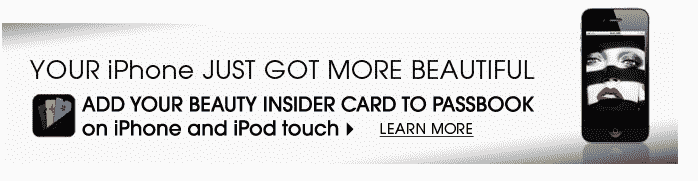

# Passbook 到底有多受欢迎？丝芙兰第一天就有 17，000 名 Passbook 用户，24 小时后达到 20，000 名 

> 原文：<https://web.archive.org/web/https://techcrunch.com/2012/09/21/how-popular-is-passbook-sephora-sees-17000-passbook-users-in-day-one-20k-after-24-hours/?grcc=a6c651b5107e9f65a0cf6e58365b7ac5Z8ZwdgtZ1Z128Z200Z103Z14&icid=wym5&grcc2=08ba1a44481efe3160c036e5b3bd4ee5~1348526718789~fca4fa8af1286d8a77f26033fdeed202~f86999fc709595b3c693a250212ce4d0~1348506952226~8~14~0~0~1~128~200~103~7~14~6~25~8~6623993317409423084>

# Passbook 到底有多受欢迎？丝芙兰第一天就有 17，000 名 Passbook 用户，24 小时后达到 20，000 人

苹果的 Passbook 有多受欢迎，这是一款新的 iOS 6 应用程序，可以让你在一个类似移动钱包的界面中存储门票、卡片和优惠券？根据为化妆品和护肤品牌[丝芙兰](https://web.archive.org/web/20221207005023/http://www.sephora.com/)开发应用程序的[品牌](https://web.archive.org/web/20221207005023/http://www.brandingbrand.com/)的一些早期数据，Passbook 的应用正在蓬勃发展。在 iOS 6 上市后的第一天，丝芙兰的“Beauty Insider”卡被添加到 17000 名用户的存折上。24 小时后，这个数字达到了 20，000。

这些数字更值得注意的是，iPhone 5 直到今天才上市，而且并非所有兼容苹果移动设备的用户都已经升级到 iOS 6，该版本包括原生的 Passbook 应用程序。根据[多个](https://web.archive.org/web/20221207005023/https://beta.techcrunch.com/2012/09/20/chartboost-15-ios-6-adoption-rate-confirmed-highest-among-iphone-owners-at-17-in-24-hours/) [数据来源](https://web.archive.org/web/20221207005023/https://beta.techcrunch.com/2012/09/20/ios-6-already-on-15-of-device-24-hours-after-release/)，截至昨天，iOS 6 已经被 15%的合格 iPhone、iPad 和 iPod Touch 设备采用。在 iPhone 上，24 小时内它徘徊在 17%左右。这些都是不错的数字，苹果用户对升级过程的熟悉以及苹果对硬件和软件的端到端控制都有助于这些数字。(相比之下，Android 的最新产品 Jelly Bean 的发行比例为 1.2%。)

对于丝芙兰来说，Passbook 向其客户群的介绍始于一封电子邮件，其中包括一个大横幅，提示客户将他们的“Beauty Insider”卡添加到 iPhone 和 iPod Touch 的 Passbook 中。点击“了解更多”链接会将用户重定向到[该网站](https://web.archive.org/web/20221207005023/http://theglossy.sephora.com/articles/44?om_mmc=ret-us%2Bnews1%2B20120919%2Bskinbag%2Bvib-ban-banpassbookglsylpg&emtc=us%2Bnews1%2B20120919%2Bskinbag%2Bvib&ematg=1517650029&dcid=501916:22513759442:35079740)，该网站进一步解释了信用卡的一般信息——例如，如何使用信用卡赢取和兑换积分以及跟踪积分余额。对于需要安装说明的用户，一个“有问题吗？”链接把他们带到了[这个页面](https://web.archive.org/web/20221207005023/http://community.sephora.com/t5/Customer-Support/Beauty-Insider-Card-in-Passbook-for-iPhone/td-p/373239?om_mmc=oth_tum)，这个页面更详细地解释了如何下载并登录到主要的 Sephora iOS 应用程序，然后将卡添加到 Passbook。

这一行动号召很可能对丝芙兰的核心客户群起到了很好的作用，他们通过点击来设置他们的应用程序，以便与 Passbook 配合使用。然而，对于该品牌的新顾客或临时顾客来说，注册成为“美容圈内人士”的过程仍然有些繁琐。当我昨晚第一次注册的时候，表单在提交后就卡在了加载中，并且一直没有通过。(今天运行良好)。这是一个网络表单，不是为原生 iOS 界面设计的。它会询问你很多细节，包括姓名、出生日期/年龄、邮政编码、电子邮件，甚至还会问你一个安全问题。我意识到，品牌只是需要我们所有的个人信息来进行营销，但是有很多方法可以在一个更友好的界面上收集这些信息。这里有一些错过的机会([另请参见昨天塔吉特的移动优惠券体验](https://web.archive.org/web/20221207005023/https://beta.techcrunch.com/2012/09/20/the-beginnings-of-a-usable-mobile-wallet-target-brings-mobile-coupons-to-apples-passbook/))，即更快地接纳新客户，以便将他们与 Passbook 联系起来。尽管如此，一天之内有 20，000 名 Passbook 用户也不是什么小事。