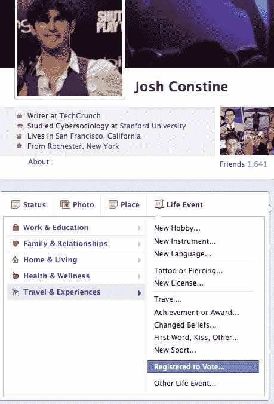
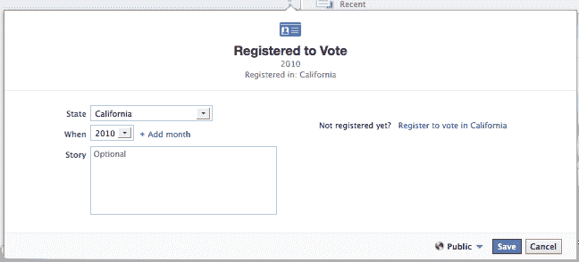
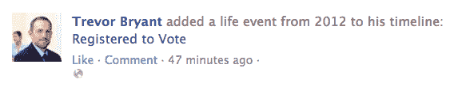

# 脸书的新时间线事件让你分享你已注册投票，注册网站的链接 TechCrunch

> 原文：<https://web.archive.org/web/https://techcrunch.com/2012/09/24/facebook-registered-to-vote/>

# 脸书的新时间线事件让你分享你注册投票，注册网站的链接

如果你看到你的朋友注册投票，你可能也会注册，更有可能实际投票。因此，为了让我们成为更好的公民，[脸书现在允许你](https://web.archive.org/web/20221225090215/https://www.facebook.com/notes/us-politics-on-facebook/registered-to-vote-add-your-story-to-facebook-timeline/10151024196570882)通过一个新的时间线事件宣布你已经“注册投票”。

美国居民可以使用[脸书发布的](https://web.archive.org/web/20221225090215/https://www.facebook.com/notes/us-politics-on-facebook/registered-to-vote-add-your-story-to-facebook-timeline/10151024196570882)中的个性化快捷链接，或者在他们时间轴的 post composer 上的“生活事件”标签的“旅行&体验”类别中找到“注册投票”。您可以添加您注册的时间和地点，并填写一个可选的详细信息框，如您支持哪个政党来召集您的网络投票。

我们和脸书的政治团队谈过，他们持有非常“技术乌托邦”的观点。本质上，他们认为脸书让每个人变得更加开放和互联的使命将会产生增加公民参与的副作用。人们希望参与他们的政府，但知道他们的朋友正在采取行动可以推动他们越过选民登记和投票的障碍。

问题是脸书新闻的报道和提醒是否真的会增加选举日的投票率。一项针对 6100 万人的研究表明，看到一个注明朋友已经投票的故事确实让更多的人在 2010 年中期选举中投票，但增幅仅为 2.2%。这很重要，但不一定会改变谁会成为总统。

话说回来，随着 [12 个州现在允许网上选民登记](https://web.archive.org/web/20221225090215/https://techcrunch.com/2012/09/19/california-and-11-states-now-allow-online-voter-registration/)，今天的新时间线事件有更多的潜力让人们实际上注册..如果他们能从脸书到他们州的网站。

当你添加时间线事件时，脸书已经提供了到你所在州的在线选民登记网站(如果有的话)的地理个性化链接。一个很好的开始。但脸书应该考虑下一步，在时间线事件产生的实际新闻报道中显示相同的链接，这样朋友们就可以在 11 月份发出自己的声音。