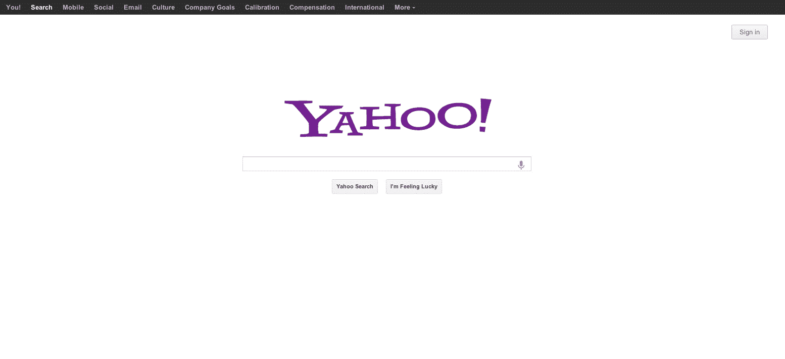

# 先睹为快新的雅虎主页重新设计？TechCrunch

> 原文：<https://web.archive.org/web/https://techcrunch.com/2012/09/26/a-sneak-peak-at-the-new-yahoo-home-page-redesign/>

TechCrunch 获得了一份秘密拷贝，这可能是新的[雅虎](https://web.archive.org/web/20221007212307/http://www.crunchbase.com/company/yahoo) [主页](https://web.archive.org/web/20221007212307/http://www.yahoo.com/)的模型。昨天，雅虎新任首席执行官[玛丽莎·梅耶尔](https://web.archive.org/web/20221007212307/http://www.crunchbase.com/person/marissa-mayer)与员工分享了她对互联网公司未来的广阔愿景。

据 AllThingsD 报道，梅耶尔没有透露修复搜索和电子邮件或“正在进行的戏剧性主页重新设计”的具体计划虽然 ATD 记者卡拉·斯威舍(Kara Swisher)似乎窃听了雅虎的电话，或许还有一个@yahoo-inc.com 电子邮件地址，但她还未能瞥一眼重新设计的内容。雅虎也一直在打击泄密行为，但这并没有阻止我们。

点击下图，在新窗口中打开截图:

是的，新主页看起来很像梅耶尔的前雇主谷歌的主页。事实上，梅耶尔，这位谷歌的第 20 号员工，监管着谷歌著名的干净、朴素的白色搜索主页。我们还听说她负责最长时间的主页无变化。因此，新的雅虎主页模型并不令人惊讶。

梅耶尔借鉴了她在谷歌工作多年的许多想法，包括关注产品和数据、自助餐厅的免费食物以及每周的“参考消息”会议，如谷歌的“TGIF”会议。她还批准公司的所有招聘，就像谷歌的联合创始人一样。

据 AllThingsD 报道，梅耶尔已经从主页[上移除了一些广告。但这种新的无广告主页设计是一个惊喜，也是一个风险，因为雅虎主页为公司带来了可观的广告收入。](https://web.archive.org/web/20221007212307/http://allthingsd.com/20120923/what-will-marissa-do-mayer-set-to-reveal-her-strategy-to-troops-this-week-in-an-act-of-radical-transparency-internal-memo/)

新主页上有雅虎计划加倍投资的关键领域的链接，包括搜索、移动和社交。它还链接到[报道的](https://web.archive.org/web/20221007212307/http://allthingsd.com/20120925/mayer-to-yahoos-at-not-so-radical-confab-personalization-mobile-rule-of-100-million-and-most-of-all-the-four-cs/) 4 C，这是梅耶尔在雅虎人才目标的一部分:文化、公司目标、校准和薪酬。

如果你没有登录，雅虎主页的第一个顶部导航按钮是“你！”，类似于谷歌的“+你。”

还要注意的是，雅虎从他们的标志中去掉了这个符号，这是 TechCrunch 在本月早些时候首次报道的。但是，不是这个！符号。

希望迈尔也有很好的幽默感。我听说她笑起来很开心。

特别感谢 Google Chrome 的开发者工具让这篇文章成为可能。