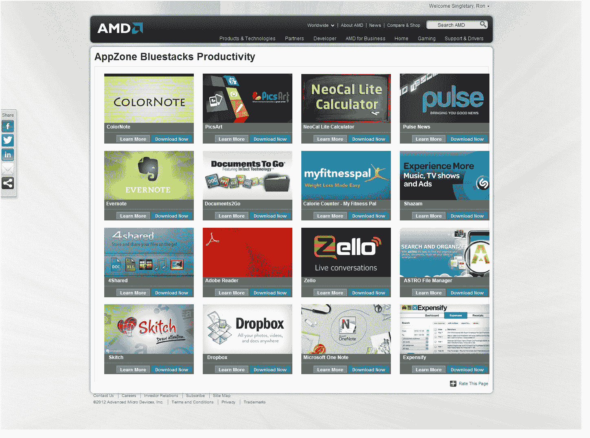

# BlueStacks 与 AMD 合作，为 Windows PCs 带来 500，000 个 Android 应用程序| TechCrunch

> 原文：<https://web.archive.org/web/https://techcrunch.com/2012/09/27/bluestacks-partners-with-amd-bringing-500000-android-apps-to-windows-pcs/>

将 Android 应用程序引入 Mac 和 Windows 电脑的初创公司 BlueStacks 今天宣布与芯片制造商 AMD 合作，该公司将看到其针对 AMD 驱动的 Windows 7 和 Windows 8 电脑优化的应用程序目录。随着“ [AMD AppZone](https://web.archive.org/web/20230404095229/http://www.amd.com/appzone) 的推出，BlueStacks 技术已经专门针对 AMD[GPU](https://web.archive.org/web/20230404095229/http://en.wikipedia.org/wiki/Graphics_processing_unit)和[APU](https://web.archive.org/web/20230404095229/http://en.wikipedia.org/wiki/Accelerated_processing_unit)进行了优化，类似于英特尔的 PC 应用商店 [AppUp](https://web.archive.org/web/20230404095229/http://www.appup.com/) 已经针对基于英特尔技术的超极本进行了优化。

此外，今天的声明打开了未来与 PC 制造商合作的大门，他们可能会将 BlueStacks 技术预载到新的 PC 上。BlueStacks 表示，它现在正在与一些知名制造商讨论预装问题，但在这一点上没有任何具体消息可以宣布。

今天的消息并不完全令人惊讶——AMD 是 BlueStacks 去年秋天 640 万美元 B 轮[的主要投资者，这使该公司获得了总计 1500 万美元的外部资金。该公司的其他投资者包括高通、思杰、安德森·霍洛维茨和 Ignition Ventures。这笔资金显示了投资者对利用 Windows 生态系统作为运行移动应用的新平台的兴奋。虽然 BlueStacks 没有讨论它与个别公司的交易条款，但据了解，一些原始设备制造商(BlueStacks 已经与华硕和优派达成协议)可能会为将 BlueStacks 集成到他们的 PC 上的机会付费，因为这样做可以让制造商获得按安装付费的收入。](https://web.archive.org/web/20230404095229/https://techcrunch.com/2011/10/20/bluestacks-raises-6-4-million-to-give-you-one-click-access-to-android-apps-on-windows-devices/)

对于 AMD 用户来说，新推出的 AppZone 商店将允许他们利用自 AMD 投资以来一直在开发的特定优化。该集成将通过无线更新推送给传统的 Windows 7 用户，并将通过 AMD“视觉中心”资源包含在新的 Windows 8 电脑中，该资源还指向驱动程序和调整显卡设置的软件等。与今年夏天早些时候的华硕交易不同，AMD 对 BlueStacks 的整合并非白标。很明显它被打上了 BlueStacks 技术的烙印。

[AppZone 现已在](https://web.archive.org/web/20230404095229/http://www.amd.com/appzone)上线，支持英语、德语、韩语、简体中文和繁体中文、法语、意大利语、西班牙语和葡萄牙语，以及总共 500，000 个 Android 应用的目录。这包括所有类别的应用程序，如购物、游戏、音乐、商业、教育等。

对于 BlueStacks 来说，这笔交易主要是为了扩大其业务范围。BlueStacks 首席执行官罗森·夏尔马(Rosen Sharma)表示:“这立即使 AMD 成为将应用程序引入 Windows 8 的最大玩家。“这不仅有利于移动领域——增加 1 亿新的潜在用户，对 AMD 的个人电脑制造商合作伙伴来说也是巨大的。你可以骑摩托车通过他们在这里增加的边缘，”他补充说。他表示，每个客户每年的利润可能在 1 美元到 10 美元之间，这对合作伙伴来说是“巨大的”。

但人们也可以将这一消息视为微软的一种尴尬，据报道，微软目前在其 Windows 商店中只有 2000 个 Windows 8 应用程序，而 BlueStacks 则有 50 万个应用程序。尽管这看起来对微软不利，但消费者可能不知道或者不关心细节。一个应用程序就是一个应用程序，他们的个人电脑现在可以像他们的(安卓)手机一样运行许多应用程序。

BlueStacks 软件成立于 2009 年，可以在各种尺寸的计算机上运行，包括笔记本电脑、台式机、一体机和平板电脑。今年夏天，[也增加了对 Mac](https://web.archive.org/web/20230404095229/https://techcrunch.com/2012/06/27/bluestacks-brings-android-to-mac/) 的支持，但该平台上的目录很小——在撰写本文时总共只有 24 个应用。该公司曾预计其测试版软件在 3 月份发布后会有数十万次下载，但却惊讶地发现需求达到了数百万次。

【YouTube http://www.youtube.com/watch?v=9yJh9wqEi2Y？feature=player_detailpage]