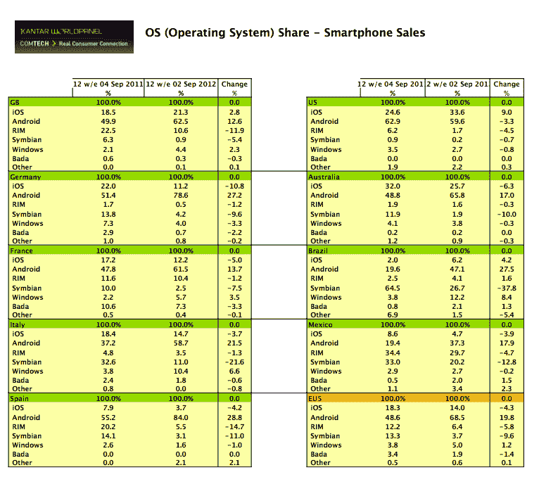

# Windows Phone 正在从 RIM 手中夺取市场份额，但它仍远未突破 Android/iOS 的堡垒

> 原文：<https://web.archive.org/web/https://techcrunch.com/2012/10/01/windows-phone-is-taking-share-from-rim-but-its-still-nowhere-near-breaking-through-the-androidios-stronghold-research/>

WPP 旗下的市场研究集团 Kantar Worldpanel ComTech 今天发布了其在欧洲、美国和其他地方主要市场的最新 12 周智能手机销售数据，这些数据显示，微软的 Windows Phone 平台无疑取得了一些进展，至少在意大利，就实际销售额而言，超过 RIM 成为第四大智能手机操作系统。但是，要获得足够的数量来挑战谷歌 Android 和苹果 iOS 在智能手机竞赛中的联合优势，还有很长的路要走。后两者加起来目前占美国等市场销售额的 93%

Kantar Worldpanel 分析师 Dominic Sunnebo 告诉 TechCrunch，英国的智能手机普及率目前为 57.6%，而美国的普及率为 42%(包括预付费和后付费)。

根据 Kantar Worldpanel 的说法，值得注意的是，Lumia 610 等低端设备似乎正在推动其表现良好的市场的销售，而不是高端、高价的旗舰手机。这种低端 Windows Phone 机型推动销售的趋势也是我们从 [Gartner](https://web.archive.org/web/20221209235034/https://beta.techcrunch.com/2012/09/30/microsoft-needs-windows-phone-7-yes-7-not-wp8-to-win-significant-mobile-marketshare/) 那里听到的，该公司表示，尽管推出了 Windows Phone 8，但当谈到销量时，将是老款 WP7(和低成本手机)承担重任。

Kantar Worldpanel 指出，这种趋势在意大利、法国和英国都有所体现，WP 在意大利的市场份额分别增长了 6.6%，法国增长了 3.5%，英国增长了 2.3%。其中，相对而言，意大利现在是 Windows Phone 最强劲的市场之一:它在过去 12 周的总销量中占 10.4%，听起来不算多，但足以超过 RIM，后者仅占销量的 5.5%，比去年下降了 14.7%。令人惊讶的是，如果这种趋势持续到未来 12 周——尽管鉴于 iPhone 5 的发布不太可能，但谁知道呢——Windows Phone 甚至可能在意大利市场超过苹果。苹果在过去 12 周的销售额中占 14.7%，但实际下降了 3.7%。从世界范围来看，意大利并不是一个巨大的市场，但可能是一个关键的象征性成就。

另一方面，意大利可能正踏着不同的鼓点前进。Symbian 的销量仍高于 Windows Phone 或 RIM，占同期总销量的 11%。然而，它正在迅速下降，数量比去年下降了近 30%。

Sunnebo 还指出，即使 WP 在意大利运行良好，它在欧洲仍然很小，在五大市场中仅占 5%，相比之下 Android/iOS 在该地区的份额为 82.4%。

事实上，Kantar Worldpanel 表上的其他进展——也许比微软和诺基亚等公司击败受到挑战的 RIM 更重要的问题是，强者在欧洲似乎越来越强。在欧洲五大经济体中，三星占智能手机总销量的 48%，安卓占总销量的 68.5%，比去年增长了近 20%。然而，在美国，安卓的故事仍然受到了轻微的挑战。谷歌的操作系统占了近 60%的销售额——仍然相当多——但和上个月的数据一样，安卓的份额仍在下降，这次下降了约 3.3%，而苹果的份额再次上升。

最大的问题是，我们应该把美国还是欧洲视为更广泛市场的领头羊。我个人的猜测是，两者都很重要:我们看到了越来越大的分化，Android 在低成本智能手机领域变得越来越强大，而苹果在高端领域变得越来越好，这一地位可能会在下一组数据中继续保持，其中将包括 iPhone 5 的销量。这在一定程度上得到了以下事实的证实:在巴西和墨西哥，安卓系统实现了最高增幅，分别增长了 47%和 37%。尽管苹果一直在通过继续以较低的价格销售旧款手机来有效地创造“低端”手机，但该公司是否决定扩展这一领域，以实际推出故意削减成本、成本更低的“纳米”新手机，从而更直接地瞄准新兴/发展中国家以及对价格更敏感的市场，仍有待观察。

