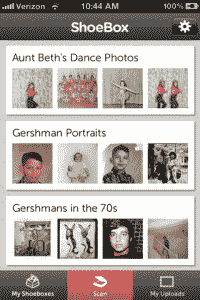

# Ancestry.com 收购照片数字化和共享服务 1000 memories TechCrunch

> 原文：<https://web.archive.org/web/https://techcrunch.com/2012/10/03/ancestry-com-acquires-photo-digitization-and-sharing-service-1000memories/>

总部位于旧金山的初创公司 1000memories 被收购，该公司提供网络和移动应用程序，用于存储、组织、共享，最重要的是数字化你的打印照片。鉴于该公司专注于保存家庭记忆，谁是新主人并不令人惊讶:【Ancestry.com[。幸运的是，对于这项服务的当前用户来说，这项协议并不意味着关闭 1000memories 的网站或应用程序，而是更多的资源来继续他们的发展。](https://web.archive.org/web/20230126145438/http://www.crunchbase.com/company/ancestry-com)

成立于 2010 年的 1000memories 一直专注于建立一项服务，让用户可以更私密地存储和分享他们的家庭照片收藏——这种照片对一小部分人来说意义重大，但不一定有意义存储在更公开的脸书相册中。这项服务允许你将这些照片[整理成虚拟的“鞋盒](https://web.archive.org/web/20230126145438/https://techcrunch.com/2012/04/03/1000memories-introduces-shoeboxes-for-more-private-photo-sharing/)”，然后通过电子邮件邀请与其他家庭成员或朋友分享。如果你愿意，你也可以选择个人照片分享到脸书上——比如说，如果你想让你的小妹妹尴尬，就贴一张她小时候穿着滑稽服装的照片。(事实证明，我姐姐并不感到羞耻，有一段时间还把它作为自己的个人资料照片。)

 1000memories 还提供了[一个 iOS 和 Android 应用程序](https://web.archive.org/web/20230126145438/https://techcrunch.com/2012/05/09/1000memories-brings-its-photo-scanning-shoebox-app-to-android-revamps-iphone-version/)，可以让你快速拍摄单张打印照片，裁剪、展平和旋转它们，然后将它们保存到你的 1000memories 帐户，并附上标题、日期和标签。通过 4 月份与 ScanCafe 的合作，该公司开始为需要扫描大量印刷品的用户提供低成本的数字化服务，这种服务与其竞争对手相比具有竞争力，有时甚至更便宜。

现在 Ancestry.com 的一部分，无论是在线和移动应用程序将继续发展。“Ancestry 对我们的品牌和我们在 1000memories 所做的事情感到非常兴奋，并计划投资于我们的持续增长和发展，”1000memories 联合创始人鲁迪·阿德勒说。“我们的公司正在以不同的方式解决同样的问题——帮助我们的用户保存和分享他们的家族历史，”他补充道。“祖先正在帮助人们保存世界上丢失的家族记录。我们正在帮助他们保存丢失在壁橱里的家庭记录。我们相信我们在一起会更强大。”

因为 1000memories 的服务没有关闭，所以它的 26 万用户没有过渡计划。他们可以像以前一样继续访问相同的 URL，并继续使用 1000memories ShoeBox 移动应用程序，该应用程序迄今已有 50 万次下载。应用程序的 iOS 版本今天更新，增加了一个新功能，现在用户可以在 Ancestry.com 上分享他们的扫描到他们的家谱。这是紧密整合两个服务的更广泛计划的第一步。Android 更新将在两周内发布。

虽然交易的条款没有被披露，阿德勒说，他们与投资者密切合作，他们对结果感到高兴。1000memories 从 Greylock Partners、Y Combinator、SV Angel、Founder Collective 和 Lowercase Capital 以及个人天使投资者那里获得了 254 万美元的外部投资。1000 名员工中的所有六人将加入 Ancestry.com，并将在 Ancestry 位于 SOMA 的新总部工作。

Ancestry.com 现在有 200 万付费用户，拥有超过 3900 万个家谱，包含 40 亿个档案。今年 4 月，Archives.com T3 公司被 T2 公司收购。六月，有消息传出 [Ancestry 正在寻找买家](https://web.archive.org/web/20230126145438/http://www.bloomberg.com/news/2012-06-05/ancestry-com-said-to-work-with-qatalyst-partners-to-find-buyers.html)，目前[总部位于伦敦的 Permira 据说有兴趣恢复谈判](https://web.archive.org/web/20230126145438/http://www.businessweek.com/news/2012-10-02/ancestry-said-to-seek-higher-price-from-permira-and-tpg)，但尚未达成任何交易。