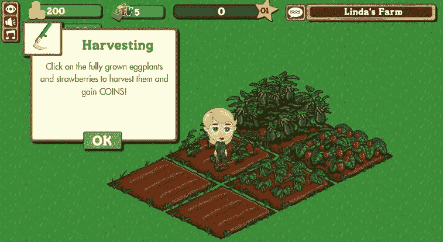
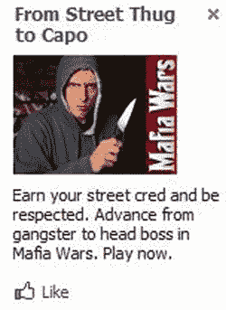

# Zynga 为何失败 TechCrunch

> 原文：<https://web.archive.org/web/https://techcrunch.com/2012/10/05/more-competitors-smarter-gamers-expensive-ads-less-virality-mobile/>

那是 2008 年，Zynga 已经想好了一切。对于那些从未玩过游戏的人来说，脸书成了游戏的入口。那里的病毒增长没有受到抑制。脸书的广告费率很低，所以购买流量很便宜。大多数游戏都是在桌面上玩的。但很快一切都变了，Zynga 从此一蹶不振。

以下是导致 Zynga 实力和股价暴跌的四大转变。

#### 太多的开发者，没有足够的游戏玩家

在 Zynga 崛起的前几年，视频游戏被视为铁杆游戏玩家的专利。他们并不是这样开始的，像 Pong 和 Pac-Man 这样简单易学的街机游戏吸引了大量观众。

但是随着游戏机变得越来越强大和家用游戏机的发展，游戏变得越来越复杂，控制器也是如此。妈妈没有玩光晕或者最终幻想。或者更准确地说，她不能。

但是脸书把一个本质上是游戏控制台的东西放到了数百万非游戏玩家面前。马克·平卡斯认识到了这一点，并为大众市场开发了游戏。咔嚓咔嚓，简单的任务，适合每个人。然而，其他企业家很快明白过来，打破了市场。

在此后的五年里，游戏玩家也变得更聪明了。最受欢迎的游戏仍然非常简单，但像战略模拟器战争指挥官这样的中核心游戏正在获得动力。一些曾经满足于点击 FarmVille 作物的人已经转向更复杂的游戏。

#### 点击变得昂贵

回到 2008 年。脸书有一个巨大的未开发的潜在游戏玩家市场，Zynga 需要一种方法来接触他们。然而，品牌对脸书的广告还不太感兴趣，其他游戏公司也没有意识到它们在获取用户方面有多么强大。这意味着点击脸书广告的成本很低，你不需要从一个游戏玩家身上赚太多的钱来获得投资回报。

因此，Zynga 匆忙筹集了一大笔资金，在 7 个月的时间里，在三轮中筹集了 4000 万美元。它购买了大量的广告，数量如此之多，以至于当时它占了脸书(T4)收入的很大比例——高达 10%。

最终，直接广告商、品牌和其他游戏公司开始向脸书广告投入大量资金，费率也随之上升。一些报告认为 2009 年[的每次点击成本约为 0.27 美元](https://web.archive.org/web/20221231115037/http://searchengineland.com/study-facebook-ad-click-throughs-declining-63324)，而现在它们几乎是的 3 倍，今年高达 0.88 美元。这意味着 Zynga 无法像过去那样高效地购买新用户。这迫使它依赖有机病毒生长，但不幸的是…

#### 脸书厌倦了垃圾游戏

当脸书推出新闻订阅和应用平台时，它并没有预料到它们会如何结合。Zynga 迅速成为病毒巨头。它构建了一些游戏，你可以通过向朋友寻求帮助来赢得游戏，并不断地打断游戏，让你分享“你能帮我挤牛奶吗？”给你每一个朋友的故事。这意味着它通过广告购买的每个用户可能会通过新闻源推广它的游戏而多带来两个朋友。

来自 Zynga 等开发商的游戏垃圾邮件很快变得如此糟糕，以至于有可能淹没朋友的状态更新和照片，破坏脸书的用户体验。因此[马克·扎克伯格站出来](https://web.archive.org/web/20221231115037/http://www.insidefacebook.com/2010/06/22/exclusive-discussing-the-future-of-facebook-and-the-facebook-ecosystem-with-ceo-mark-zuckerberg/)，在一次采访中说道:

> 很多用户喜欢玩游戏，但也有很多用户讨厌游戏，这是一个很大的挑战，因为喜欢玩游戏的人想在他们的信息流中发布关于他们农场或边境的更新。但是不关心游戏的人希望没有更新。所以[我们做了一些重新平衡](https://web.archive.org/web/20221231115037/http://www.insidefacebook.com/2010/09/21/facebook-making-changes-to-news-feed-requests-bookmarks-to-promote-social-games-or-hide-them/)，这样如果你不是一个游戏玩家，你会得到更少的更新。

Zynga 的病毒盛宴已经结束。

#### 屏幕变小了，利润也变小了

多年来，Zynga 可以免税出售其脸书桌面游戏上的虚拟商品。它本质上是以低价出售数字图像的拷贝来赚钱，利润很高。2011 年 7 月，脸书最终强迫所有开发者使用虚拟货币信用点数，并开始抽取 30%的折扣。Zynga 可能已经谈妥了略低的税率，但这仍然是对其底线的打击。

追溯到 Zynga 的全盛时期，大多数脸书的使用都是在桌面上，也就是游戏所在的地方。但是向手机的转变很快。这似乎让脸书大吃一惊，也打击了 Zynga。

这个游戏巨头只有免费增值的经验，没有开发过你在玩之前就已经购买的游戏。它需要学会构建每节课都非常吸引人的游戏，而不是你进去做家务的游戏。生活在 iOS 和 Android 平台上也意味着放弃 30%的购买收入。

Zynga 的解决方案是通过收购进入市场，但这并没有成功。它收购了 Newtoy 公司的 Words With Friends，这是一个巨大的成功，但它并没有赚到很多钱，[公司的创始人刚刚离开了公司。它](https://web.archive.org/web/20221231115037/http://venturebeat.com/2012/10/05/words-with-friends-co-creators-leave-zynga/)[在游戏最受欢迎的时候收购了 Draw Something 开发商 OMGPOP](https://web.archive.org/web/20221231115037/https://techcrunch.com/2012/03/21/done-deal-zynga-gets-draw-something-phenom-by-acquiring-omgpop-were-hearing-210m/) ，却眼睁睁地看着它跌出排行榜，迫使 Zynga[注销高达 9500 万美元](https://web.archive.org/web/20221231115037/http://thenextweb.com/insider/2012/10/05/conflagration-zyngas-omgpop-acquisition-torched-nearly-500000-a-day/)。

金融因素当然也在下跌中发挥了作用:股票追回；Pincus 出售股份；Zynga 的 IPO 价格和时机；例如，脸书麻烦不断的首次公开亮相。不过，那是另一个故事了。

Zynga 10 个月前以每股 10 美元的价格上市。今天，在下调收入预期后，该公司股价又下跌了 0.23 美元，至 2.48 美元。我相信 Zynga 能够找到一条复苏之路，尽管这并不容易。它可能需要更先进的游戏，这些游戏本身就是病毒式的，是专门为在手机上赚钱而开发的。这将需要它停止人才的流失，并找到真正相信 Zynga 通过游戏连接世界的使命的新鲜血液。

*【图片鸣谢:大贝阿兰 via [便士街机](https://web.archive.org/web/20221231115037/http://penny-arcade.com/report/editorial-article/zynga)】*