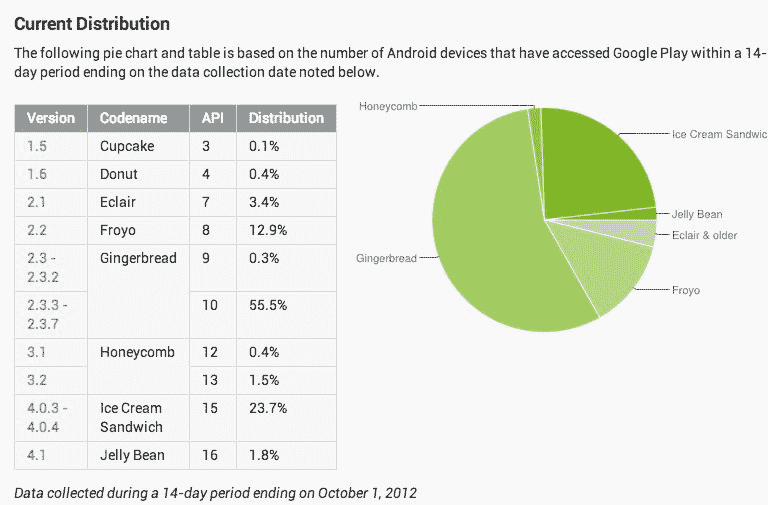

# 在 Android 平台上管理应用程序开发的 5 种方法

> 原文：<https://web.archive.org/web/https://techcrunch.com/2012/10/07/5-ways-to-manage-app-development-on-the-android-platform-without-going-nuts/>

# 在 Android 平台上管理应用程序开发的 5 种方法

Android 平台的分裂状态可能会使管理应用程序开发变得困难。测试可能是一项艰巨的任务，但基于云的服务为开发人员提供了新的方式，让他们可以快速了解他们的应用在任何类型的设备上的外观。

在周五的演示日上， [AppThwack 公司的 Trent Peterson 说补救方法就是自动化测试。通过其基于云的平台，开发人员可以在几分钟内获得他们的应用程序在人们使用的各种设备和版本的 Android 操作系统上如何运行的答案。AppThwack 运营着一个实验室，测试每一台运行 Android 的设备。他们把实验室作为其服务基础。](https://web.archive.org/web/20221124021539/https://www.appthwack.com/)

它是这样工作的:

*   使用该网站的拖放功能安全上传。
*   AppThwack 在真正的手机和平板电脑上运行你的应用程序，进行测试，并收集统计数据。
*   您可以实时查看屏幕截图、高级结果、日志、堆栈跟踪和趋势。

要了解更多信息，我推荐 [Sarah Perez](https://web.archive.org/web/20221124021539/https://beta.techcrunch.com/2012/07/03/appthwack-takes-on-android-fragmentation-with-new-automated-testing-service/) 对她在 7 月份写的服务进行全面的回顾。

为了了解 Android 的生态系统，这里有一张它的平台和运行的不同版本的图表。

自 7 月份以来，AppThwack 已经进行了 563，000 次测试，所以这些人知道什么有效，什么无效。我问彼得森，对于为 Android 平台开发应用的企业开发者，他有什么建议。他给了我五条建议:

*   在编写代码时开发测试是很重要的。这可以通过使用 [JUnit](https://web.archive.org/web/20221124021539/http://www.junit.org/) (标准单元测试)、 [Robotium](https://web.archive.org/web/20221124021539/http://code.google.com/p/robotium/) (一个开源自动化库，可以轻松编写模拟用户交互的 JUnit 测试)，或者像 [Gorilla Logic 的 MonkeyTalk、](https://web.archive.org/web/20221124021539/http://www.gorillalogic.com/forums/monkeytalk-ios-android)这样的工具来完成，这种工具特别强大，因为它允许跨平台测试(Android+iOS)。
*   由于不可能在将 bug 发送出去之前捕捉到每一个 bug，所以像 [BugSense](https://web.archive.org/web/20221124021539/http://www.bugsense.com/) 和 [Crittercism](https://web.archive.org/web/20221124021539/http://www.crittercism.com/) 这样的工具提供了一种方法，当应用程序在实际客户的设备上崩溃时，可以自动发送 bug 报告。
*   [Apptentive](https://web.archive.org/web/20221124021539/http://www.apptentive.com/) (目前在 [TechStars Seattle)](https://web.archive.org/web/20221124021539/http://www.techstars.com/program/locations/seattle/) 提供了一种与你的客户实际联系的方式，并找出什么可行，什么不可行。他们专注于确保客户留下好评，因为他们真的很喜欢你的应用。
*   [ActionBarSherlock](https://web.archive.org/web/20221124021539/http://actionbarsherlock.com/) 如果应用程序安装在运行旧操作系统的旧设备上，则允许该应用程序正常降级。这意味着在旧设备上，功能将被模拟或替换，但允许开发人员跳过传统的代码内分支，这非常容易出错，随着市场变得更加分散，这将成为一个噩梦。

企业开发人员应该明智地考虑提供定制测试的服务。像 AppThwack 这样的公司可以推荐工具和策略，或者实际上帮助编写测试计划和脚本。Testdroid 是另一个值得探索的服务。

像 AppThwack 这样的服务不会解决你所有的问题，但它肯定可以使开发成为一项更简化的任务，并防止你的客户把他们的智能手机扔进河里。