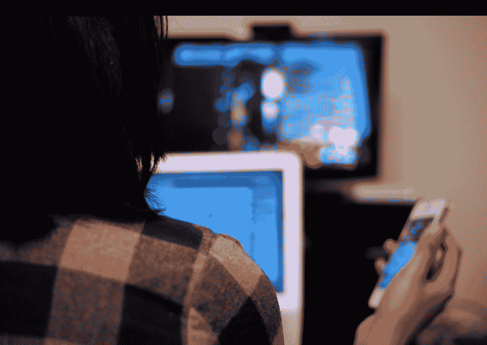

# Twitter 主宰直播电视，因为社交电视正在失败 TechCrunch

> 原文：<https://web.archive.org/web/https://techcrunch.com/2012/10/07/twitter-dominates-live-tv-because-social-tv-is-failing/>

****

**编者按:** *Somrat Niyogi 是 [Miso](https://web.archive.org/web/20221130213025/http://www.gomiso.com/) 的 CEO。*

每次打开电视，我都会看到推特。标签和 Twitter 句柄出现在电视节目中。有专门的网页介绍像奥运会这样的世界大事。甚至娱乐新闻报道也发生了变化，因为普通大众可以即时了解名人生活中发生的事情。([拉塞尔·克罗](https://web.archive.org/web/20221130213025/https://twitter.com/russellcrowe/status/242146334117883904)事实上是安全的，多亏了附近的纽约海岸警卫队)。

但是为什么电视上到处都是 Twitter？

首先，这很简单。有一个盒子。你在里面输入内容，人们可以立即在他们的手机或网络上看到你输入的内容。其次，它已经在人们的日常习惯中根深蒂固。Twitter 利用了我们生活中存在的“微小时刻”。你在排队，所以你打开推特。你坐在红灯前的车里，不幸的是，你打开了推特。当广告开始时，你在电视机前有片刻的休息时间，所以你打开 Twitter。

这些原因也是大众媒体和消费者采用 Twitter 作为在电视机前分享和消费的平台的根本原因。任何商业广告或停机时间都是一个提示，也是打开 Twitter，分享或看看发生了什么的绝佳时机。

因此，不可否认的事实是:Twitter 目前在直播电视中占据主导地位，因为它提供了这些轻松、愉快和有益的“进来出来”体验。但最终，Twitter 也因为我们在社交电视行业犯下的错误而占据了主导地位。

如今，第二屏幕应用的问题是围绕现有第二屏幕行为的假设。诚然，人们在看电视时也在使用笔记本电脑、智能手机或平板电脑。但是人们在脸书上查看邮件，做其他事情。另一个主要问题是，第二屏幕应用未能回答终极问题:为什么用户要打开你的应用，而不是电视上的其他十亿个应用？

##### 我们做错了什么

我们做的是与人有关的生意，而不是为人服务的生意。

作为一个行业，我们正试图利用商业主张，而不是消费者主张。是的，人们在看电视时会打开另一个屏幕。但是，当我们停止试图利用第二屏幕的时候，我们就朝着正确的方向前进了。

我们需要停止讲述，开始提问。现在，第二屏幕应用程序正在说，“这是你看电视时使用智能手机的其他方式！”但是真的有人会问:“人们看电视时到底想做什么？”我可以保证，根据我的经验，我发现普通用户并不关心这种双屏同步的社交电视现象。

*我们会保留所有东西和厨房水槽。*

拥有“复选框”哲学的公司将会失败。大多数思维过程是这样的:

“用户希望第二个屏幕上有四样东西。他们想发现新的节目。他们想购买电视上的产品。他们想和朋友聊天。他们想要更多的内容。等等，他们还想在推特上分享这一切。所以这是五件事。等等，他们还想知道一些琐事。所以这是六件事。哦，还有……”

当这种想法开始时，我相信你还不如继续添加色情内容，因为大多数用户最终会想要(显然，对吗？).

打勾，添加每一个可能的功能，并宣称“我们是最好的，因为我们拥有一切”是没有价值的。公司应该选择一个单一的价值主张，并很好地实现它。这也是为什么 Instagram 有 1 亿用户，没有第二屏 app 有机攀升到 100 万用户。

这是我们整个新兴产业的一大败笔。我们使用人们不理解的术语。

“同步体验”对普通用户意味着什么？“把东西从第二屏幕扔到电视上”这个概念怎么样？或者，让我们再退一步:日常用户是否理解“社交电视”这个术语？

人们理解清晰简单的价值道具，如“回答问题”、“谈论电视”或“与朋友交谈”但是一旦你开始把那些东西和其他 100 样东西结合起来，引入新的概念，它就失去了意义。

我敦促所有的第二屏幕和社交电视公司去掉所有不属于他们产品核心的东西。你应该能够回答“你是做什么的？”一句话。如果你告诉街上的任何人这是什么，他们应该马上说，“有道理。”

我们并不介意转换障碍。

如果有人先推出了类似脸书的服务，你会怎么做才会转向脸书呢？让人们使用任何产品已经很难了，但在第二屏幕上的注意力战争中，切换壁垒真的很高。当已经存在实现某些目标的手段时，这尤其困难。

有很多探索和指南应用程序。作为一名技术人员，我总是对我看到的创新印象深刻，但是普通消费者呢？如果你问他们如何决定和决定看什么电视节目，他们可能会做他们过去一直做的事情:他们通常使用电视上的指南。或者，在网飞和 Hulu 的情况下，他们浏览已经内置在服务中的指南。

改变的转换成本包括:使用应用程序代替电视上的内容，使用类似指南的应用程序的界面，以及选择特定的指南应用程序等。总而言之，这是一个艰难的转变。这是可能的，而且随着时间的推移会发生，但转换成本很高，除非你做一些简单而神奇的事情，并提供真正的差异化价值主张。

*我们不是在创造一种习惯。*

不要误解我:第二屏幕空间有很多机会。有很多想法需要探索。事实上，还没有一个用例能抓住每个电视观众的心。当观众想要非常不同的东西时，很难知道哪一样东西对最大的观众有最强的吸引力。这就是前面描述的问题发生的原因。一些第二屏幕公司插入尽可能多的功能，试图覆盖所有的基础。

但是，我们不应该试图抓住每一件事，我们每个人都需要专注于一件事，并全力以赴。一个明显的机会是帮助人们发现看什么。另一个是帮助人们回答他们关于电视的问题。

我再强调一下:关键是做一件事，并且做对。正如马特·科勒最近写的那样，移动领域有赢家，模式正在形成:“[伟大的移动应用就像现实生活中的按钮遥控器](https://web.archive.org/web/20221130213025/http://www.quora.com/Matt-Cohler/Mobile/Great-mobile-apps-are-push-a-button-remotes-for-real-life?srid=upx&st=ns)

我们生活在一个单一用途应用程序的世界里。当用户有一个想法时，他们使用一个应用程序来解决他们的想法。“我想拍一张很棒的照片。”打开 Instagram。“我想找个地方吃饭。”打开 Yelp。"我想知道新闻里有什么新闻。"打开脉冲。“我想看看我的朋友们在做什么。”打开脸书。

目标是“拥有一个想法”人们会怎么想…然后为什么打开你的应用？这个想法必须足够重要，这样每次它出现在用户的脑海中，他们打开你的应用程序，习惯就形成了。它必须做一些不同的、比其他任何东西都好的事情，最重要的是必须简单。

##### 电视行业的每一个人…

正如我在最近的帖子中警告的那样，[在 TechCrunch 上发表了关于电视生态系统的文章](https://web.archive.org/web/20221130213025/https://beta.techcrunch.com/2012/05/27/please-dont-ruin-the-second-screen/)，如果我们作为一个行业不能走到一起，那么我们都会失败。现在，我鼓励每个人问自己:有没有一种人们想每天使用的习惯性的、单一的思维体验，我可以用一种神奇、简单的方式传递给他们？

我相信有。但是，只有时间能证明一切，还有更多工作需要去做。最重要的是，我相信电视和围绕它的体验只会越来越好…只要我们走上正轨。