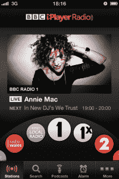

# BBC 凭借 iPlayer Radio、新的 iOS 和广播服务网络应用打造 iPlayer 帝国 TechCrunch

> 原文：<https://web.archive.org/web/https://techcrunch.com/2012/10/08/bbc-builds-out-its-iplayer-empire-with-new-ios-and-web-apps-for-radio-service/?utm_source=podnews.net&utm_medium=web&utm_campaign=podnews.net:2019-03-25>

今天，英国 BBC 又向前迈出了数字化的一步，这一次涉及到该公司的广播资产:这家国有广播公司今天推出了 iPlayer Radio 一款新的集成[移动网络和桌面应用程序](https://web.archive.org/web/20221006105842/http://www.bbc.co.uk/radio)，以及一款新的独立 iPlayer Radio [iOS 应用程序](https://web.archive.org/web/20221006105842/https://itunes.apple.com/gb/app/bbc-iplayer-radio/id560458506?mt=8&ls=1)，大大增强了其广播业务在数字平台上的功能，提供了更多视频、更好的导航和改进的点播选项。这款网络应用将在全球范围内推出，也就是说，将在多个移动和桌面平台以及所有地区推出，而原生应用体验目前将仅限于 iPhone 和 iPad 设备，并且仅限于英国。目前，所有的服务都是完全免费的。

但是与上周发布的一份报告相反，BBC 没有与 Spotify、Deezer 或该领域的任何其他提供商推出任何音乐下载或点播流媒体服务。据报道，这项服务被称为 Playlister。“从战略上来说，与音乐提供商有明显的重叠和潜在的联系，”BBC 节目和点播总经理丹尼尔·丹克今天告诉 TechCrunch。“现在没有任何有形的东西，但我们总是有这样的对话。”他将 BBC 电台的“当今世界角色”描述为“直接输出”。

还有一个机会是，BBC 需要以数字方式改变人们对其广播服务的看法和使用，然后才能提供这样的服务并充分利用它:Danker 表示，目前 90%的广播收听是直播的，只有 10%是点播的——这意味着目前还不清楚是否有很多听众会在这个时候向 BBC 寻求点播流或下载音乐服务。

尽管如此，将 BBC 广播公司的资产更紧密地整合在一起，是未来提供更多增强服务的一步。

广播网络应用是英国广播公司首次全面尝试投入大量投资，使其广播节目跟上广播公司对其视频资产所做的工作:英国广播公司 iPlayer 允许用户通过其网络应用和本地应用观看点播内容，在去年 9 月向视频服务添加了[下载组件](https://web.archive.org/web/20221006105842/http://www.guardian.co.uk/media/2012/sep/04/bbc-mobile-download-iplayer-smartphone)。

与此同时，该应用程序有几个不错的额外功能:频道选择器上的转盘让人想起老式收音机上的调谐器(BBC 电台主持人在宣传节目中指出了这一点)。当你进入一个电台的主屏幕时，你会看到一个小凸起，提示你探索其他功能，如追看电台节目以及相关的视频剪辑。该应用程序还内置了闹钟功能，可以像闹钟收音机一样工作。用户还可以选择不同的节目，并设置提醒，以便在节目开启时收听。

英国广播公司称，Android 应用程序将很快推出，尽管它必须首先解决 Adobe Flash 的问题，以便该应用程序能够在目前市场上的许多 Android 设备上运行。

与此同时,[网络应用](https://web.archive.org/web/20221006105842/http://www.bbc.co.uk/radio)是为所有屏幕设计的，并在 BBC 运营的许多频道中提供更具凝聚力的体验——这些频道包括地区电台以及专门播放特定音乐和其他流派的电台。在此之前，每个界面都与其他界面略有不同，这意味着用户在它们之间导航并不容易。与原生应用一样，这也是关于集成视频和音频体验。英国广播公司表示，这只是网络应用开发的开始，它还将提供更多直接来自 DJ 的内容(从这个意义上说可能是原创内容)，以及更多“观众和工作室之间的双向对话”

“我们的下一步将是使直播电台更具互动性，让人们更容易享受 BBC 庞大的音频档案，并加强电台作为英国发现音乐的头号场所的地位，”BBC 音频和音乐多平台和互动总监 Mark Friend 在今天早上的一次介绍会上告诉记者。

Friend 指出，现有 iPlayer 应用程序的用户仍然可以像以前一样通过它访问广播服务，但这些服务最终将被淘汰。“让 500 万人经历一场大变革是我们在未来几个月必须小心处理的事情，”他指出。

BBC 称，虽然 web 应用程序现在已经打开，但 iOS 应用程序很可能要到今天晚些时候才会出现在 app store 中。

改善广播体验的举措早就应该采取了，并指出 BBC 可能在利用日益增长的数字广播消费受众方面略有失利。该公司表示，截至目前，iPlayer 每月的广播请求在手机上同比增长 56%，至 280 万次，在平板电脑上增长 300%，至 120 万次。

英国广播公司选择的国际推广方式也是如此。目前，原生应用程序仅在英国可用，丹克没有透露它计划何时在国际上推广。这可能会让 BBC 在应用程序中添加更多广告，或者像现有的 iPlayer 应用程序一样对服务收费。