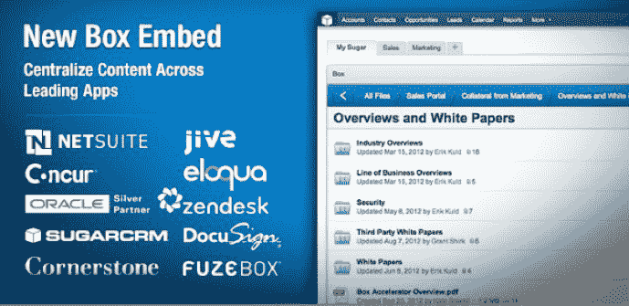

# Box 推出 HTML5 嵌入式框架，将内容与第三方企业软件应用集成 TechCrunch

> 原文：<https://web.archive.org/web/https://techcrunch.com/2012/10/09/box-debuts-html5-embeddable-framework-to-integrate-content-with-third-party-enterprise-software-apps/>

# Box 推出 HTML5 嵌入式框架，将内容与第三方企业软件应用集成

在今天 Box 的年度 Boxworks 活动上，该公司首次推出了一种新的方式，用于在整个企业中访问其云存储和协作平台。通过新的 HTML5 嵌入式框架，开发人员可以将他们的 Box 帐户和信息集成到许多知名的第三方企业应用程序中，包括 Concur、Cornerstone OnDemand、DocuSign、Eloqua、FuzeBox、Jive、NetSuite、Oracle、SugarCRM 和 Zendesk。

Box 现在在全球拥有 1400 万用户，包括 14 万家活跃企业和 92%的财富 500 强企业，它正在将其几乎所有的协作和文档管理功能引入外部应用程序，包括文件预览、评论、任务和搜索到合作伙伴和客户应用程序中。

它还使 Box 可以方便地集成到用户需要访问 web 内容的任何地方，比如内部网、外部网、论坛、维基和博客。Box Embed 将于本周面向所有 Box 客户免费发布。合作伙伴 NetSuite 和 SugarCRM 将于本周推出，其他应用程序支持将于下一季度推出。

Box 联合创始人兼首席执行官亚伦·列维(Aaron Levie)表示:“内容对于企业运行的每个应用程序都至关重要。“通过将 Box 的企业内容和协作扩展到当今领先的业务应用，Box 正在改变人们和组织在云中访问、共享和管理其业务信息的方式。我们正在让我们的合作伙伴和开发人员在他们的服务中利用 Box 的强大功能变得非常简单，并为企业生产力提供一个中心内容层。”

正如 Box 的 Chris Yeh 向 TechCrunch 解释的那样，Box 的目标是在员工工作的应用程序(如 CRM)中为用户带来上下文相关的数据和完整的 Box 体验。他将实现该框架的容易程度比作在网站中嵌入 YouTube 视频。

