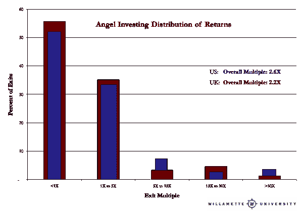

# 天使投资者确实赚钱，数据显示总体回报率为 2.5 倍

> 原文：<https://web.archive.org/web/https://techcrunch.com/2012/10/13/angel-investors-make-2-5x-returns-overall/>

**编者按:** *[罗伯特·威尔特班克(Robert Wiltbank)，博士](https://web.archive.org/web/20230327061516/http://www.willamette.edu/~wiltbank/)，是威拉米特大学(Willamette University)的教授，他和韦德·布鲁克斯(Wade Brooks)在那里经营着一家天使投资基金，由二年级 MBA 学生管理。他是天使资源研究所的董事会成员，也是 Montlake Capital(一家晚期增长资本基金)和 Revenue Capital Management(一家基于版税的贷款机构)的合伙人。他合著了两本书和许多学术文章。*

大约 10 年前，由于一个我无法解决的问题，我开始研究天使投资的回报:投资界似乎肯定天使投资者是乡巴佬。传统观点认为，他们会不计后果地投资于非常早期的项目，而这些项目大多注定会失败。每当他们可能接近成功时，精明的“专业”投资者就会冲进来，把他们灌趴下，赢得真正的回报。此外，天使们还面临着一个选择问题:所有最优秀的企业家和机会都会自然而然地流向最优秀的风险投资基金，只给天使投资者留下“残羹剩饭”。

那到底是哪个？天使投资人只是不知情的慈善家还是合法的创业投资人？

通过考夫曼基金会(Kauffman Foundation)、NESTA(一家英国创业基金会)、华盛顿大学和威拉米特大学(Willamette University)支持的研究，我汇编了现存最大的天使投资者财务回报数据集。我与之相处的天使投资人看起来并不幼稚或无能。虽然不是专业投资者，但大多数天使凭自己的能力非常成功，绝大多数是他们自己创业努力的结果。他们创造新业务和新市场的第一手知识似乎与成功投资于其他从事同样工作的企业家非常相关。

根据这一数据，对天使投资者总体回报的最佳估计是他们投资的 2.5 倍，尽管在任何一项投资中，正回报的几率都不到 50%。这和风险投资回报绝对有竞争力。

安迪·拉赫勒夫的文章暗示天使投资者不赚钱，这引起了广泛的兴趣。这篇文章发人深省，提出了几个非常好的观点。第一，大家要明白，天使投资是高风险投资；这真的是一个“本垒打”游戏，就像正式的风险投资一样。第二，投资组合，即使是天使投资，也是一个很好的方法。第三，每当你进行风险投资时，限制你的下注规模并确保你不会将太多的财富投入激进的头寸是一个很好的原则。安迪在硅谷风险投资的个人经历中获得的宝贵经验。

幸运的是，现在在硅谷和全国范围内都有关于天使投资者回报的良好数据，虽然还需要更多的研究，但数据表明天使投资者能够而且经常赚钱。当然，有能力的天使投资者有多有少，就像正式的风投一样，但作为一个群体，他们肯定不是不知情的慈善家。作为企业家投资者，他们似乎能产生可信的回报。

有了这个数据，我们就不需要从风险投资家的经验中进行推演了。安迪表示:“如果普通风险投资基金几乎不赚钱，种子投资代表的机会甚至不如风险投资公司追求的机会那么有吸引力，那么天使投资者的典型回报肯定非常糟糕。”只是他们不是。像这样的推论是有问题的，因为早期风险投资不会发生在一个有效的市场中。天使投资者的行为通常与风投不同，风投放弃种子期投资的事实并不一定意味着他们这样做了，因为种子期投资天生就不那么引人注目。(风投退出种子期投资的另一个看似合理的解释是，这是基金规模增长的结果，而不是种子期吸引人的机会减少了。)

我们来看看实际数据。(如果你对数据很感兴趣，你可以阅读两份报告，详细介绍美国和英国的数据收集工作，以及对结果分布的更详细描述:[考夫曼基金会天使回报研究](https://web.archive.org/web/20230327061516/http://sites.kauffman.org/pdf/angel_groups_111207.pdf)和 [NESTA 天使投资研究](https://web.archive.org/web/20230327061516/http://www.nesta.org.uk/publications/reports/assets/features/siding_with_the_angels)。除了这两篇从业者报告，你还可以阅读一篇更加[正式的学术论文](https://web.archive.org/web/20230327061516/http://www.willamette.edu/~wiltbank/jbv_angels_2009.html)，讨论企业家的专业技能如何影响天使投资者的回报。]

图表中显示的数据的总体倍数是天使投资的 2.5 倍(即投资 100，000 美元，将获得 250，000 美元的回报)。它基于天使投资者在 15 年时间内进行的 1200 多项退出投资，分别收集了北美和英国的数据。它在地理上，或者在 1998-2000 年的泡沫中，或者在任何一个行业中都不是高度集中的。来自美国和英国不同样本的回报分布实际上是相同的，这是对北美初始数据的一个有用的稳健性检查。数据中没有“附带价值”估计值。(如果你想了解这些事情的更多细节，你可以去疯狂阅读完整的报道。)

以下是一些需要注意的重要事项:

1.  在任何一项投资中，天使投资者更有可能失去他们的钱，即赚取不到 1 倍的回报。这有风险。然而，一旦投资者拥有至少六项投资的投资组合，他们的中值回报就会超过 1 倍。渥太华天使投资公司的欧文·艾伯特用这些数据做了一些出色的蒙特卡洛模拟，发现进行近 50 项投资接近 95%的总体回报。当然，大多数投资者会处于中间位置。天使投资者可能应该至少进行十几项投资，但这只是经验之谈。这一点很关键:每一笔投资都必须做好 ***，就好像这是你唯一的*** ***一个***；不能降低门槛让你更快地建立一个糟糕的投资组合。
2.  现金的生产高度集中在赢家身上；90%的现金回报是由 10%的退出产生的。这与风险投资的集中度基本相同。下一个最大的现金回报“桶”是在高容量，但低倍数组，1 倍到 5X 的类别。然而，需要注意的是，它与正式的风险投资并不完全相同。这些回报发生在地理上的任何地方(不全是在湾区或波士顿)，发生在各个行业，而且大多数情况下是在没有风投后续投资的情况下发生的。事实上，风险投资者最终只投资了三分之一的风险企业，而且他们投资的风险企业比风险投资者不投资的风险企业产生的回报更低。
3.  当你汇总所有数据时，这些天使投资者(遍布美国和英国)在大约四年的平均时间内产生了 2.5 倍的总投资倍数。这个回报和正规的风险投资回报是绝对有竞争力的。因为这些估计的误差比来自风险投资来源和风险投资专家数据的误差要大，所以我不会断言天使投资人“胜过”正式的风险投资人。但是假设他们在天使投资中赚钱是在欺骗自己，这是没有数据支持的。

相对于正式的风险投资，天使投资者似乎给他们投资和建立公司的策略带来了更多的变化。他们的创业经验(其中 85%是“套现”的企业家)，以及他们投资自己的钱的事实，使得他们只是“黑”风投的想法有点离谱。他们不同于正式的风投。一些投资者关注资本效率，一些投资者关注尽可能多的资本。有的主动寻求 VC 介入，有的刻意避免 VC 介入。许多其他方法一直在发展。

但在我们远离硬数据之前，在过去的一两年里，天使资源研究所(ARI)一直在编写 [HALO Report](https://web.archive.org/web/20230327061516/http://www.angelresourceinstitute.org/halo-report/) ，这是一份关于美国团体天使投资者活动的季度报告。关于估值、活动水平、地理和行业分布的数据非常有趣，随着时间的推移，这也将提供天使投资回报的季度评估。今年上半年，估值并不奇怪，约为 270 万美元的前期资金，轮规模约为 55 万美元，分布在各种行业。这幅图似乎再次更能代表天使们是合法的企业家投资者。同样值得注意的是，天使投资比正式的风险投资在全国范围内更加广泛；不是高度集中在湾区。

为了客观地看待事情，重要的是要记住大多数风险投资，即使是伟大的风险投资，也不会*接受风险资本投资。不到三分之一的 IPO 是风险资本支持的公司。虽然这确实令人印象深刻，因为风投只投资了不到 1%的新企业，但这仍然意味着每三次 IPO 中就有两次是从未有过风险投资者的公司。天使投资人和精明的企业家一样，不一定把筹集正式的风险资本投资视为成功的衡量标准。*

没有人庆祝贷款，但出于某种原因，有些人喜欢庆祝接受风险投资。最好的例子:股权投资(不管是天使投资还是风险投资)是一笔巨大的资产*和相应的财务义务*。最坏的情况:它是你脖子上的一个沉重负担… *伴随着相应的财务责任*。

就像天使投资人一样，风险投资人想要回他们的钱——如果他们能拿到的话，要翻 50 倍。天使投资人是傻瓜，而风险投资人垄断了建立伟大公司的市场，这种观点根本没有数据支持。现在让我们回到销售更多产品和更少库存的话题上来！