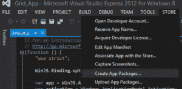

# Wowzapp:微软于 11 月在全球范围内开放 Windows 8 Hackathon 的注册

> 原文：<https://web.archive.org/web/https://techcrunch.com/2012/10/17/wowzapp-microsoft-windows-8-hackathon/?guccounter=1&guce_referrer=aHR0cHM6Ly93d3cuZ29vZ2xlLmNvbS8&guce_referrer_sig=AQAAAGAIwhLswuNSGV72fJecCbTscIFt89e5rp1zTV7G3cGeoqgbf9t-MCzaVqQwfLAElx3R8AH-EOD0SqKChRz1bBfKd_rVZ7dAKKDXl9CZOBS0Grglvnij4Wo95Vt_x659sJJVtUG8_yfC3dH2erm4GMcEoWT25LgpQos4u5qrepK8>

# Wowzapp:微软在 11 月份为其全球 Windows 8 Hackathon 开放注册

Windows 8 即将面世，但是尽管微软尽了最大努力，仍然没有太多 Windows 8 风格的应用程序。为了启动 Windows 8 开发社区，微软今天宣布，从 11 月 9 日到 11 日，它将在 60 多个城市举办一场全球黑客马拉松。[活动的注册现已开放](https://web.archive.org/web/20221005201929/https://msevents.microsoft.com/CUI/EventDetail.aspx?EventID=1032532285&Culture=en-US&community=0)。

黑客马拉松，微软决定称之为“Wowzapp 2012”，主要是针对学生的，但是微软发言人告诉我，它对所有开发者开放。

 微软将为所有参与者提供构建应用程序所需的工具，包括 Visual Studio 2012 Express(就像 Visual Studio Professional 一样，通过[微软的 DreamSpark 程序](https://web.archive.org/web/20221005201929/https://www.dreamspark.com/Student/Windows-8-App-Development.aspx)对学生免费提供)。在活动中，微软应用专家、开发人员和培训人员将到场帮助参与者开发他们的应用程序(或者对他们现有的应用程序进行最后的润色)。除了这种帮助，参与者还将收到一个窗口商店注册码，以便他们可以向商店提交应用程序。

微软表示:“Windows 8 为学生提供了一个绝好的机会，让他们在大学毕业前就能获得开发人员的实践经验，并有可能通过 Windows 商店的应用下载赚钱。”。“无论学生是想免费提供应用程序，还是想从付费应用程序或广告中赚钱，Windows 应用商店都可以提供这种灵活性。”

除了这个计划，微软还在运行[一代应用](https://web.archive.org/web/20221005201929/http://www.generationapp.com/Code#fbid=idIIqfgT_Dp)和其他计划，以激励开发者为 Windows 8 编写应用。就在上个月，微软还在印度班加罗尔举办了 [Appfest](https://web.archive.org/web/20221005201929/http://www.microsoft.com/india/events/win8appfest/) ，这是世界上最大的不间断编码马拉松，超过 2500 名开发者在这里编写 Windows 8 应用。