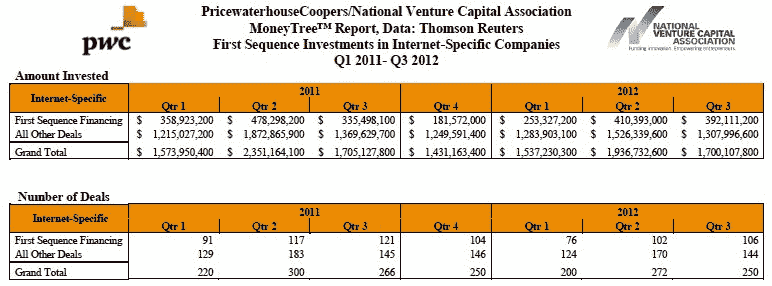
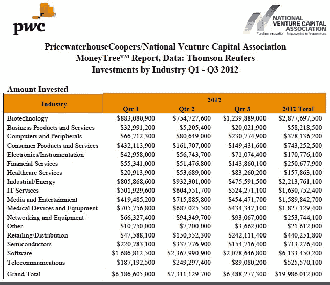

# 2012 年第三季度，风投对 890 家公司投资 65 亿美元；美元总额和交易量双双下降 TechCrunch

> 原文：<https://web.archive.org/web/https://techcrunch.com/2012/10/18/vcs-put-6-5b-in-890-companies-in-q3-2012-total-dollars-and-deal-volume-both-down/>

根据普华永道 LLP 和国家风险投资协会的 MoneyTree 报告(基于汤森路透提供的数据)，2012 年第三季度，风险资本家在 890 笔交易中投资了 65 亿美元。与 2012 年第二季度相比，本季度的投资金额下降了 11%，交易数量下降了 5%，2012 年第二季度的投资金额为 73 亿美元，交易数量为 935 笔。

今年前三个季度的投资总额为 200 亿美元，涉及 2661 笔交易。该报告称，这一水平低于去年此时的水平，因此 2012 年的交易额和交易量都可能低于 2011 年。

普华永道美国风险资本业务全球管理合伙人 Tracy T. Lefteroff 在一份新闻稿中表示，“我们看到新筹集的风险基金越来越少，这意味着可用于新投资的资本越来越少。而且，我们看到风险资本家对可用资本非常谨慎，因为缺乏大量的流动性事件。相反，风险资本家继续支持他们投资组合中已经存在的公司。

软件行业获得了所有行业中最高水平的资金，在第三季度投资了 21 亿美元用于 304 项交易，标志着过去五年中第四个软件投资超过 20 亿美元的季度。与第二季度的 300 笔交易相比，这一投资水平意味着美元下降了 12%，交易量增加了 1%，第二季度的投资额为 24 亿美元。

与上一季度相比，互联网专用投资的美元金额下降了 12%，交易金额下降了 8%，250 笔交易的金额为 17 亿美元，但仍远高于过去两年普遍存在的每季度 10 亿美元的水平。此外，本季度十大交易中有六项属于互联网特定类别。

当然，Square 是本季度最大的风投交易之一，融资 2 亿美元。Box 在过去的这个季度也筹集了大量资金，为[带来了 1.25 亿美元的收入。Fab 融资](https://web.archive.org/web/20221206101020/https://beta.techcrunch.com/2012/07/31/box-raises-125m/)[1.05 亿美元，](https://web.archive.org/web/20221206101020/https://beta.techcrunch.com/2012/07/18/fab-seals-the-deal-on-105-million-in-new-funding/) GitHub 融资[1 亿美元](https://web.archive.org/web/20221206101020/http://www.techmeme.com/120709/p50#a120709p50)，JustFab 融资[7600 万美元](https://web.archive.org/web/20221206101020/https://beta.techcrunch.com/2012/07/26/justfab-just-nabbed-another-76m-to-take-its-fashion-platform-international/)，Quirky 融资[6800 万美元](https://web.archive.org/web/20221206101020/https://beta.techcrunch.com/2012/09/06/quirky-lands-68m-from-andreessen-kleiner-to-build-an-online-community-for-inventors/)；都是在过去的一个季度。

第三季度的其他大涨幅还有 [Zendesk](https://web.archive.org/web/20221206101020/https://beta.techcrunch.com/2012/09/12/preparing-for-an-ipo-online-customer-service-platform-zendesk-raises-60m-from-redpoint-goldman-sachs-and-others/) 、 [Nimble Storage](https://web.archive.org/web/20221206101020/https://beta.techcrunch.com/2012/09/10/eyeing-an-ipo-enterprise-data-company-nimble-storage-raises-40-7m-from-sequoia-and-accel/) 、 [Zscaler、](https://web.archive.org/web/20221206101020/https://beta.techcrunch.com/2012/08/29/zscaler-cloud-security/)、Edmodo、 [DocuSign、](https://web.archive.org/web/20221206101020/http://www.techmeme.com/120712/p61#a120712p61)和 Jumptap。

从阶段来看，2012 年第三季度，风险投资在所有发展阶段的金额和交易都有所下降。第三季度，种子阶段投资的美元金额下降了 22%，交易金额下降了 7%，67 笔交易的投资金额为 1.78 亿美元。早期阶段的投资也有所下降，美元投资下降了 21%，交易下降了 7%，395 笔交易中有 17 亿美元。种子/早期阶段交易占第三季度总交易量的 52%，而 2012 年第二季度为 53%。第三季度的平均种子交易金额为 270 万美元，低于 Q2 的 320 万美元。第三季度早期交易的平均金额为 440 万美元，低于上一季度的 520 万美元。

第三季度，扩张阶段的投资仅下降了 3 %,交易下降了 1 %, 241 笔交易中有 26 亿美元。总体而言，第三季度扩张阶段交易占风险交易的 27%，平均扩张阶段交易为 1080 万美元，低于上一季度的 1110 万美元。

在第三季度的 187 轮交易中，后期交易的投资金额下降了 10%，交易金额下降了 4%，至 20 亿美元。第三季度后期交易占总交易量的 21%，与 Q2 相似，当时 195 笔交易中有 22 亿美元。

第三季度，公司首次获得风险资本的融资金额下降了 8%，至 10 亿美元，但第三季度的交易数量增加了 1%，至 297 笔交易。第三季度首次融资占所有美元的 16%和所有交易的 33%，而 2012 年第二季度占所有美元的 15%和所有交易的 32%。软件、媒体和娱乐以及 IT 服务行业的公司在第三季度获得了最多的首轮融资。种子/早期阶段的公司获得了大部分的首次投资，获得了 82%的交易。

