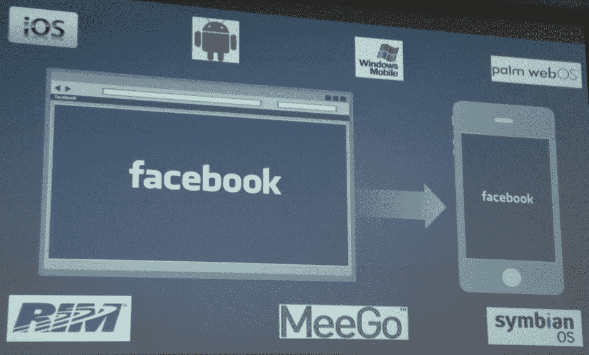
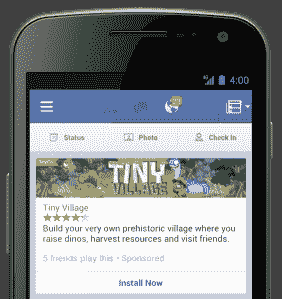

# 脸书副总裁:我们首先转向创造合适的移动体验，桌面可以在稍后跟上

> 原文：<https://web.archive.org/web/https://techcrunch.com/2012/10/19/facebook-mobile-first/>

# 脸书副总裁:我们首先转向创造合适的移动体验，桌面可以在稍后跟上

“自今年年初以来，如果你出现在一个产品回顾会上，并且在开始或大部分演示中展示了除移动以外的任何东西，你会被要求回去再做一次，”脸书公司的企业发展副总裁 Vaughan Smith 今天在全球移动互联网大会上说。脸书发出的信息是，它已经发展成为一家以移动为先的公司，准备在小屏幕上茁壮成长。

正如史密斯所解释的那样，移动网站的优先次序发生了重大转变，“就在去年，80%的产品评论还在谈论桌面网站。”但从那时起，“我们开始思考如何先创造合适的移动体验，然后桌面才能跟上。”

证据就在程序中。史密斯说:

> *“早在 2008 年和 2009 年，我们在移动设备上的工作方式是我们有一小群人，我们可能适合这个阶段大约 20%的人。我们坐在一起，我们的工作是把脸书网站转换成手机。我们复制并转换了它。自今年 1 月以来，我们已经完全改变了产品开发的方式。**我们已经培训了所有工程师，让他们先做移动计算。**所以你看到的是在今年年初，大部分移动代码提交来自于我提到的更大的团队。现在，大部分移动代码提交来自负责新闻订阅、Messenger、Timeline 或我们即将推出的任何产品的团队。这对我们来说是一个巨大的变化。”*

整个演讲可以通过跳到 3:13:45 在 GMIC 网站上[观看。](https://web.archive.org/web/20221209230932/http://www.gmic-sv.com/live/)

你已经可以看到一家移动公司的业绩了。它现在处于定期发布周期中，每个月都会更新安卓应用程序，每两个月更新 iOS 应用程序。它为其 iOS 应用程序推出了一个[主要后端更新，使其速度翻了一番，安卓也在进行类似的改造。](https://web.archive.org/web/20221209230932/https://beta.techcrunch.com/2012/08/23/facebook-for-ios-faster/)

史密斯说，“回想起来很有趣，今年第一季度，我们的移动产品上没有广告。”自那以后，它发布了许多新的移动货币化产品。本周，它开始公开销售其首个非社交新闻源广告，帮助开发者获得更多应用安装。它进入了移动优先的礼品电子商务领域，让人们通过手机为朋友购买礼物。它甚至允许页面所有者从手机上购买广告。

向移动的转变要求脸书彻底改变其盈利战略。它没有空间展示大量的小广告。相反，它必须投放更少的广告，但要让它们高度吸引人，并让人们直接付费。但这并不意味着这种转变是不好的。Smith 自豪地指出，“当我们看到人们从在桌面上使用脸书转向在移动设备上使用时，他们在脸书上花费的时间增加了 20%。”