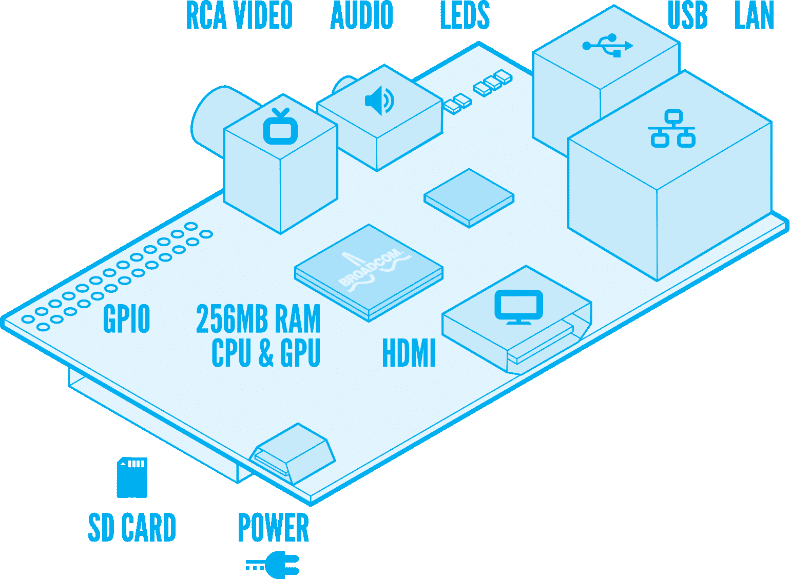
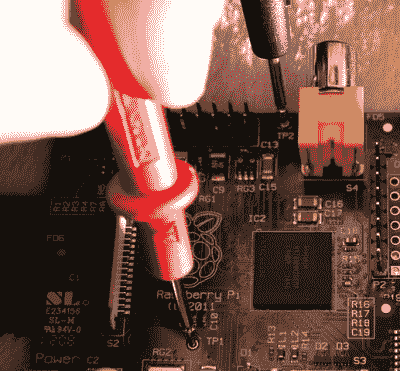
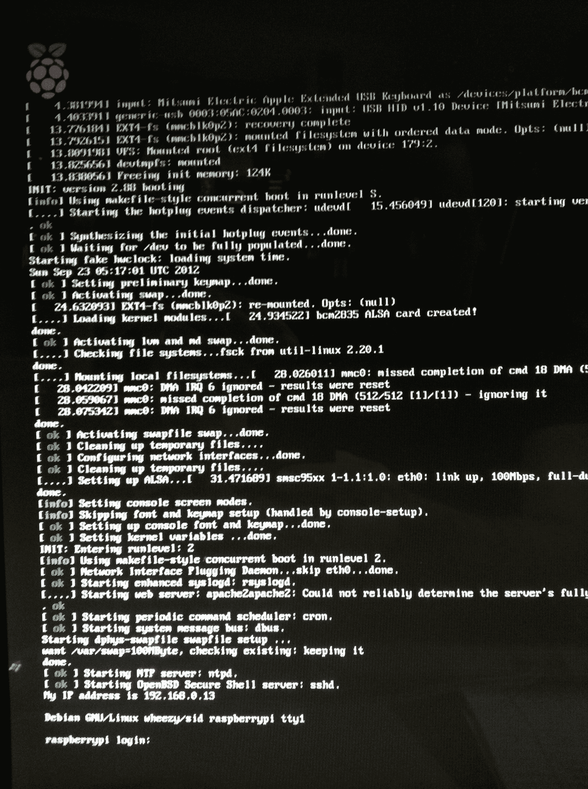
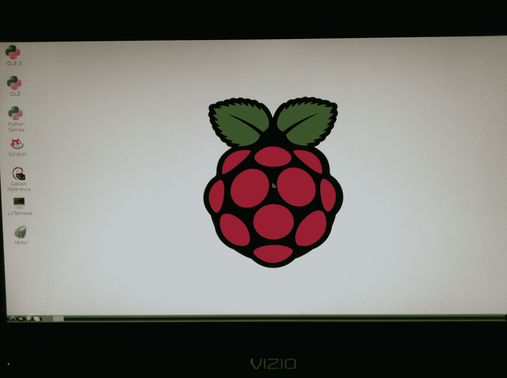

# 开始使用树莓派并不像馅饼一样简单

> 原文：<https://web.archive.org/web/http://techcrunch.com/2012/10/21/getting-started-with-the-raspberry-pi-is-not-as-easy-as-pie/>

名为“树莓派”的超低价电脑令人惊叹不已。正如 TechCrunch 最近[报道的](https://web.archive.org/web/20230328231017/https://techcrunch.com/2012/10/14/raspberry-pi-the-small-computer-with-the-big-ambition-to-get-kids-coding-again/)，这款 25-35 美元的电路板迷你电脑旨在为全球的孩子们提供一种学习计算机编程的简单方法。但树莓派不像你从苹果公司买到的电脑，也不像你在当地百思买买到的电脑。不是即插即用那么简单。这需要一点额外的工作和时间。你需要成为一名黑客才能让它工作。

我得到了已经售出的 40 万套中的一套。我注意到的第一件事是树莓派是不带任何配件出售的。你得到的只是上面看到的电路板，没有任何连接。总部设在英国的非盈利慈善机构[树莓派基金会](https://web.archive.org/web/20230328231017/http://www.raspberrypi.org/)制造了这款电脑，它表示希望保持低价，甚至可能是[20 美元一天](https://web.archive.org/web/20230328231017/https://techcrunch.com/2012/10/19/raspberry-pi-mini-computer-tiny-3525-price-tag-could-be-squeezed-a-little-lower-but-dont-expect-sub-20-pi/)。但是为了降低价格，他们不得不做出一些艰难的选择，包括哪些硬件和接口。

虽然一台 25 到 35 美元的电脑可以成为一个很好的标题，但很有可能你要花几倍的钱才能让它运行起来。这个总数仍然比一台新的个人电脑或苹果电脑的价格低得惊人。

你需要[连接](https://web.archive.org/web/20230328231017/http://www.raspberrypi.org/quick-start-guide)一个电源、显示器、USB 键盘、鼠标、SD 存储卡和一个以太网接口。如果你想变得有趣，你也可以找一个盒子来装它，并附上各种传感器、显示器和几乎任何你能想到的东西。基本系统运行不需要焊接。

 
*图由保罗比奇和 via[raspberrypi.org 网站](https://web.archive.org/web/20230328231017/http://www.raspberrypi.org/quick-start-guide)*

卖树莓派的经销商也卖一些需要的配件，但是都是供不应求，就像电路板本身一样。所以，我决定开始使用家里已经有的零件。

我从 RaspberryPi.org 网站上的[快速入门指南](https://web.archive.org/web/20230328231017/http://www.raspberrypi.org/quick-start-guide)、他们的[维基](https://web.archive.org/web/20230328231017/http://elinux.org/RaspberryPiBoard)和支持[论坛](https://web.archive.org/web/20230328231017/http://www.raspberrypi.org/phpBB3/)获得了在线帮助。

#### 力量

我开始寻找电源，因为不包括电源线。快速入门指南说你需要找一个“微型 USB 电源——确保你用的是质量好的，能在 5V 电压下提供至少 700 毫安的电源。不要试图通过将树莓 Pi 插在电脑或集线器上来给它供电。”

Raspberry Pi 的制造商表示，他们选择微型 USB 插孔是因为它的无处不在，并表示它被主要移动运营商贸易集团 GSMA 选为通用充电解决方案。Micro USB 也是欧洲的标准充电端口，在美国用于 Android 手机。

作为一个巨无霸用户，我使用了很多 USB 充电器，但它们的另一端有一个 Apple Dock 连接器。不是 Micro USB。我在一个支持页面上看到，亚马逊 Kindle 上的电源可以工作，它的终端是一个微型 USB 插头。看着电源适配器上的小字，上面写着“输出:4.9V 和 0.85 A”。这不是规格中的 5V，但听起来足够接近，0.85 A 大于 700mA 的规格。我不知道它是不是“高质量的”。

这个电源确实让树莓派的 LED 灯亮了。它确实起了一点作用。但是在所有东西都连接上之后，我的键盘重复字母(比如“EEEEEEEEEEEE”)，尽管我按了一次“E”键。其他的钥匙根本不能用。起初我怀疑是坏键盘，但在帮助论坛中搜索“重复键”并阅读了 [45 结果](https://web.archive.org/web/20230328231017/http://www.raspberrypi.org/phpBB3/search.php?keywords=repeating+keys)和[维基](https://web.archive.org/web/20230328231017/http://elinux.org/Rpi_Hardware#Power)后，我了解到键盘问题可能是由电源引起的。根据维基的说法，“电源不足的常见症状是不可靠的以太网或键盘操作…以及启动时的 SD 卡错误。”

为了判断我的电源是否不足，维基建议我拿出万用表，读取电路板上两个测试点的电压。我不记得在我的其他电脑上有过这样的经历。

用亚马逊 Kindle 供电，我得到的读数是 4.62 伏。维基说，我应该看到 4.75 到 5.25 伏之间的电压，“任何超出这个范围的东西都表明你的电源或电源线或输入 polyfuse F3 有问题。”我抓住机会，决定我需要一个更好的电源，而不是一个新的输入 polyfuse F3，不管那是什么。在搜索支持论坛后，我找到了我希望的 10 美元的更好的电源适配器，并在亚马逊上订购了它。使用 Kindle USB 转 Micro USB 电缆的新电源适配器，我得到的读数为 4.92 伏，树莓 Pi 工作得更好。

#### 班长

Raspberry Pi 的视频输出是 HDMI 或通过 RCA 插孔的复合视频。我有一个带 HDMI 输入的显示器和一根备用的 HDMI 电缆，所以这对我来说不是问题。但是，您不能使用 VGA 连接到显示器，许多用户可能会第一次尝试。Raspberry Pi FAQ 说“没有 VGA 支持，但是有适配器，虽然这些相对比较贵。”

根据常见问题，没有 VGA 支持的原因是“芯片专门支持 HDMI。VGA 被认为是一种生命周期即将结束的技术，因此支持它不符合我们目前的计划。”Raspberry Pi 基金会希望它试图接触的许多学生可以使用旧电视作为显示器，因为他们中的许多人都有复合视频输入 RCA 插孔。我尝试在电视上使用复合视频模式，虽然图像不如 HDMI 方法清晰，但还是可行的。

#### USB 键盘和鼠标

找到一个 USB 键盘和鼠标相当容易。但是，如果你没有键盘，这些键盘是相当便宜的，但它们是另一项小支出。

#### SD 存储卡

你还需要一个 SD 卡来存储操作系统、程序和数据。这是一个聪明的存储解决方案，SD 卡很容易获得。

我用的是 2GB 的卡，但是空间不够了，所以我打算升级到 4GB 或更大的卡。 [FAQ](https://web.archive.org/web/20230328231017/http://www.raspberrypi.org/faqs) 说“我们已经尝试了高达 32GB 的卡，大多数卡似乎工作正常。也可以附上 u 盘或者 USB 硬盘。”

Raspberry Pi 的默认操作系统是 Debian，这是 Linux 的一个版本。我很快了解到，你不能简单地从电脑上把这个软件复制粘贴到 SD 卡上。(注意:虽然我本可以购买一个预先配置了操作系统的 SD 卡，但我有一个订单积压，我自己尝试一下会更有趣。)

我下载了 Debian 的特别版“Raspbian wheezy ”,推荐给刚入门的人。一旦[从 Raspberry Pi 网站下载了](https://web.archive.org/web/20230328231017/http://www.raspberrypi.org/downloads)，维基就给了我[指示](https://web.archive.org/web/20230328231017/http://elinux.org/RPi_Easy_SD_Card_Setup)如何通过把它连接到读卡器和我的 Mac 电脑上来把图像复制到我的 SD 卡上。共有 12 个步骤，包括在终端程序中键入如下命令:

`sudo diskutil unmount /dev/disk3s1`

`sudo dd bs=1m if=~/Downloads/debian6-19-04-2012/debian6-19-04-2012.img of=/dev/rdisk3`

也有一些可怕的警告，基本上是说，如果我的 Mac 电脑出错，我可以删除它。

> 使用分区的设备名，通过省略最后的“s1”并用“rdisk”替换“disk”来计算出整个磁盘的原始设备名(这一点非常重要:如果获得错误的设备名，您将丢失计算机硬盘上的所有数据)。

与原来的命令行方法相比，wiki 说明页面的最近更新包括一个“主要是图形界面”的方法，用于将图像复制到 SD 卡。但是，您仍然需要运行终端和以下命令:

`sudo dd if=path_of_your_image.img of=/dev/diskn bs=1m`

一旦操作系统被加载到 SD 卡上，你就可以把它插入 Raspberry Pi 上的插槽，希望它能启动。

前两次我尝试这样做，我得到了致命的错误和树莓派将冻结。其中一些可能是由于前面描述的电源问题。

有一次，红色电源灯亮了，但树莓派不启动。我在支持论坛上发现了一个[建议](https://web.archive.org/web/20230328231017/http://www.raspberrypi.org/phpBB3/viewtopic.php?f=28&t=8226&start=50)删除“the。_.垃圾。垃圾/，。fseventsd/，…OS X 放在卡上，一切都很好。”我把 SD 卡放回读卡器，连接到 Mac 电脑，启动终端程序，用一些基本的 Unix 操作系统删除这些文件，比如 rm filename 这样的命令。当我把 SD 卡放回树莓派时，一切都很好。

看到树莓派成功启动，我有一种自豪的成就感。

#### 以太网连接

为了充分利用 Raspberry Pi，我把它插在以太网 LAN 电缆上，上网没有任何问题。您也可以使用 USB Wi-Fi 或无线适配器将它连接到互联网。

#### 软件和浏览器

当 Raspberry Pi 启动时，它将以命令行模式启动。以下是您应该看到的内容:

然后，我通过在命令行输入 startx 启动了它的图形用户“X window system”。
以下是您得到的结果:

该操作系统安装了美岛莉网络浏览器。以下是 TechCrunch 网站的样子:

 
我还安装了 Chromium 浏览器。这是浏览器中的 TechCrunch:

但是要做好页面加载速度极慢的准备。

#### 下一步是什么

Debian 操作系统预装了 Python，这是推荐的默认教育编程语言。只需一个命令行文本，我就能安装 PHP。您可以从 Raspberry Pi 运行 web 服务器或媒体服务器。你可以在上面安装为 TechCrunch 提供动力的软件 WordPress 。您可以闪烁单个 LED 或创建一个令人惊叹的 [8x8x8 LED 立方体](https://web.archive.org/web/20230328231017/http://www.youtube.com/watch?v=S6P3jcxKh-k)。如果你是一个游戏玩家，你可以运行《雷神之锤 3 》,就像去年德文·科尔德维在 TechCrunch 上写的那样。而且这么多[更有](https://web.archive.org/web/20230328231017/http://raspberrypihacks.com/raspberry-pi-hacks/some-of-the-best-raspberry-pi-ideas-and-uses-ive-seen-so-far/)。

正如 Raspberry Pi 团队所写的“我们不认为 Raspberry Pi 可以解决世界上所有的计算问题；我们相信我们可以成为催化剂。我们希望在任何地方都能看到便宜的、可访问的、可编程的计算机。”

在开始使用树莓派之后，我很兴奋地想看看我能用它做些什么。我认为树莓派基金会的使命是一个非常值得追求的目标。今天，他们正在世界各地实现这一目标。但我担心目前的设置要求可能会让一些学生、家长和老师望而却步。我确信团队和开发者社区也在致力于此。