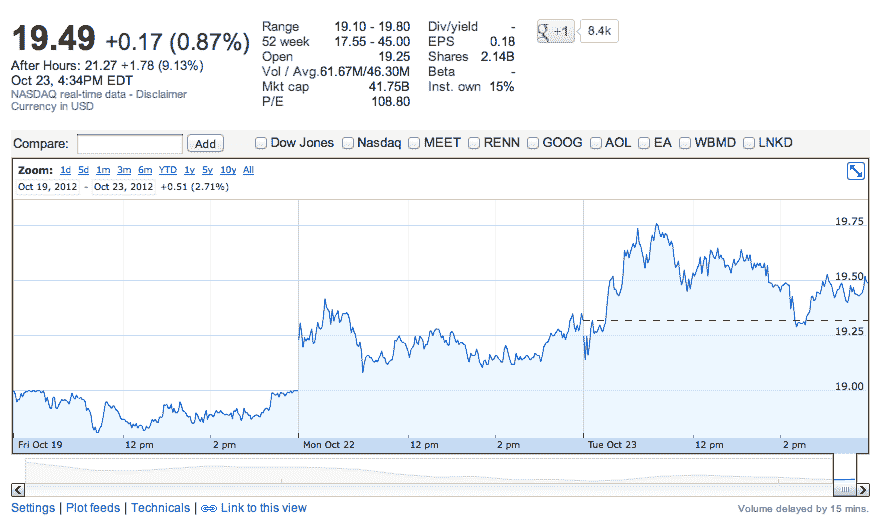

# 华尔街的快乐:脸书在盘后交易中攀升近 10%

> 原文：<https://web.archive.org/web/https://techcrunch.com/2012/10/23/wall-streets-happy-facebook-climbs-nearly-10-in-after-hours-trading/>

# 华尔街的快乐:脸书在盘后交易中攀升近 10%

由于广告收入增加，越来越多的证据表明脸书正在从移动设备用户身上赚钱，华尔街投资者在盘后交易中将该公司的股票上涨了 9.8%。脸书的交易价格为 21.39 美元，高于今天收盘时的 19.49 美元。

脸书公布第三季度收入为 12.6 亿美元，比上一季度的 11.8 亿美元增长近 7%，比去年同期的 9.54 亿美元增长 32%。广告收入是一个亮点，该公司在过去的一个季度赚了 10.9 亿美元，比去年同期增长了 36%，也比第二季度的 9.92 亿美元的广告销售额有所增长。

更好的是，该公司总广告收入的 14%来自移动设备。这个季度的移动广告收入略高于 1.5 亿美元。新闻订阅中较老的赞助故事和较新的应用程序安装和页面广告可能会成为一项每年超过 10 亿美元的业务。

非 GAAP 基础上的第三季度净收入(不包括员工股票薪酬的临时成本)为 3.72 亿美元，高于去年同期的 2.27 亿美元。这意味着它的非 GAAP 每股收益(EPS)为 12 美分。根据公认会计准则，脸书第三季度亏损 5900 万美元。同样，这主要是因为基于股份的薪酬。