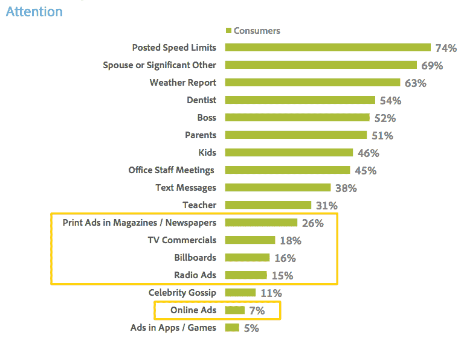
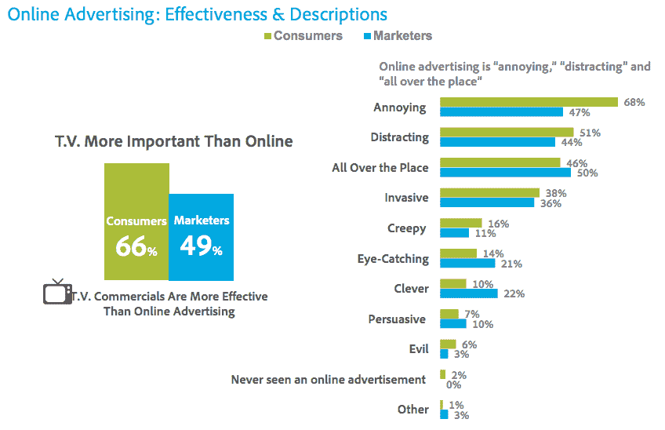
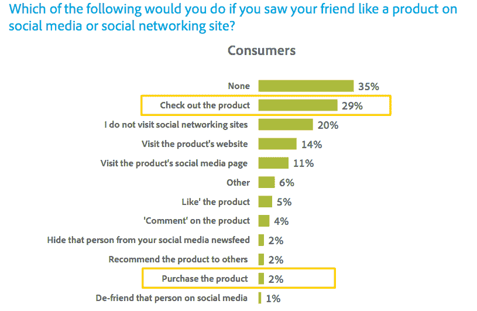
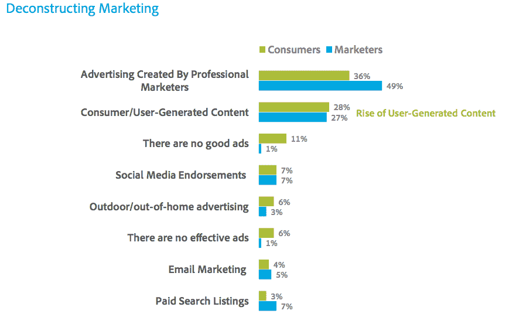

# 在线广告调查:大多数美国消费者对在线广告感到“恼火”;比起网络广告，更喜欢电视广告；想要社交媒体不喜欢按钮；并且认为大多数营销都是“一派胡言”

> 原文：<https://web.archive.org/web/https://techcrunch.com/2012/10/24/online-ad-survey-most-u-s-consumers-annoyed-by-online-ads-prefer-tv-ads-to-online-want-social-media-dislike-button-and-reckon-most-marketing-is-a-bunch-of-b-s/>

# 在线广告调查:大多数美国消费者对在线广告感到“恼火”;比起网络广告，更喜欢电视广告；想要社交媒体不喜欢按钮；并且认为大多数营销都是“一派胡言”

Adobe 对在线广告进行了更多的研究。这一次，它不是一个市场指数，而是对 1250 名美国消费者和营销人员对在线广告的看法进行的民意调查。[的调查](https://web.archive.org/web/20221116234456/http://www.adobe.com/aboutadobe/pressroom/pdfs/Adobe_State_of_Online_Advertising_Study.pdf)有时读起来很有趣——几乎一半的受访者同意“在线广告令人毛骨悚然，并且跟踪你”，超过一半的人同意“大多数营销都是一堆废话”。该调查还强调了在线广告未能吸引人们注意力的持续问题——在争夺消费者注意力的战斗中，只有应用程序内/游戏内广告表现更差，纸质广告和电视广告吸引了更多的消费者注意力

几乎三分之一的消费者(30%)认为在线广告没有效果，而超过一半的人(54%)认为网络横幅广告不起作用。毫不奇怪，持这种观点的营销人员比例更低(分别为 16%和 33%)。

相当多的受访消费者(66%)认为电视广告比网络广告更有效。看广告最喜欢的两个地方是印刷杂志和看最喜欢的电视节目。但最受欢迎的网站排在第三位，仅高于广告牌——尽管只有 11%的消费者受访者喜欢。

调查发现,“烦人”和“分散注意力”是描述在线广告最常用的两个形容词。仅有 2%的受访者声称从未看过在线广告

在社交媒体方面，调查发现，一小部分(57%)消费者在社交媒体上代表他们喜欢的品牌“喜欢”一些东西。超过一半(53%)的人说他们非常希望有一个社交媒体“不喜欢”按钮。

当调查受访者被问及如果他们在社交媒体上看到朋友喜欢某个产品会怎么做时，近三分之一(29%)的人说他们会查看该产品，5%的人说他们自己也会喜欢该产品，而喜欢点击的 2%的人认为他们会立即购买该产品

在哪些类型的广告被认为是最有效的方面，调查发现大部分(28%)的受访者认为用户生成的内容是一种有效的广告媒体。付费搜索列表被认为是最无效的——只有 3%的消费者认为它们有效

