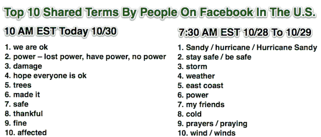

# 脸书成为全国的飓风公告栏:“我们没事”是今早的头号热门词汇

> 原文：<https://web.archive.org/web/https://techcrunch.com/2012/10/30/facebook-the-reassurance-machine/>

当推特在飓风桑迪的新闻报道中扮演谣言工厂和事实核查者的角色时，脸书是人们给亲人留言的方式，记录他们的特殊情况。截至美国东部时间今天上午 10 点,“我们很好”是脸书最热门的词汇。前十名中的其他词包括“权力”(失去权力，拥有权力)，“成功”和“安全”以下是完整的列表，以及为什么脸书和 Twitter 的趋势不同。

Twitter 的优势在于实时新闻、各种观点以及对事实的同行评议。这就是为什么关于飓风桑迪受灾地区的最新、通常也是最准确的消息出现在推特上，而 [Buzzfeed 称其为“真相机器”是正确的](https://web.archive.org/web/20230319090901/http://gofwd.tumblr.com/post/34623466723/twitter-is-a-truth-machine)

另一方面，脸书在灾难情况下的优势是它对我们现实世界社交图的准确描绘，以及显示我们最亲近的人的更新的过滤订阅。这意味着，如果你发布“我们很好”,而你的父母或好友登录了，他们很可能会看到。同样的更新可能已经被推特上的推文洪流卷走了。

脸书没有 Twitter 的快速转发功能和多样化的图表，可以在那些可以否认虚假报道的人面前得到虚假报道。在盛怒之下，它可以传播不准确的消息。但当涉及到你自己的身份时，脸书会把你的信息传达给正确的人，就像你的个性化社区的城镇广场公告板一样，不管它的成员住在哪里。

脸书新闻项目经理瓦迪姆·拉夫鲁西克分享了从周日到周一早上的 24 小时，以下是截止到今天早上美国脸书用户分享的十大热门词汇。在桑迪袭击之前，人们正在讨论天气预报，并向受影响地区的朋友致以良好的祝愿。然后，随着风暴在一夜之间袭来，人们开始分享他们的个人情况，以安抚所爱的人。

联邦紧急事务管理局一定会很高兴，因为脸书正在减轻移动网络更新的压力。联邦应急管理局要求人们避免无线电话，代之以发短信或使用社交网络。

大多数人可能都不会打电话给父母，告诉他们关于纽约证券交易所大厅积水的最新虚假报告。然而，他们可能会打电话说他们成功了，安全了，或者有电了。由于这是一个异步的、一对多的通信平台，每份《脸书邮报》都可以减少几个电话和几条短信的需求，为关键、紧急的连接腾出带宽。

脸书和推特在应对灾难中的角色确实提出了一个问题。必要时，政府和紧急广播系统可以征用电视或无线电波，以迅速达到民众。政府将频谱授权给私人频道和电台，赋予了它权力。现在，随着人们切断联系，注意力分散到在线新闻和娱乐渠道，脸书和 Twitter 可能是发布紧急信息的更好方式。

所以问题是，在危机时刻，政府有权在每个人的脸书新闻和推特上插入信息吗？