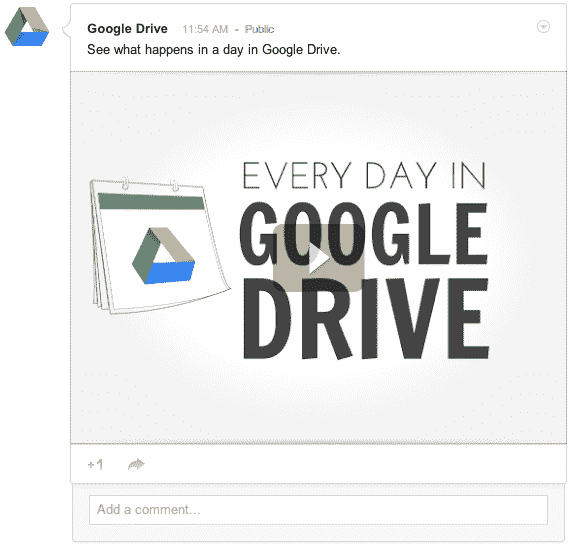
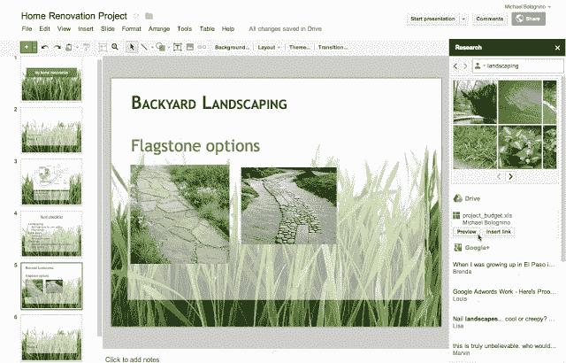

# 您现在可以在 Google+中查看从 Google Drive 共享的内容，而无需离开流 TechCrunch

> 原文：<https://web.archive.org/web/https://techcrunch.com/2012/10/31/you-can-now-share-things-from-google-drive-to-your-google-stream-and-circles/>

# 你现在可以从 Google Drive 的 Google+共享中查看内容，而无需离开流媒体

这是谷歌社交层 Google+的一点改变。Google Drive 团队宣布，从今天开始，您可以在 Google+上与您的圈子和流共享文档等内容。这并不新鲜，但在流中查看这些项目却是一件新鲜事。这是一笔相当大的交易，因为它将服务变成了流行的 Hangouts 功能之外的一个完全协作的环境。

你可以在工作中用你的公司地址使用 Google+,所以我明白了为什么这个功能非常适合即时分享 PDF、视频或幻灯片演示。很方便。事实上，它不仅仅是方便，它完全改变了我们与日常接触和更新的事物的交流方式。

以下是谷歌软件工程师李·[对此的看法](https://web.archive.org/web/20221205150934/http://googledrive.blogspot.com/2012/10/share-your-stuff-from-google-drive-to.html):

> 有了 Google+，你可以和合适的人分享你想要的东西。那可能是你周末苹果采摘探险的照片，或者是你最喜欢的新博客上的一篇文章。从今天开始，你还可以分享你在 Google Drive 中创建和存储的内容，人们将能够直接在 Google+流中浏览演示文稿、打开 pdf、播放视频等。
> 
> 要开始，只需在从 Drive 共享时单击 Google+图标，或者将 Google Drive 中文件的链接复制并粘贴到您的 Google+帖子中。

由于 Google+倡议，通过解锁你存储在 Google Drive 上的所有东西，如照片等，谷歌的整套产品现在都是链接在一起的。你为什么想这么做？嗯，在某些情况下，您可能希望公开一个电子表格。我希望有一天能在我的溪流中看到它。例如，如果你像我一样正在计划一场婚礼，你可能会有一群人在后勤方面提供帮助。在这种情况下，即时共享文档绝对有意义。在溪流中观赏它们？黑仔。

这里有一个[样本演示在](https://web.archive.org/web/20221205150934/https://plus.google.com/u/0/+GoogleDrive/posts/HqHvgd72Qxb)流中供您查看。

昨天，该团队宣布了一个用于文档、幻灯片和图纸的“研究窗格”，使您可以更快地访问这些内容:

将所有这些与最近 [Gmail 的速度变化](https://web.archive.org/web/20221205150934/https://beta.techcrunch.com/2012/10/30/googles-gmail-launches-new-compose-email-view-and-reply-experience-that-will-save-you-time/)结合起来，事情看起来对谷歌及其用户体验非常有利。这是今天为 Google+和 Drive 用户推出的。

我以前说过，现在我要再说一遍，Google+不是一个社交网络…该公司刚刚完全社会化。该公司没有把你视为“Google+用户”，它只是把你视为谷歌用户，仅此而已。

[图片来源: [Flickr](https://web.archive.org/web/20221205150934/http://www.flickr.com/photos/puuikibeach/3362470356/) ]