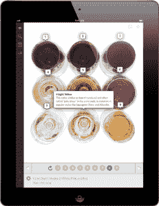

# 电子书出版商 Inkling 推出自己的在线商店:图文并茂的学习内容亚马逊 TechCrunch

> 原文：<https://web.archive.org/web/https://techcrunch.com/2012/11/01/ebook-publisher-inkling-launches-its-own-online-store-an-amazon-for-illustrated-learning-content/>

不想被南韩和其他国家超越，南韩要求在 2015 年前使用数字教科书，今年早些时候，联邦通信委员会和教育部发布了 T2 数字教科书剧本，以帮助加速美国学校采用数字教科书。根据[国家教育技术主管协会(SETDA)最近的一份报告](https://web.archive.org/web/20221207110654/http://setda.org/web/guest/outofprint)，这不是一个这种转变是否会发生的问题，而是何时发生的问题。

自 2009 年推出以来， [Inkling](https://web.archive.org/web/20221207110654/https://www.inkling.com/) 一直致力于通过为 iPad 从头开始构建引人入胜的互动学习内容，为移动数字时代重塑出版业。最初专注于高等教育，今年 Inkling 一直在扩大其范围，进入面向消费者的书籍和继续教育，以及在网络等其他平台上提供其内容。

如今，Inkling 继续这一扩张，推出了“Inkling Library”，这是一家在线商店，将展出一系列流派的精选数字电子书，并计划成为一站式商店，消费者可以在这里找到爱好和兴趣特定的学习材料。根据 Inkling 创始人兼首席执行官 Matt MacInnis 的说法，该图书馆类似于亚马逊的图文并茂的学习内容，将提供 300 种图书，来自旅游和冒险，食品和饮料，艺术和摄影，音乐等类别。

 电子书是从零开始制作的，旨在展示一个模糊的数字出版平台，这意味着每本书都带有高级搜索、在 iPad、iPhone 和网络上同步的能力、术语表、交互式导游和幻灯片、高分辨率图像和社交笔记等功能。内容来自像弗罗默和奥赖利这样的出版商，包括一些现在由威利拥有的[“为傻瓜”](https://web.archive.org/web/20221207110654/http://en.wikipedia.org/wiki/For_Dummies)系列。这些书的平均价格约为 9.99 美元，可以选择以 0.99 美元或更高的价格购买章节。

麦金尼斯说，到今年年底，Inkling 希望有 400 本书出版到图书馆，其中一些内容是专门为 Inkling 创作的，一些内容是人们熟悉的，已经出版了(如《傻瓜书》)，一些内容是为图书馆增加的——但所有这些都旨在展示现在数字教科书市场上的可能性——对于独立和老牌出版商来说。

今年 2 月， [Inkling 推出了 Habitat](https://web.archive.org/web/20221207110654/https://beta.techcrunch.com/2012/02/14/an-answer-to-apple-inkling-creates-first-industrial-publishing-platform-for-interactive-ebooks/) ，这是一个基于云的跨平台出版环境，基本上允许任何出版商创建数字优先的图书或将现有的纸质内容迁移到数字版本。在某种程度上，这是对苹果发布 iBooks 2 的反应，但它不是一个允许任何人创建数字教科书的平台，而是专注于专业出版商，为他们提供一种更简单的方法来实现目录的数字化，而不是花费数百万美元来开发自己的技术。

麦金尼斯表示，此举最终让 Inkling 开始产生真正的收入，因为与麦格劳·希尔(McGraw Hill)、皮尔森(Pearson)和威利(Wiley)等出版商的合作导致了数字电子书产量的增长。Inkling 已经能够在医学学生中获得特别的吸引力，因为来自大型出版商的书籍现在已经在全球 150 所医学院使用，并将于今年秋天在 900 家校园书店上市。总的来说，来自 4000 多所学校的大学生已经购买了 Inkling 的书籍，创始人表示，这已经开始让一批以前从未听说过它的新学生接触到它。

继 Habitat 之后，该公司今年夏天发布了 Inkling 3.0，将电子书带到了 iPhone 和 iPod Touch 上。现在，随着图书馆的出现，该公司开始将一个庞大的数字出版和发行平台的各个部分整合在一起，提供面向教育的内容以及面向消费者的书籍，这些内容可以在网络、手机和 iPad 上获得。

麦金尼斯认为，虽然 Inkling 面临着来自技术和出版巨头的竞争，特别是苹果和亚马逊这样的巨头，但他们试图解决简单的问题，而不是解决困难的问题。出版商希望有一种工业级工具，可以用来在分销渠道上数字化他们的内容，这实际上不仅仅是一个简单的文本到数字的端口。

这位首席执行官认为，截至目前，它是少数几个专注于数字化如何和爱好内容的公司之一。通过帮助出版商和作者让他们的内容出现在谷歌搜索结果、Twitter 信息流和普通消费者网站上，这将有助于加快迄今为止相当缓慢的教科书采用速度。

该暗示图书馆现已在该公司的主页上上线。[找到这里](https://web.archive.org/web/20221207110654/https://www.inkling.com/)。