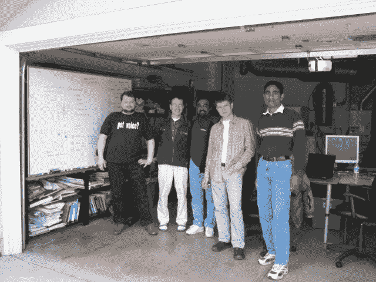

# Qik 创始人的故事:将移动视频从车库中取出，放入 Skype TechCrunch 手中

> 原文：<https://web.archive.org/web/https://techcrunch.com/2012/11/03/qik-started-in-a-garage-discovered-by-scoble-survived-the-financial-meltdown-and-became-the-world-leader-in-mobile-video-before-merging-with-skype/>

伯纳德·穆恩是

[SparkLabs Group](https://web.archive.org/web/20221210071409/http://www.sparklabsgroup.com/)

，毕业于哥伦比亚大学国际和公共事务学院，是

[Coro Fellowship](https://web.archive.org/web/20221210071409/http://www.corofellowship.org/)

.

More posts by this contributor

在为 Vidquik 寻求建议时，我通过威斯康星大学麦迪逊分校的校友网络认识了 Qik 的联合创始人 [Ramu Sunkara](https://web.archive.org/web/20221210071409/http://www.crunchbase.com/person/ramu-sunkara) 。听他讲述 Qik 从 2006 年在 Ramu 的车库里成立到 2011 年 1 月被 Skype 以 1.5 亿美元收购的[的历程令人振奋，所以我决定为打造下一个新事物的每个人采访他。我们在他位于加州洛斯拉图斯的车库“G 套房”见了面，Qik 就是在那里成立的。](https://web.archive.org/web/20221210071409/https://beta.techcrunch.com/2011/01/06/confirmed-skype-buys-mobile-video-startup-qik/)

**伯纳:**Qik 是怎么开始的？

2006 年，我们在这个车库里创办了这家公司。我们三个人创办了这家公司，巴斯卡尔·罗伊、尼古拉·阿布凯罗夫和我。他们和我一起在甲骨文工作，我们会说，“我想看看你现在看到的”，所以我们决定做一些视频。我们有三个创始人，然后第四个创始人是维贾伊·泰拉。Vijay 给了我们种子资金，从一开始就与我们合作，并在 2008 年 3 月 B 轮结束后全职加入。

YouTube 刚刚起步，所以我说让我们想想在视频方面能做些什么。尼古拉在莫斯科，巴斯卡尔在圣克拉拉，我们会在洛斯阿尔托斯我的车库里见面。我们想看看尼古拉在莫斯科看到了什么，反之亦然，所以我们的第一个原型是从电脑到任何网站的实时视频。你登录一个网站，看看其他人现在在流什么。

巴斯卡非常擅长营销。Nikolay 的专长是技术，Vijay 在战略方面非常出色，并创建了另一家初创公司 Tibco，而我则同时拥有产品、技术和市场推广。最重要的是，在我们出发之前，我们之间有一种信任。

有一次我们拿了第一轮资金，我们看到 PC 市场太拥挤了。我们说过我们需要退出那个市场。我们的投资者资助我们，希望我们为 MySpace 社区开发一款基于 PC 的视频流产品。

伯纳德:你最初筹集了多少钱？

**Ramu:** 我们的 A 轮是 90 万美元。在我们获得资金后，我们都聚在一起，一致认为 PC 领域非常拥挤，我们必须转移到移动领域。创始团队的大部分人都很兴奋地投身于移动领域，我们告诉投资者我们将转向移动领域，这就是我们在 2007 年进行的转型。

我们建立了直播技术，并将其应用于移动领域。移动网络各不相同，带宽也在不断变化。我们构建了 IP，因此我们的产品可以理解网络中的所有实时变量。这比桌面宽带世界更适合移动世界。

2007 年，我们意识到市场上只有一款诺基亚手机配有前置摄像头。大多数智能手机只有一个后置摄像头，网络还没有出现。所以我们说，“让人们能够从手机的背面摄像头与你一起流式传输。”记得那时候还没有 iPhone 和 Android。

我们开始为产品想名字，巴斯卡尔做了一些研究，想出了“Qik”，意思是瞬间。我们都同意了，所以我们的名字变成了“Qik”我们以 5500 美元的价格购买了 Qik 域名，这是我们的营销预算。

Qik 车库团队，从左至右:Alexander Markow(首席工程师)、Nikolay Abkairov(创始人)、Bhaskar Roy(创始人)、Alexey Timanovsky(首席建筑师)、Ramu V. Sunkara(创始人)。

伯纳德:你是如何推出你的产品的？

**瑞木:**我们是三个人，没有一个人有手机背景。但是我们确实有一个产品，所以我们让客户从我们的网站下载应用程序。这是应用商店出现之前的时代。以前，所有的移动应用公司都去排队推销无线运营商。我们决定不去找移动运营商(AT & T、威瑞森、Sprint 等。)来分发 Qik。这对我们有利。我们没有花任何时间与无线运营商交谈，而是将应用程序放在 Qik 网站上，供诺基亚用户找到并下载。

**伯纳德:**你是如何向那些初始用户营销的？

**Ramu:** [我们的一个早期测试版用户去了加州伯林盖姆的苹果商店](https://web.archive.org/web/20221210071409/http://scobleizer.com/2007/12/15/first-look-qik-video-streaming-from-cell-phones/)，向一位名叫罗伯特·斯考伯的先生做了介绍。Scoble 说，“我可以用手机把现场视频传到网上？”这位 Qik 用户用手机直播了 Scoble。他在苹果商店的显示器上看到了自己。2007 年 12 月 17 日，他向全世界宣布他可以通过手机进行视频直播。产品就是这样推出的。

每个人都很清楚，如果你想发布新闻，你应该使用 Qik。你按下电话上的一个按钮，你就在互联网上直播了。

伯纳德:你们是第一批？

是的，我们是第一批。有几家公司试图谈论它，但他们没有产品。在消费电子展上，几家媒体报道了我们。BBC 首先在世界经济论坛上报道了我们，并说，“这是我们将世界与我们联系起来的方式。”从英国广播公司到世界经济论坛，再到全球媒体和博客网站，我们在不到六周的时间内向世界推出了我们的产品！

当那个星期五消息传出时，我们确实没钱了。我们的数据中心已经满负荷了，因为人们正在从网站上下载产品和流式视频。我认识马克·贝尼奥夫是因为他和我一起在甲骨文工作，所以我立即通过我们共同的朋友联系了他。然后马克·安德森和本·霍洛维茨给我发了一封电子邮件:“嘿，我们谈谈吧。”

那个星期一，我以 300 万美元完成了我们的 B 轮融资，稍后给了他们估值。他们给了我钱。这种事情只会发生在硅谷，也就是说，只有演示，没有推介！

伯纳德:那么接下来发生了什么，你用那 300 万美元做了什么？

**拉姆:**关于我们颠覆性技术的消息传遍了全世界。美国参议员开始使用它，新加坡总理和来自德克萨斯州奥斯汀的国会议员约翰·卡尔伯森。嗡嗡声不断传来。嗡嗡声也吸引了我们。在 B 轮融资之前，我们每月的支出是 9 万美元，后来我们每月的支出增加到了 50 万美元。我们扩大了团队和运营，然后我们没钱了。

一路走来，我们赢得了 2008 年授予移动公司的每一个奖项。华尔街日报评选我们为“十大移动应用”；《综艺》杂志给了我们“十大创新者奖”；如此等等。iPhone 3G 发布的时候，还不能做视频。人们越狱 iPhones 来安装 Qik。然后，我们比任何竞争对手提前 24 小时推出了 iPhone 的 Qik 产品。所以 24 小时有很大的不同。

我们保持优势。当有机会时，我们立即抓住了。这就是我们如何通过 iPhone 现象击败竞争对手的。我们在 2008 年席卷了市场，但在 10 月份，我们的资金告罄。我们很快就花完了——我们银行里一点钱也没有了。这是我在危机时刻认识到拥有一个伟大导师的价值的时候。这样的人是神派来的，因为他们之前经历过这个过程。他们真的可以帮助你。对我来说，这就是本·霍洛维茨。

2008 年，当我们没钱的时候，我每个月借了 20 万美元，持续了 8 个月，维持了公司的运营。我们有一个非常好的团队。尽管金融动荡，我们没有损失一个人。他们专注于最初的产品进化图。本对我们保持平衡至关重要，并帮助我们度过了难关。

**伯纳:**哇，他们在这段时间都和奇克在一起？

**Ramu:** 对，他们都挺过去了。我们有一个非凡的产品，但还没有找到盈利模式。2008 年夏初，风险基金试图给我们提供资金。这是因为该产品得到了如此多的免费宣传。那时候我一分钱都没拿。人们在 8 月份给了我们 4 份投资意向书，我说，“不，不，不。我们将进一步开发产品，获得更多用户，稍后我们将关闭。”然后，市场在 2008 年深秋崩溃。所以我学到的教训是，当钱给你的时候，你应该接受。

**伯纳:**没错。如此真实。这段时间你的心态是怎样的？因为这很令人钦佩。你相信你的产品和公司，但随着时间一个月一个月地过去，一定会有怀疑在悄悄逼近。

**瑞木:**是的。这让我们努力思考，关注收入。我们在 9 个月内没有获得资金的原因是，这个在 2008 年获得如此多奖项的产品仍然没有收入模式。没有人向我们提供资金，因为金融危机中的每个投资者都想看到收入模式。这迫使我们思考——收入从何而来？这让我们走向了一种优质模式，并与合作伙伴一起获得分销收入。我们在 2009 年发现了这两个问题。

伯纳德:那是你专注于与无线运营商做分销交易的时候吗？

**Ramu:** 是啊。那时我们专注于与运营商的分销交易。第一笔交易是 Sprint，第二笔交易是 T-Mobile，第三笔交易是…..你明白了。Sprint 将 Qik 服务作为他们在 2010 年全国 4G 发布中的最佳应用。

**伯纳德:**明白了。所以当你最终完成第一笔交易时，你得到了投资者的钱？

**瑞木:**是的。交易结束时，投资者说，“好吧，这就是公司赚钱的方式。”

伯纳德:当时你的团队有多大？

我们大约有 25 个人。

**伯纳德:**二十五人。你说所有人都留下了？

所有人都呆在一起。

在金融危机期间，你是如何让团队保持专注的？我想这是有疑问的。

团队总是有疑虑，但我们通过不断传达我们的愿景和我们将要做的事情来保持动力。每次我们有投资条款清单、投资者会议或重要讨论时，我们对美国和莫斯科的团队都非常透明。

这很有挑战性，因为我们的团队分布在红木城和莫斯科之间。我们必须有良好的沟通，以确保这两个团队都明白我们在哪里。拥有一个相互信任的优秀创始团队至关重要，这对我们非常有利。

第三，他们(团队)都热衷于解决问题。在电话上做现场视频有非常困难的技术问题。一路上，iPhone 和 Android 不断向我们提出新的技术挑战。****

伯纳德:那么当你招聘的时候，这是你想要的东西吗？****

**Ramu:** 对移动领域和产品都充满激情。我们让产品工程师在不同的移动平台上开发软件，这只是团队的三分之一。另外三分之一的人在研究基于云的视频基础设施，因为一旦视频进入云端，管理起来就相当庞大。接下来的三分之一是构建整合到社交网络的网络基础设施，构建报告，以及所有其他的东西。

不接受资助是我们在 2008 年犯下的最大错误。我们学到了很多，我们幸存下来只有两个原因:我们有一个伟大的团队，我有一个伟大的导师，本·霍洛维茨。马克·安德森和本也适时介入(作为投资者)。这是在他们成立自己的基金之前。那是最艰难的九个月。我们有像 Camp 和 Quest Ventures 这样的伟大投资者，所有的朋友和家人都参加了 2009 年 5 月的下一轮 C 轮投资。

这迫使我们努力思考，“我们如何在这个产品上赚钱？”2009 年底，我们开始从与诺基亚的分销收入以及苹果应用商店的定价产品中赚钱。我们挺过了艰难时期，活了下来。那时大多数竞争者都走了。我们有来自以色列、加拿大和美国的竞争对手。当事情不顺利时，你需要可靠的投资者来帮忙。

Bernard: 你提到你的竞争对手发展得不够快。Qik 的产品是如何进化的？

**Ramu:** 最初是流媒体上网、视频存档、视频分享，然后是双向视频通话，最后是视频短信。Qik 是你在手机上捕捉你想在互联网或手机上与朋友分享或现场分享的任何时刻所需的所有东西，所有这些都被存档了。

随着你们的发展，你们的用户群有变化吗？

**Ramu:** 是的，我们的用户群变了。我们最初的卖点是希望使用 Qik 向他们的社区发布新闻的记者/博客，但我们意识到市场上没有收入，因为记者需要比手机所能生产的更多的高质量视频。对他们来说，视频质量对实时性至关重要，因为有新闻价值的项目需要原始的视频。今天，我们都在看高清视频，而不是手机视频。我们很快意识到有一个很好的走向市场的方法，但不是为了确保我们的成功。所以我们做出了改变，成为了一家消费公司。这是我们开始获得主流采用、主流分销和主流收入的时候。我们成为了智能手机用户的个人分享服务。

**Bernard:** 你的产品进化也恰逢用户和收入？

**瑞木:**是的。我们的用户群、活跃用户和收入每年增长 10 倍。当人们开始下载和注册时，产品的使用和收入都增长了 10 倍。

**Bernard:**Qik 的技术有何独特之处？

**Ramu:** 我们建立了一个智能流媒体云，它能够理解不同类型的手机视频以及从云端丢失的帧。它智能地对视频进行代码转换，并确保消费者不会看到不连贯或丢失的帧。这是我们自己的专利技术。我们建立了所有的服务器和电话，维护了一到两个到云的 TCP/IP 连接，并管理它们上面的一切，不像 Skype 的点对点基础设施。随着我们的进一步发展，这是一个必要的架构决策，因为 PC 比移动设备具有更大的容量，并且不依靠电池工作。当你为移动用户开发产品时，这是一个重要的权衡。

我们构建的云基础设施可以从任何移动设备上获取任何类型的视频，并将其实时发布到任何设备和/或互联网上。

我们在四个不同的领域建立了技术。我们如何在不放弃质量的情况下实时制作这个视频？第一个领域是实时视频质量。这里的一个大的权衡是你流得少一点只是为了适应管道，但是如果你流得多，就会堵塞管道。我们如何在不影响质量的情况下做到这一点？那是我们拥有六项专利的地方。然后我们有了技术，可以在不同的智能手机上工作。当我们从诺基亚开始时，它迫使我们考虑手机之间的所有差异。因此，我们建立了我们的客户端技术，可以适用于所有手机，利用最佳质量的视频和消耗最少的电池。

我们还以视频永远不应丢失的理念打造了我们的 IP。当你拍摄视频时，你的手机信号可能会中断，你的手机电池可能会耗尽，等等。这就是我们所说的:“我们必须建立技术，让我们的视频永远不会丢失。”我们最初的用户都是记者，如果他们的视频丢失了，他们会很难过。我们在设备和云上维护日志，进行定期检查和分阶段提交，以确保视频完整存档。

**Bernard:** 你的产品有什么特别的特点让它更有粘性，或者让人们更忠诚于你的产品吗？

真正迫使人们开始更认真对待我们的最大竞争或功能是 FaceTime 推出的时候。苹果让视频通话变得很酷。每个人都说我们也必须拥有这个产品。我们是在苹果、安卓、诺基亚和其他手机上做得最好的产品。

伯纳德:你们是如何分销你们的产品的？

**Ramu:**2010 年底，我们与北美和海外的运营商签订了分销协议。在南韩有 SKT，还有日本的软银等等。这是我们计算 Qik 分销收入的地方。2010 年，全世界都在 iPhones 上看到了 FaceTime。对于所有的机器人来说，FaceTime 功能并不是优先考虑的，所以我们成为了 Android OEMs(手机制造商)的首选产品。所有 Android 运营商和原始设备制造商都希望获得 FaceTime 平价，他们必须采用 Qik，我们与他们合作，在 55 个以上的设备上预装 Qik。

**伯纳德:**太好了，很明显你得到了…

**瑞木:**我们获得分销收入。我们的分销收入不错，有新的活跃用户，从 2009 年到 2010 年到 2011 年，收入每年增长 10 倍。

这一趋势持续到 2011 年，当时我们与 Skype 合并。Skype 收购我们时，我们与全球 13 家运营商和所有 10 大原始设备制造商有分销关系。这就是我们在分销和收入方面的一切进展。

我了解到，如果你让其他人宣传产品，效果会比你推销自己的产品好得多。我们得到了诺基亚的支持和布道。优秀的商业和营销。Sprint 在推出第一个 4G 网络时也在推广我们。Sprint 把 Qik 作为杀手级应用，也是你需要 4G 的一个理由。沃尔玛/T-Mobile 也开始销售两款智能手机，用于家庭间的 Qik 视频聊天。

你认为是什么因素促使 Skype 收购了 Qik？

我们补充了 Skype 已有的功能。Skype 是一款桌面 VoIP 和视频产品，我们以手机为中心。从一开始，我们的设计重点就是“如何为移动世界打造一款产品？”Qik 是完全基于云的基础设施，不是点对点的。第二件事是我们正在做所有这些高级服务，比如视频消息和视频聊天。Qik 建立的云视频基础设施可以自动存档视频，这对于 Skype 来说很难做到，因为它是点对点的。就产品和 Skype 的未来计划而言，这是一种协同效应。他们的另一个协同效应是 Skype 在爱沙尼亚的塔林有研发业务，而 Qik 在莫斯科有业务。

推动合并的另一个原因是我们在 2008 年夏天的错误，当时投资者想给我们钱。我们没拿，差点害死公司。这一次，我们说，“让我们抓住它。”

**Bernard:** 兴趣最初是怎么从 Skype 来的？

**Ramu:** Skype 查看了 Qik 路线图。他们看到了他们想做的东西。Skype 是一种高级模式。Qik 拥有完全相同的高级模式，直接面向移动消费者。第二件事是 Skype 的移动野心和 Qik 的足迹是相同的。Skype 需要构建的东西，Qik 已经在市场上有了。因此，当我们合作时，他们意识到他们想要建立的东西，Qik 已经有了。我们与所有运营商和原始设备制造商都有分销关系。

在北美，Sprint、T-Mobile 和美国电话电报公司都选择了 Qik，威瑞森正在他们的实验室里评估 Qik。所以他们想，你知道，你不能在你的手机上有两个视频产品。所以他们不得不收购 Qik。

**伯纳德:**所以他们一开始就和你谈了合作交易，然后就加速了？

**瑞木:**加速相当快。大约一周之后，他们提出了一个报价。我说不出确切的时间，但很快他们就提出了一个 Qik 董事会可以接受的修改后的报价。再过四周，这笔交易就完成了，并在 2011 年 CES 上宣布。所有这些都发生在圣诞节和新年假期。

伯纳:哇，真快。所以我认为当他们第一次出价时，这是他们最好的出价。

他们提出了第二份报价，被 Qik 董事会接受。他们以 1.5 亿美元收购了这家公司。对于 Qik 的所有工程师来说，这是一个很好的路线图。这对两家公司和现在的微软来说都是一次伟大的合并。

伯纳德:你有什么经验可以告诉其他企业家吗？

**Ramu:** 对我们有用的三件事:第一，团队必须有良好的工作关系。我认为车队必须和睦相处，因为你不知道未来会发生什么。你转向不同的点，花光了钱，做了很多艰难的决定。这个团队需要真正的合作。

第二，这个想法必须是颠覆性的。当我们开始 Qik 的时候，我们不知道任何关于移动分销或移动消费者货币化的事情。诸如此类的事情你可以想出来。当 iPhone 和 Android 在 2007 年上市时，我们的采用速度加快了。如果这个想法是破坏性的，它会给你更多的时间来搞清楚这些事情，因为市场正在试图搞清楚。利用这段时间获得更多的关注和更多的讨论，同时找出你的分销和收入模式。

最后就是执行力。你只要坚持到底。有时会变得暗淡，但要集中精力，克服它。如果你有一个好的导师，执行也会变得容易一些。我真的很幸运，有一群在艰难时期坚持下来的投资者。

**Bernard:** 移动视频还有大机会吗？

**Ramu:** 移动视频还有很大的机会。今天，我们还没有可以在所有电话和所有运营商上使用的通用语音电话。我们有适用于所有手机和运营商的短信服务，但没有视频服务。有 Skype(和 Qik)、苹果 FaceTime、谷歌 Hangout 等解决方案。他们建立了自己的视频体验，并在自己的生态系统中工作。如果有人能够开发出一种产品，能够与运营商一起解决经济问题，并且可以在所有支持视频的终端上使用，我认为这是一笔好生意。挑战在于运营商、原始设备制造商和视频服务提供商的移动生态系统必须解决经济问题。

**伯纳德:**我稍后会和你讨论你的下一个创业项目是什么。非常感谢你的时间和见解，Ramu。

没问题。我喜欢分享我在 Qik 的故事和经验。