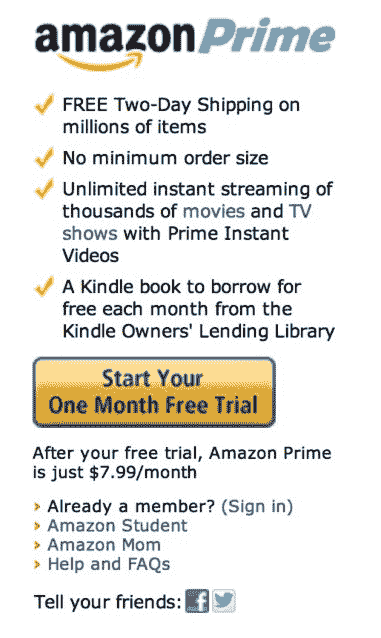

# 亚马逊为 Amazon Prime 提供 7.99 美元的包月服务[更新:亚马逊证实这只是一个测试]

> 原文：<https://web.archive.org/web/https://techcrunch.com/2012/11/06/amazon-offers-7-99-monthly-subscription-to-amazon-prime/>

# 亚马逊提供 7.99 美元的亚马逊 Prime 包月服务[更新:亚马逊证实这只是一个测试]

亚马逊现在为用户提供亚马逊 Prime 服务的包月选项，价格为每月 7.99 美元，作为 79 美元/年订阅的替代选择。这是与以前相同的服务，提供免费的两天送货，每月从亚马逊借阅图书馆获得一本免费书籍，从亚马逊的 Prime Instant Videos 获得电影和电视的即时流媒体，等等。

 这个选项最初是由一名读者在[黑客入侵网飞的](https://web.archive.org/web/20230128112609/http://www.hackingnetflix.com/2012/11/amazon-testing-a-799-per-month-prime-subscription.html)网站时发现的，然后通过亚马逊的网站确认了价格。该网站的作者 Mike Kaltschnee 告诉 TechCrunch，为了看到这个选项，他必须在测试时不登录亚马逊 Prime 帐户。他说他也不得不尝试不同的浏览器，并指出火狐为他工作。值得一提的是，我们在所有浏览器中都看到了同样的 7.99 美元/月的选项，包括 Chrome、Safari 和 Firefox。要自己访问它，请单击右上角的“加入 Prime ”,然后选择下面的选项进行注册。

有一个很大的黄色按钮，上面写着“开始你的一个月免费试用”，下面的文字表明亚马逊 Prime 只是 7.99 美元/月。这相当于 95.88 美元/年，因此比年度订阅要贵。然而，根据亚马逊网站上的帮助页面，79 美元的订阅似乎仍然是那些喜欢它的人的一个选择。

亚马逊尚未通过新闻稿正式宣布这一消息的事实暗示，这可能是一个有限的推出或测试。(话说回来，亚马逊也没有正式宣布在美国的史泰博商店增加[“亚马逊储物柜”。)~~我们已经要求亚马逊确认细节，如果有回音，我们会及时更新。~~](https://web.archive.org/web/20230128112609/http://www.reuters.com/article/2012/11/05/net-us-staples-amazon-lockers-idUSBRE8A41LD20121105)

更新:我们的预感似乎是正确的。亚马逊发言人对此事仅发表了如下评论:*“我们一直在寻找改善顾客购物体验的方法。我们正在测试每月 Prime 订阅。除此之外，我们没有什么可以提供的。”*