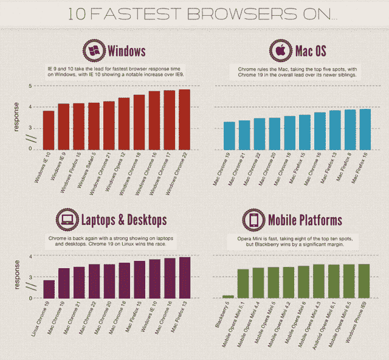

# 报告:Internet Explorer 10 是 Windows 上最快的浏览器，Chrome 19 在 Mac 上胜出 TechCrunch

> 原文：<https://web.archive.org/web/https://techcrunch.com/2012/11/06/report-internet-explorer-10-is-the-fastest-browser-on-windows-chrome-19-wins-on-mac/>

# 报告:10 是 Windows 上最快的浏览器，Chrome 19 在 Mac 上胜出

根据 web 应用程序性能管理公司 [New Relic](https://web.archive.org/web/20221206170527/http://newrelic.com/) 的最新数据，微软在 Windows 8 上的 Internet Explorer 10 目前是 Windows 上所有浏览器中响应时间最快的，[导致该公司](https://web.archive.org/web/20221206170527/http://blog.newrelic.com/2012/11/06/browser-wars-a-new-installment-of-our-ongoing-series-on-browser-speed/)—[和微软](https://web.archive.org/web/20221206170527/http://blogs.windows.com/ie/b/ie/archive/2012/11/06/internet-explorer-10-wins-again-on-performance.aspx)——得出 IE10 是目前 Windows 上最快的浏览器的结论。看看它每月监测的 400 亿网页浏览量，New Relic 的数据显示，IE9 排在第二位，其次是 Firefox 15、Safari 5 和 Chrome 21。

有趣的是，在 Mac 上，旧版本的 Chrome (19)显示出比任何新版本更快的平均响应时间(不过，New Relic 的数据不包括 Chrome 23 的测量结果，因为它今天才发布)。

当然，微软对这些结果非常满意。雷德蒙德的人们今天在他们的庆祝博客帖子中没有谈到的一件事是，一旦你跨平台看，IE10 开始迅速落后。在全面比较中，Linux 版 Chrome 19 的响应时间最快，其次是 Mac 版 Chrome 19(谷歌显然在 19 版上做了一些正确的事情)，Mac 版 Chrome 21，Mac 版 Chrome 20，Mac 版 Chrome 18 和 Mac 版 Firefox 15。IE 10 在这次全对比中只排第八。

以下是微软对今天结果的评论:

> Internet Explorer 10 速度快、流畅，而且[是为现实世界的性能而从头开始构建的](https://web.archive.org/web/20221206170527/http://blogs.msdn.com/b/b8/archive/2012/02/16/internet-explorer-performance-lab-reliably-measuring-browser-performance.aspx)。越来越多的证据表明，Internet Explorer 是 Windows 8 上速度最快的浏览器。

不过，公平地说，IE10 在 Windows 上明显领先，这与众多和其他[基准测试](https://web.archive.org/web/20221206170527/http://www.strangeloopnetworks.com/resources/research/fall-2012-state-of-the-union/)的结果非常一致。尽管名声在外，但微软显然已经在 10 上有所建树。当然，目前只有 Windows 8 机器可以运行 IE 10，但 Windows 7 版本(或至少是预览版)应该会在未来几周内到来。