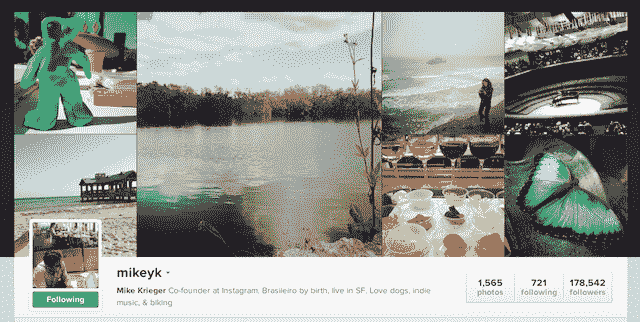
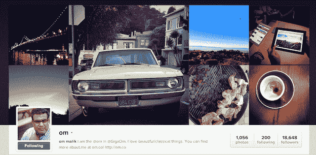
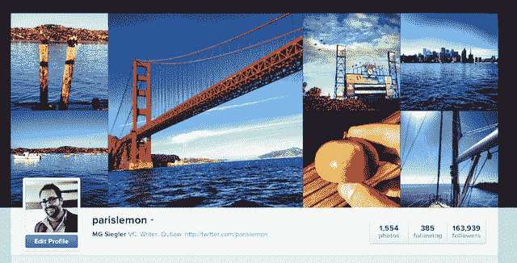

# 如果笔胜过剑，相机胜过笔 TechCrunch

> 原文：<https://web.archive.org/web/https://techcrunch.com/2012/11/06/the-pen-is-not-mightier/>

昨天，Instagram [推出了](https://web.archive.org/web/20221208141529/https://beta.techcrunch.com/2012/11/05/mobile-first-web-second-instagram-finally-lets-users-have-functional-web-profiles/)网页简介。对某些人来说，它们很可爱。对其他人来说，他们早就该这么做了。对[的许多](https://web.archive.org/web/20221208141529/http://www.techmeme.com/121105/p38#a121105p38)来说，它们是哼哼——一种明显的方式来注入另一个关于脸书以 10 亿美元收购初创公司的笑话(但实际上只有* 7 亿美元左右——ZING！).

对我来说，这些档案实际上是一个非常清晰的窗口，可以看出为什么脸书会花这么多钱收购 Instagram。这些简介实现了脸书的时间线功能未实现的愿景，也许会更进一步。

现在，看着[我自己的 Instagram 简介](https://web.archive.org/web/20221208141529/http://instagram.com/parislemon)很有趣。这是重温我最近照片的好方法。通过对我的历史中更好的表面图像的简单调整，它变成了纯粹的、强大的怀旧。

但是看看其他人的简介会发现更多。这是一种前所未有的对某人的视觉呈现。而且它的创建不需要用户做任何超出他们已经完成的工作(拍摄初始照片)。这些简介可以透露一个人的很多信息——但都不需要说一句话。

查看我认识的人的个人资料是非常有效的。毫无疑问是他们，但以一种我以前从未考虑过的方式。这是一本视觉自传。

当你听说 Instagram 的用户增长轨迹使他们有望超越 Twitter——甚至可能在明年——并且他们的日使用量[可能已经有了](https://web.archive.org/web/20221208141529/http://allthingsd.com/20120927/instagram-beats-twitter-in-daily-mobile-users-for-the-first-time-data-says/)时，一开始你会感到震惊。但应该一点都不震惊。言语艰难。打字需要努力。人们担心他们会说些愚蠢的话。有语言障碍。140 个字符的限制有所帮助，但也会在其他方面造成伤害。

图片是通用的。智能手机让它们变得实时，无时无刻。像 Instagram 这样的应用程序已经把它们变成了一种视觉语言。这是一场完美的风暴，在完美的时间创造了一种新的交流方式。

Instagram 所做的最重要的一件事就是把每个人都变成了摄影师。你可能是一个伟大的人。你可能会认为你是一个伟大的人。或者你可能是个差劲的人。没关系。重要的是你在拍照。你在用一种大多数人永远不会或不会用文本的方式交流和记录你的生活。

当你只是拍一张照片时，你可能没有意识到你在记录你书中的一段，但你确实在记录。事实上，这些图片都有地理标签和时间标记，这就是这本书的装帧。

这是你的视觉轮廓。随着 1 亿 Instagram 用户融入 10 亿脸书用户，这是每个人的视觉形象。

脸书的时间线专题过去是，现在也是天才。但是太复杂了。事件、工作里程碑、旅行、婚姻、分手、文本、照片、视频等。事实上，现在大部分都必须手动添加，这已经够糟糕的了。但是时间线的真正力量应该是你生活的整个时间线——只是没有人会回去添加过去的那些元素。即使他们想，也很难记住所有正确的数据。

我一直认为脸书免费扫描旧图片集是明智之举。让人们把它们送进来，或者与沃尔玛合作，在商店里扫描它们，然后立即把它们放入时间表。如果它们有时间戳，那就很简单了。如果没有，就创建一个工具，让用户可以轻松地将包放在大致的日期范围内，包括它们被拍摄的时间和地点。嘣。即时实际时间线——不仅仅是 2008 年的时间线(或者你注册脸书的任何时间)。

对于脸书来说，这将是一个不可思议的强大的用户锁定代理，更重要的是，对于用户来说，这是一个杀手级的特性。我在俄亥俄州的旧床底下一定有一万张照片。我不确定我会不会再看他们一眼，这既可笑又可悲。

Instagram 是时间轴向前发展的关键——尽管是间接的。照片一直是脸书的一个重要元素(有些人会认为*是脸书最重要的*元素)。在智能手机普及之前，把它们带进脸书太麻烦了。即使有了智能手机，脸书也不是最适合拍照的地方，因为不是每个人都一直在拍照。

脸书的规模迅速使他们成为最大的图片服务，但这并不是因为它无论如何都是一个伟大的图片服务。

这就是为什么脸书开发并发布了他们自己的相机应用程序。它永远不会成为 Instagram，但他们想尝试捕捉每个人一直拍照的精神。一路上，他们能够捕捉到 Instagram 本身。一个非常聪明的举动。

另一个明智之举是:允许 Instagram 作为独立服务继续存在。脸书的许多其他元素会扰乱和扭曲 Instagram 创造的视觉语言。想法应该是使用这些图像来增强更强大的脸书，但保持图片网络完整和无缝。没有什么能比有人用法语大喊大叫更快地打断一场精彩的日语对话。

在我们的历史上，图片比以往任何时候都更是一种可以与文字相媲美的表达和交流方式。而且在很多方面，更好。我们现在正在看这出戏。这是“一图胜千言”在规模上的实现。

反过来，这很容易价值 10 亿美元。给予或接受。

