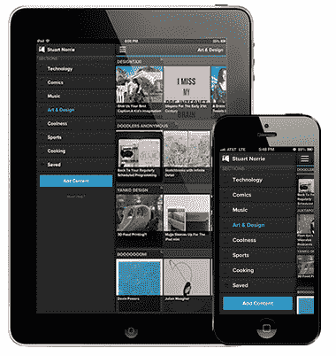
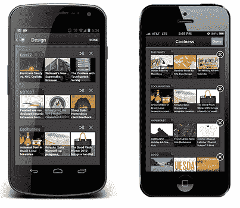

# 面向 Android 和 iOS 的 Pulse 3.0 发布，提供无限页面、更好的搜索和更多技术

> 原文：<https://web.archive.org/web/https://techcrunch.com/2012/11/08/pulse-3-0-for-android-and-ios-launches-with-unlimited-pages-better-search-more/>

# 面向 Android 和 iOS 的 Pulse 3.0 推出了无限页面、更好的搜索等功能

流行的移动新闻阅读应用程序 Pulse T1 刚刚在推出了适用于 iOS 系统 T5 和安卓系统 T7 的 3.0 版本 T3。此次更新为应用程序带来了一个新的、更时尚的设计，但最重要的是，它引入了该服务的用户长期以来一直要求的一些功能。

例如，Pulse 3.0 中的新功能是能够根据您的需要将任意多的站点和订阅源固定到一个页面上。到目前为止，每个页面的订阅源数量都是有限的，这常常让我们这些试图跟上大量订阅源的人有点难以使用该应用程序。类似地，现在你可以继续滚动浏览你的消息来源的故事，因为 Pulse 也给应用程序添加了无限滚动功能。

你也可以通过重命名、重新排序和快速删除来定制你的页面。

 通过增加一个新的侧边栏，Pulse 还对你如何在应用内导航做了一些改变。你只需从左向右滑动或点击屏幕左上角的菜单图标，新的导航侧边栏就会出现。

还有一个新的搜索功能，让你可以在应用程序中搜索谷歌、Tumblr、YouTube、Reddit、脸书、Flickr、Blekko 和其他服务。

所有这些更新都适用于 Android 和 iOS 用户(而 iPhone 和 iPad 应用程序，以前是两个独立的产品，现在已经成为一个通用的应用程序)。然而，Android 用户也将获得一个重新设计的主屏幕脉冲小工具和改进的通知，承诺将“你的消息来源的最佳故事直接发送到你的通知中心。"

