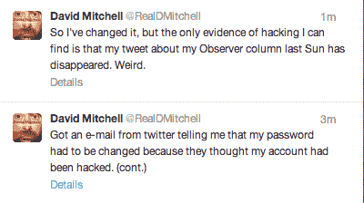
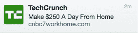

# 你可能从 Twitter 上收到了一封关于你的账户被入侵的邮件，这是真的 TechCrunch

> 原文：<https://web.archive.org/web/https://techcrunch.com/2012/11/08/you-might-have-gotten-an-email-from-twitter-about-your-account-being-compromised/?utm_source=feedburner&utm_medium=feed&utm_campaign=Feed:+Techcrunch+(TechCrunch>)

# 你可能从 Twitter 上收到了一封邮件，说你的账户被盗用了，这是真的

推特用户们，睁大眼睛:推特正在向一些用户发送电子邮件，告诉他们已经重置了密码，并要求他们创建一个新的。如果你不能登录你的帐户，这可能就是原因。从推特上关于密码问题的人数来看，很多用户受到了影响。英国喜剧明星大卫·米切尔是其中之一

【T2

是的，TechCrunch 自己的账户已经被入侵——请不要点击任何看起来像这样的链接(**更新**:我们现在已经赶走了垃圾邮件发送者，并重新控制了 TC Twitter 账户)

Twitter 的电子邮件中没有详细描述泄露的原因——它只是说“Twitter 认为您的帐户可能已被与 Twitter 无关的网站或服务泄露”。由 [TweetSmarter](https://web.archive.org/web/20221206232550/http://blog.tweetsmarter.com/twitter-downtime/twitter-resetting-user-passwords-after-massive-hijack-attack/) 撰写的博客指出，在大量账户被黑客攻击后，这类电子邮件往往会被发送出去。

如果你登录 Twitter 账户有问题，但在收件箱中看不到邮件，不要忘记检查你的垃圾邮件文件夹，以防邮件被过滤出你的主订阅源。

我们向 Twitter 寻求更多关于黑客攻击规模的信息，但该公司没有提供任何信息。它确实表示，收到电子邮件的用户应该重置密码(使用提供的密码重置链接)，并补充说，任何无法登录其帐户的用户可以直接前往 Twitter.com，在设置中重置密码。

一些 Twitter 用户批评该公司在电子邮件中包含更改密码的链接——这是一种经常被钓鱼欺诈用来获取密码的技术。但是注意了，伙计们:至少这一次是真的。即便如此，为了真正安全起见，你应该手动输入 Twitter 密码重置页面的链接——以避免任何被钓鱼的风险。

(未来，让我们希望 Twitter 部署[双因素认证](https://web.archive.org/web/20221206232550/https://beta.techcrunch.com/2011/02/10/google-rolls-out-two-factor-authentication-for-everyone-you-should-use-it/)来加强账户安全——就像 Gmail、Dropbox 等。)

这是潜在受害用户收到的电子邮件的全文

> ## 嗨，[姓名]
> 
> Twitter 认为您的帐户可能已被与 Twitter 无关的网站或服务侵入。我们已经重置了您的密码，以防止其他人访问您的帐户。
> 
> 你需要为你的 Twitter 帐户创建一个新密码。您可以在此链接选择新密码:
> [https://twitter.com/pw_rst/](https://web.archive.org/web/20221206232550/https://twitter.com/pw_rst/e/816653/SbFw90gXxxVPj%21XIp4_c_Q30fro%3D-1352363022-user/0?utm_campaign=twitter20080313004041&utm_medium=email&utm_source=resetpwnotice)…
> 
> 和往常一样，您也可以从我们的密码重新发送页面申请新密码:[https://twitter.com/account/resend_password](https://web.archive.org/web/20221206232550/https://twitter.com/account/resend_password)
> 
> 请不要重复使用旧密码，并确保选择一个强密码(如由字母、数字和符号组合而成的密码)。
> 
> 一般来说，请确保:
> 
> *   在输入密码之前，一定要检查你浏览器的地址栏是否在 https://twitter.com 的网站上。钓鱼网站通常看起来就像 Twitter，所以在输入您的登录信息之前，请检查 URL！
> *   避免使用承诺给你带来大量追随者的网站或服务。众所周知，这些网站会发送垃圾邮件更新并损害用户帐户。
> *   在[https://twitter.com/settings/applications](https://web.archive.org/web/20221206232550/https://twitter.com/settings/applications)的申请页面上查看您已批准的连接。如果您看到任何您无法识别的应用程序，请点按“撤销访问”按钮。
> 
> 如需了解更多信息，请访问我们的[帮助页面](https://web.archive.org/web/20221206232550/https://support.twitter.com/articles/31796)查看被黑或被入侵的账户。
> 
> Twitter 团队

**更新**:自从发布这个故事后，很多人发微博给我们，确认他们已经收到了 Twitter 的通知，要求更改他们的密码

**更新:** [推特已经给了我们一份情况说明。](https://web.archive.org/web/20221206232550/https://beta.techcrunch.com/2012/11/08/twitters-response-to-compromised-account-situation-accounts-were-compromised-but-we-sent-out-too-many-emails/)