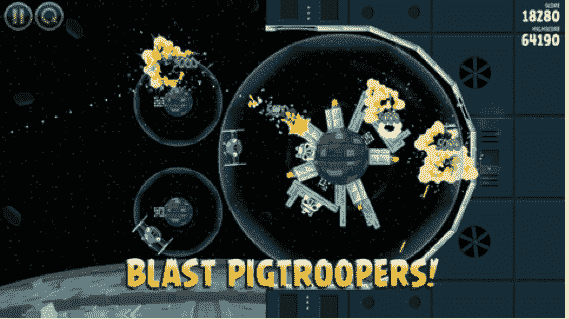

# 感受原力:Rovio TechCrunch 表示,《愤怒的小鸟:星球大战》以创纪录的 2.5 小时位居美国应用商店榜首

> 原文：<https://web.archive.org/web/https://techcrunch.com/2012/11/09/feel-the-force-angry-birds-star-wars-tops-u-s-app-store-in-record-2-5-hours-says-rovio/?utm_source=feedburner&utm_medium=feed&utm_campaign=Feed%3A+Techcrunch+%28TechCrunch%29>

# 感受原力:Rovio 表示,《愤怒的小鸟:星球大战》以创纪录的 2.5 小时位居美国应用商店榜首

Rovio 的[愤怒的小鸟星球大战混搭](https://web.archive.org/web/20221208065229/https://beta.techcrunch.com/tag/angry-birds-star-wars/)昨天发布——仅用了 2.5 小时就登上了美国应用商店的榜首。在[的博客](https://web.archive.org/web/20221208065229/http://www.rovio.com/en/news/blog/243/angry-birds-star-wars-makes-the-jump-to-hyperspace)中公布了这一数字，游戏制造商指出其最新版《愤怒的小鸟》飙升至排行榜首位的速度打破了其之前的所有记录。

这款游戏目前还高居英国 iOS 应用商店付费应用排行榜榜首。

《愤怒的小鸟星球大战》将愤怒的小鸟重新塑造成勇敢的反叛者，在超过 80 个星球大战主题的关卡中与邪恶的帝国猪战斗。

Rovio 还没有公布《愤怒的小鸟:星球大战》的实际下载量，但是早期迹象表明它的摇钱树仍然健康。

