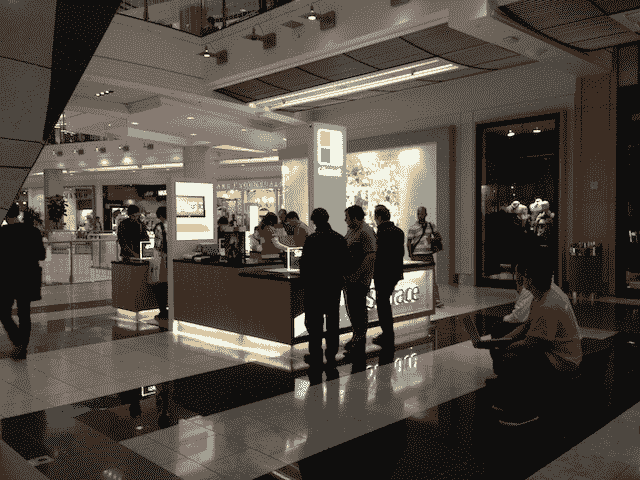
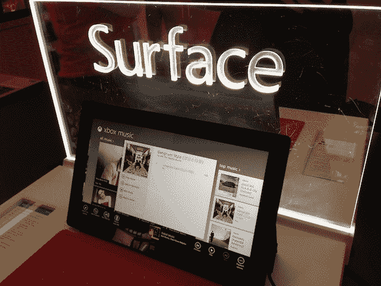
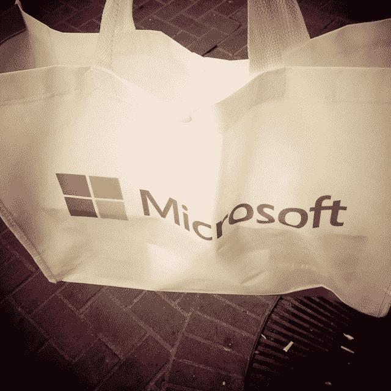

# 火星表面:我与微软展台的约会 TechCrunch

> 原文：<https://web.archive.org/web/https://techcrunch.com/2012/11/11/youre-really-going-to-want-to-read-my-surface-review/>

“地表最好的特征是什么？”

“嗯，一切。”

我在当地一家商场购买微软 Surface 的经历就这样开始了。

是的，我买了一台 Surface——我是苹果所有产品的爱好者，也可能是 iPad 的最大粉丝。对我来说，了解竞争环境对我继续思考苹果平板电脑很重要。这也是我玩和评论我非常喜欢的 Nexus 7 的原因。而且，如果某样东西是最好的，我会用它——不管是不是苹果制造的。可能会让你们中的一些人感到震惊，但事实是。

不幸的是，虽然谷歌很高兴送我一部 Nexus 7(嗯，也许“高兴”不是一个正确的词，但他们想知道我的想法是好的)，但微软想尽办法确保我*不会*得到一部 Surface review unit。公司内外有几个人想给我弄一个，都被否决了。我仍然不清楚这是因为他们认为我有偏见，还是因为他们觉得这款设备不够好。

不管怎样，都很傻。如果我写一些不诚实的东西，我只是在搬起石头砸自己的脚。如果我说 Surface 很烂，很棒，我看起来像个傻子。另外，微软也不能阻止我自己去商店买一个，想写什么就写什么。我就是这么做的。以及我要做的事。

稍后会有评论(我想实际上先花时间使用它)。首先，我想写一点关于*购买*Surface 的经历。当我本周早些时候在推特上说我打算买一个时，大量的回复都是询问这个问题。我认为这主要是因为 [Marco Arment 关于他在微软商店的经历](https://web.archive.org/web/20221002183427/http://www.marco.org/2012/10/26/an-alternate-universe)的精彩帖子。我的故事有点不同，因为我实际上不在商店里。相反，我是从安装在旧金山市中心购物中心的微软弹出式售货亭里买的。

这是一个好看的亭子。这看起来就像苹果公司可能会做的那种信息亭。很多很多坚实干净的表面。很多发光的玻璃。人们可以尝试许多表面。与大多数微软商店不同，这个售货亭并不在苹果商店的正对面，但那只是因为在这个商场里没有苹果商店。相反，它在 J.Crew 之外，这可能是次好的事情，因为 J.Crew 董事长兼首席执行官米奇·德雷克斯勒是苹果董事会成员。

大约有六名穿着鲜艳纯色衬衫的员工在周围徘徊，回答任何问题，并演示一些表面功能。听他们中的一些人说，在炫耀什么方面，显然有一个脚本可以遵循，即 Office 支持和 Touch Cover。除了上面愚蠢的“一切”评论，“惊人的”、“神奇的”、“伟大的”和“酷的”到处都是。

是的，这和你在苹果商店听到的是同一类型的东西——但这就是重点。微软试图模仿这种体验，这很奇怪，也有点令人毛骨悚然。

但是员工们都很友好，看起来训练有素。(好吧，除了一个咳嗽的人，我不想让他靠近任何我会碰的东西——Surface:细菌版。有一次，他们中的一个人开玩笑说，他们不能拿起桌子上的 iPhone，因为微软可能有摄像头监视这种敌对的异物。至少我认为这是个玩笑。

售货亭里有很多顾客——虽然没有挤满人，但人们还是不停地进进出出。虽然在我在那里的半个小时里，我只看到一个 Surface 真的被买走了——我买的那个。

当被问及销售情况时，一名员工说他们“卖了一吨”。另一个人说他们在“卖很多”。当被问及是否可以想买多少就买多少时(当然是问他们是否还有很多库存)，答案是“当然！”

至少还有两个客户询问了即将推出的“Surface Pro ”,它将运行更全面的 Windows 8 版本。在这里，员工不太愿意帮忙。当有人问专业版什么时候会推出时，回答是“我不知道”。“他们不会告诉我们这些事情。”

许多顾客在理解表面手势时有问题，所以员工会介入帮助。向右滑动打开一个菜单。从底部向上滑动以打开另一个。向下滑动应用程序以将其关闭。这种困惑是可以理解的，因为当你启动 Surface 时会有一个教程向你展示这些手势，但显然一个刚刚开始玩运行单元的客户不会看到这一点。

仅仅从几分钟的演示来看，这个软件似乎相当有问题。内置社交 app 一直挂着。地图非常慢。人们会移除触摸盖并旋转屏幕，但软件没有响应，所以他们会做出更大的旋转手势。这显然不是一个理想的演示体验。

很多人特别想试试键盘——无论是触摸键盘还是打字键盘。许多人一开始在 Touch Cover 上打字都有问题(我也是)，但 Type Cover one 似乎工作得很好。只有一个演示单元有一个 Type Cover，其余的都配有不同颜色的 Touch Covers。没有没有键盘的展示面——这应该是一个平板电脑，对吗？

一名 kiosk 员工表示,“99%的”购买 Surface 的人同时也购买了一个键盘(或者一个带有触摸盖的更昂贵的套装)。这位员工说，触摸键盘和打字键盘的销售比例大约是 50/50。

售货亭也有充足的《光环 4》供应。我觉得这有点奇怪，因为他们不卖 Xboxes。但我想这是有道理的——“嘿，孩子，上来吧，我们有糖果！”

结账时，我被要求提供我的姓名和电子邮件地址，但我保证不会收到垃圾邮件。当我付款时，我不得不走到柜台后面用手指签名——这看起来有点像方形签名流程，但它不是。大约 650 美元(税后)给了我一个 Surface 和一个红色/橙色的 Touch Cover。

总的来说，我觉得这次经历并不像阿蒙特那样消极。但是，我只是在一个售货亭，而不是真正的商店。这些员工并不太咄咄逼人或令人讨厌，其中几个人在解释产品功能时甚至显得非常兴奋(一个人显然喜欢分屏模式，这很酷)。他们当然没有推动我去销售，对此我非常感激。事实上，当我说我想买一个时，我发誓他们看起来很惊讶。

达成交易的员工手腕上戴着一个有趣的东西:一只 iPod nano 手表。“这是一份礼物，”他笑着说。

当然是了。

**更新** : [这是我的完整评论](https://web.archive.org/web/20221002183427/https://beta.techcrunch.com/2012/11/19/i-got-one-but-i-dont-get-it/)。

