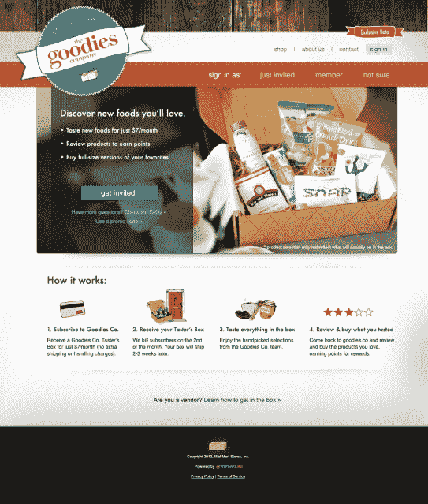
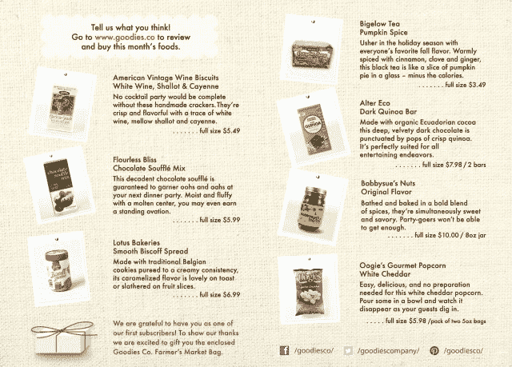

# 与初创公司竞争，沃尔玛推出食品订阅服务 Goodies.co，每月 7 美元

> 原文：<https://web.archive.org/web/https://techcrunch.com/2012/11/14/undercutting-startups-walmart-launches-food-subscription-service-goodies-co-for-7-per-month/>

沃尔玛对基于订阅的商务的试验今天仍在继续，公开推出了[Goodies.co](https://web.archive.org/web/20230403230116/https://www.goodies.co/)，这是一项食品订阅服务，每月运送一盒样品大小的美食。这项服务是沃尔玛位于硅谷的创新实验室 [@WalmartLabs](https://web.archive.org/web/20230403230116/http://www.walmartlabs.com/) 最新推出的，该实验室专注于快速构建、推出和测试新的商业模式，这些模式可能会也可能不会在晚些时候进入 Walmart.com 或沃尔玛商店。

[@WalmartLabs](https://web.archive.org/web/20230403230116/http://www.walmartlabs.com/) 在沃尔玛内部经营着一家类似于初创公司的公司，这些年来通过收购其他初创公司而发展壮大，包括 [Kosmix](https://web.archive.org/web/20230403230116/https://techcrunch.com/2011/04/18/walmart-ventures-into-the-social-media-space-with-acquisition-of-kosmix/) 、 [OneRiot](https://web.archive.org/web/20230403230116/https://techcrunch.com/2011/09/13/walmart-acquires-mobile-and-social-ad-targeting-startup-oneriot/) 、 [Grabble](https://web.archive.org/web/20230403230116/http://gigaom.com/2011/11/09/scoop-walmart-acquires-grabble) 和 [Small Society](https://web.archive.org/web/20230403230116/https://techcrunch.com/2012/01/04/walmartlabs-acquires-mobile-agency-small-society/) 。该集团通常专注于电子商务项目，比如去年推出的礼物推荐服务 Shopycat。顺带一提，Shopycat 是@ WalmartLabs 的成功案例之一——它提供的总部位于脸书的礼物建议现在正赶在这个假期之前进入 WalmartLabs。另一个实验室创新，北极星，现在也是 Walmart.com 的搜索引擎。

沃尔玛将开始测试名为 Goodies.co 的基于订阅的商务服务的消息是在今年五月首次披露的，预计将在“一两个月内”推出然而，这项服务最终在 8 月推出了测试版。最初由沃尔玛员工测试，后来通过口口相传进一步传播，Goodies.co 现在在美国拥有 3000 名用户

Goodies 的顾客每月只需支付 7 美元就能买到一盒 6 到 8 个样品，否则零售价为 15 美元。价格包含税和运费，是当今市场上最便宜的电商食品订阅服务之一。相比之下，创业公司[爱吃](https://web.archive.org/web/20230403230116/http://lovewithfood.com/)，[毕业于 500 创业加速器](https://web.archive.org/web/20230403230116/https://techcrunch.com/2012/07/10/love-with-food-645k-seed/)，一盒八样东西每月收费 10 美元。 [Pop-Up Pantry 的](https://web.archive.org/web/20230403230116/https://popuppantry.com/)餐盒每月起价 17 美元，健康零食服务 [Sprigbox](https://web.archive.org/web/20230403230116/https://sprigbox.com/plans) 每月起价 26.95 美元，一盒 10-13 种食品。

 和这个领域的其他产品一样，沃尔玛的产品包括各种独特的美食产品，手工、有机、无麸质或其他健康产品的组合，既来自沃尔玛广泛的供应商群体，也来自刚刚上市的新公司。

目前，沃尔玛的目标不是从订阅服务中获利，而是对测试订阅商业模式本身的可行性感兴趣，这种商业模式在很大程度上仍未经证实。据@WalmartLabs 的产品副总裁 Ravi Raj 称，他的团队“相当有信心”能够吸引成千上万的客户使用这项新服务。“但一旦我们达到一定规模，这对沃尔玛来说将开始变得有意义，”他补充道。当被问及规模会有多大时，拉吉拒绝回答。

现在是第四个月了，Goodies 向更广泛的受众敞开了大门，允许任何人从今天开始注册这项服务的邀请。Raj 说，这些邀请将按照先到先得的原则发放。不幸的是，并不是每个人都会在年底收到他们的奖金。这在很大程度上取决于需求以及 Goodies 能以多快的速度满足需求。

沃尔玛不只是用商品来测试消费者对基于订阅的商务的兴趣。零售商也有兴趣收集盒子中产品的数据，以帮助其确定是否在 Walmart.com 上库存该商品。虽然沃尔玛还没有对迄今为止参与的 30 多家供应商做出任何承诺，但无论是实体货架还是虚拟货架，都有供应商在私下测试期间向沃尔玛免费提供样品。

为了获得顾客对商品的反馈，沃尔玛鼓励用户在配套的 Goodies.co 社交网站上留下商品评级和评论。这样做的交换条件是，客户可以获得忠诚度积分，这些积分可以在将来兑换成一个免费的盒子。这些数据，加上从 Goodies.co 购买全尺寸商品的顾客的销售数据，是沃尔玛决定是否有任何商品值得在沃尔玛网站上移动的依据。

为了让你知道盒子里可能有什么样的东西，11 月的“轻松娱乐”主题盒子包括葡萄酒饼干、南瓜蛋奶酥、黑巧克力浸泡的藜麦棒、白切达爆米花等。鉴于订阅商务服务已经覆盖了从美容用品到鞋子的所有领域，另一个大问题是，为什么沃尔玛要从食品开始测试？

“我们觉得有很大的创新空间，尤其是在食品领域。拉吉解释说:“食物是一个非常有趣的社交类别，人们喜欢谈论他们发现的新食物。“作为美国最大的杂货商，这符合沃尔玛的优势。这就是我们挑选食物的原因。”