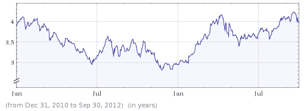
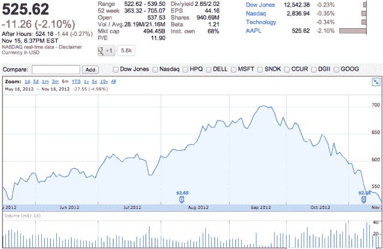

# 苹果股价跌至六个月来的最低点，而且看不到见底的迹象 TechCrunch

> 原文：<https://web.archive.org/web/https://techcrunch.com/2012/11/15/apples-stock-price-is-crashing-and-the-bottom-is-not-in-sight/>

美好的时光不可能永远持续。最终音乐消失了，气球爆了，每个人都回家了。

不要发出夸张的警报，让我们看看事实。苹果股价自 9 月 19 日 iPhone 5 发布前两天开始稳步下跌。自 9 月份以来，股价已经下跌了 25%。股票价格今天以六个月来的最低点收盘。今年的价格仍然上涨了 30 %,但远低于几个月前 74%的涨幅。

分析师仍然看好苹果。据雅虎财经报道，本月有更多的分析师像上个月甚至三个月前一样，推荐 AAPL 股票买入。但是股票的价格很贵。为了让股价上涨，它需要新的投资者，而苹果似乎正在失去这一点。

[美国消费者新闻与商业频道提醒](https://web.archive.org/web/20221208011636/http://www.cnbc.com/id/49842457)我们，共同基金和对冲基金构成了苹果公司相当大的一部分股东。现在，不知什么原因，他们正在抛售股票。没有这些资金做后盾，股价自然会下跌。

然而，当挖掘得更深入一点时，美国消费者新闻与商业频道有点太惊人了。说到体积，苹果在过去的三年里一直非常稳定。如果股价要下跌，会随着时间的推移慢慢发生。从经济角度来看，苹果并没有经历一场弄巧成拙的预言。

此外，对 iPhone 5 的期待也很重要。和往常一样，市场倾向于预测产品发布，并在股价中反映出来。从 7 月 2 日到 9 月 19 日，股价上涨了 18%。

除此之外，截至 2012 年 9 月 30 日，2012 年第三季度和第四季度的市值与收入之比实际上有所增加。现在判断它是否会在 2013 年 Q1 减少还为时过早，因为苹果预计将达到公司历史上最大的收入，因此股价可能会双向波动。然而，在 9 月 30 日，AAPL 的股价是苹果年收入的四倍。这对于一家老牌公司来说令人印象深刻，对于苹果这样的巨头来说更是如此。

*市值/年收入*

最后，苹果公司在 9 月和 10 月发布了多个重要产品，为假期做准备 iPhone 5、iPad mini、新款 ipod、新款 iPad、iMac、MacBook Pro 和 Mac mini。在如此短的时间内发布如此多的产品对苹果来说是一个前所未有的选择，这肯定会增加 Q1 2013 年的收入。在连续两个季度低于或符合预期后，投资者正在等待这些收益。共同基金和对冲基金也可能卷土重来。

今天，苹果仍然是三个月前的那家公司。它仍然拥有同样的资产负债表和畅销产品。不要认为像竞争对手 Nexus 4 或 Mapgate 这样的东西可以像这样推动市场。iPad mini 可能会成为今年最热门的节日礼物，iPhone 5 的销量可能会超过地球上所有其他智能手机。这些都没有改变。

但是很难否认苹果公司发生了一些变化。

公司里有一种不同的感觉。该公司曾经是一个对抗权势集团的好斗的失败者，随着每一个新发布的产品，它的受欢迎程度(和股价)直线上升。然后，几乎在一夜之间，苹果从一个小家伙变成了一个要被打败的人。从大卫*到*歌利亚。随着这种变化，许多充满希望的乐观情绪慢慢消失了。

为了让现有投资者满意，苹果正在慢慢地从一只超级明星股票转变为一只以适中的利率支付公平股息的股票。经典的蓝筹股。下一个 IBM 或家得宝。自 1995 年以来，苹果公司第二次在上周支付季度股息。

股价是衡量一家公司健康状况的愚蠢指标。它可能只是说了一些关于苹果的身份。虽然在可预见的未来，苹果的股价可能会下跌，但该公司本身将继续推出最畅销的产品和服务。

Romain Dillet 对本文有报道贡献。