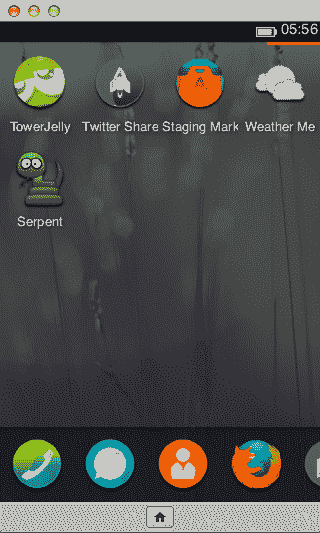
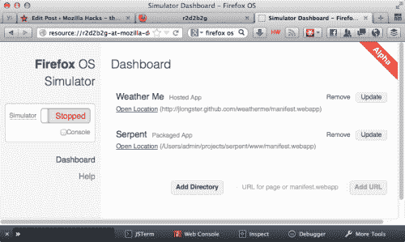

# Mozilla 为 Firefox OS TechCrunch 推出基于浏览器的实验模拟器

> 原文：<https://web.archive.org/web/https://techcrunch.com/2012/11/15/mozilla-launches-browser-based-simulator-for-firefox-os/>

# Mozilla 为 Firefox OS 推出基于浏览器的实验模拟器

Mozilla 的 [Firefox OS](https://web.archive.org/web/20221207045142/https://developer.mozilla.org/en-US/docs/Mozilla/Firefox_OS) (也被称为 Boot to Gecko)，一个专注于 HTML、CSS 和 JavaScript 等 web 技术的移动操作系统，正在快速地通过其开发阶段。虽然在许多手机上安装火狐操作系统[已经成为可能](https://web.archive.org/web/20221207045142/https://developer.mozilla.org/en-US/docs/Mozilla/Boot_to_Gecko/Installing_Boot_to_Gecko_on_a_mobile_device#Added_step_for_the_Samsung_Galaxy_S2)，火狐操作系统团队今天[发布了它的火狐操作系统模拟器](https://web.archive.org/web/20221207045142/https://hacks.mozilla.org/2012/11/announcing-the-prototype-firefox-os-simulator/)。该模拟器仍被认为是“实验性的”，基本上是一个 Firefox 插件，应该可以在 Windows，Mac 和 Linux 上运行(尽管目前 Linux 和 Windows XP 存在一些已知问题)。

 一旦安装完毕，模拟器将会自动更新来自 Boot to Gecko (B2G)项目的最新快照，这样那些想开始为新操作系统开发应用程序的开发者就不必担心使用过时的版本了。正如 Firefox OS 团队在今天的公告中指出的，“Firefox OS 模拟器是目前试用 Firefox OS 应用程序并验证它们在[提交到市场](https://web.archive.org/web/20221207045142/https://marketplace.mozilla.org/developers/docs/mkt_submission)之前的外观的最简单方式，”组织为移动 web 应用程序开发的[新应用程序商店](https://web.archive.org/web/20221207045142/http://www.mozilla.org/en-US/apps/)。

Mozilla 指出，与其他模拟器不同，Firefox OS 模拟器不会创建虚拟计算机。相反，这个插件本质上是给浏览器带来了 [B2G 桌面](https://web.archive.org/web/20221207045142/https://developer.mozilla.org/en-US/docs/Mozilla/Boot_to_Gecko/Using_the_B2G_desktop_client)——操作系统的桌面版本。Mozilla 之前在 10 月份推出了一款 B2G 手机模拟器,但在当时，这个项目仍然被认为是一个高度实验性的原型。

Mozilla 希望很快发布模拟器的 1.0 版本(今天发布的是 0.7 版本)。该团队希望在 1.0 版本中实现的主要目标是“让运行 B2G 和安装你正在开发的应用程序变得容易”

如果你对火狐操作系统的开发感兴趣，也可以看看在 [Mozilla 的开发者博客](https://web.archive.org/web/20221207045142/https://hacks.mozilla.org/)上关于项目的一些[最新帖子](https://web.archive.org/web/20221207045142/https://hacks.mozilla.org/2012/11/hacking-firefox-os/) [。](https://web.archive.org/web/20221207045142/https://hacks.mozilla.org/2012/11/firefox-os-video-presentations-and-slides-on-the-os-webapis-hacking-and-writing-apps/)

