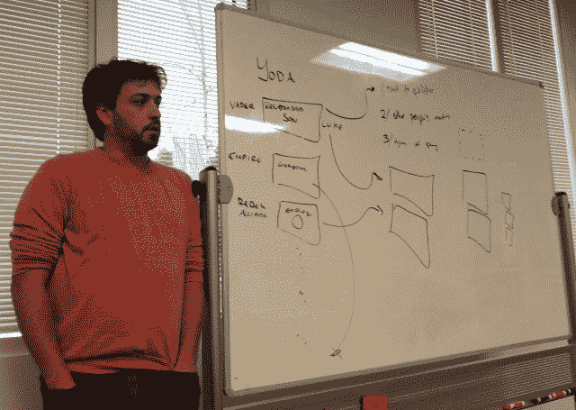
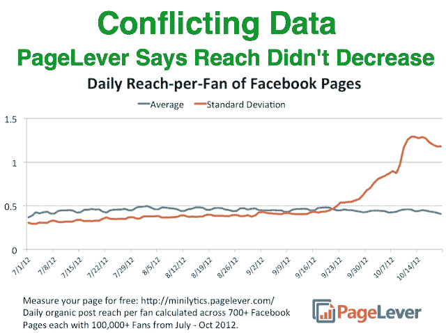
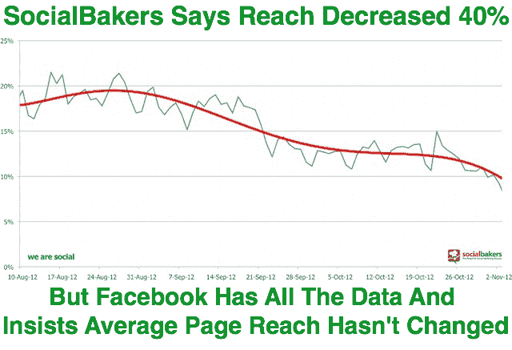

# 脸书解释了新闻分类的四种方式，并坚持认为平均页面到达率没有下降 TechCrunch

> 原文：<https://web.archive.org/web/https://techcrunch.com/2012/11/16/facebook-page-reach/>

今天，脸书解决了围绕新闻提要的争议和一些页面可及性的降低。它概述了决定一篇文章是否会出现在新闻提要中的四个主要因素，并坚持认为页面到达率总体上没有下降。然而，新闻订阅算法的改变确实开始减少收到投诉的页面，并成功地将投诉总数减少了两位数。

脸书的新闻订阅产品经理 Will Cathcart 今天早上在脸书总部告诉一屋子的记者，“我们在新闻订阅方面面临的问题是，人们每天都来脸书，但人们没有足够的时间来查看正在发生的一切。”

因此，为了确定任何给定页面的帖子是否会出现在新闻提要中，脸书考察了四个主要因素:

1.  如果你以前和某个作者的帖子有过互动:如果你喜欢脸书展示给你的某个页面上的每一个帖子，它会从那个页面上展示给你更多。
2.  其他人对某个帖子的反应:如果脸书上的其他人看到某个帖子后都不理睬或抱怨，他们就不太可能会给你看那个帖子。
3.  你过去与同类型帖子的互动:如果你总是喜欢照片，你会有更好的机会看到页面上发布的照片。
4.  如果某个帖子被其他浏览过它的用户投诉，或者发帖的页面在过去收到过很多投诉，你就不太可能看到那个帖子。从 2012 年 9 月开始，这一因素变得更加普遍。

卡斯卡特用一个星球大战主题的例子来解释这些是如何工作的。假设达斯·维达发帖说他和卢克·天行者已经确认他们是父子。为了确定尤达是否在他的新闻提要中看到了这篇帖子，脸书会查看:尤达过去是否喜欢过维德的帖子或与之互动，脸书给莱娅和汉·索洛看维德的关系帖子时，他们是否喜欢，尤达过去是否倾向于与关系变更帖子互动，以及是否有其他人抱怨过维德或这位西斯尊主的这个帖子。

脸书经常对其新闻订阅排序算法进行修改，通常被称为 EdgeRank，这与谷歌修改 PageRank 的方式类似。脸书表示，它调整了衡量这些因素的方式，试图提高参与度和总体满意度。根据卡斯卡特的说法，也许某些页面的覆盖范围会减少，但总体来说，人们会更多地与新闻互动。

脸书在 9 月份做了一次重大修改。用户可以点击任何新闻源帖子旁边的下拉箭头进行投诉，举报为垃圾邮件或将其隐藏，并表示他们不想看到更多类似的帖子。卡斯卡特说:“我们开始惩罚投诉率高于平均水平的事情，奖励投诉率低于平均水平的事情。脸书认为这一改变是成功的，因为参与度提高了，“投诉以两位数的百分比下降了。"

然而，卡斯卡特证实，虽然调整“对页面产生了不同的影响，但在算法改变后，页面内容的中值范围相对没有变化。但这将对不同的页面产生不同的影响，这取决于这些页面与谁以及这些人与什么其他东西相关联。

然而，关于对平均可及范围的实际影响，有相互矛盾的报告。一些像 [PageLever 说它保持稳定](https://web.archive.org/web/20221007215635/https://beta.techcrunch.com/2012/11/07/killing-rumors-with-facts-no-facebook-didnt-decrease-page-news-feed-reach-to-sell-more-promoted-posts/)，但是其他像 [We Are Social 和 SocialBakers 说](https://web.archive.org/web/20221007215635/http://wearesocial.net/blog/2012/10/react-halved-reach-facebook/)平均页面到达下降了 50%。这真的伤害了一些企业，这些企业依靠脸书页面帖子带来的流量来购买或展示广告。一些对算法变化嗤之以鼻的企业错误地得出结论，脸书故意降低他们的覆盖范围，以迫使他们购买其推广的帖子广告——要求页面付费，以提高特定帖子的覆盖范围。

但这才是真正的交易。这些分析提供商只查看相对较少的页面，通常不到 1000 页。脸书广告公司的产品营销总监马特·伊德玛告诉我，这些研究表明，“一切都取决于你在看哪一组页面，以及你在看多少页。我们在看所有的页面。中值范围没有减少。”但是平均范围呢？Idema 关闭了这个说，至于中间值和平均到达之间的差异，“我很确定他们是不可区分的。”

所以基本上，如果一家分析公司的客户的页面访问量大幅下降，那么这家公司的客户就更有可能收到投诉。为了确保万无一失，我与脸书再次核实，他们确认平均页面到达率没有下降。那么，为什么所有的喧嚣？因为覆盖范围增加或保持不变的页面不会引起波澜，但是那些覆盖范围减少的页面会发出很大的声音。

社交网络希望新闻提要成为最美味的内容煎蛋卷，这意味着它必须打破几个鸡蛋。但是它想给用户任何他们想看的东西。卡斯卡特引用了脸书的游戏提要，它让游戏玩家只能看到能帮助他们获胜的游戏帖子。脸书上周刚刚推出了一个专门的页面 feed，让人们看到他们最喜欢的企业和组织的 feed，而他们的朋友被过滤掉了。Idema 表示，它计划在这方面做得更多。我会说，一个专门的购物或新闻供稿可以在工程中。是的，一个新闻提要。

脸书从未像今天这样对新闻分类算法进行重大修改。尽管它正在寻求创造更好的用户体验，并且[证实它不会做出改变来销售更多的广告](https://web.archive.org/web/20221007215635/https://beta.techcrunch.com/2012/11/07/killing-rumors-with-facts-no-facebook-didnt-decrease-page-news-feed-reach-to-sell-more-promoted-posts/)，一些企业还是受到了伤害。这是一个不幸的现实，依赖像脸书这样的集中营销渠道，而不是像电子邮件这样的开放渠道。脸书给予，脸书夺走。