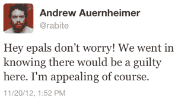

# Goatse Security 的 Auernheimer 因 iPad 网站黑客案被判有罪

> 原文：<https://web.archive.org/web/https://techcrunch.com/2012/11/21/conviction-in-ipad-website-hacking-case/>

# Goatse Security 的 Auernheimer 在 iPad 网站黑客案件中被判有罪

周二下午，在新泽西州纽瓦克的联邦法院，陪审团判定 Andrew“Weev”Auernheimer 有罪，原因是他在 2010 年的一次入侵中扮演了角色，该入侵导致美国电话电报公司账户维护网站泄露了 iPad 用户的 114，000 个电子邮件地址。Auernheimer 被指控的两项罪名成立:未经授权阴谋访问计算机( [18 U.S.C. 1030](https://web.archive.org/web/20230304220647/http://www.law.cornell.edu/uscode/text/18/1030) (a)(2)(C)，1986 年《计算机欺诈和滥用法》的一部分)和与个人信息有关的欺诈( [18 U.S.C. 1028](https://web.archive.org/web/20230304220647/http://www.law.cornell.edu/uscode/text/18/1028) (a)(7))。

[正如我所料](https://web.archive.org/web/20230304220647/https://techcrunch.com/2012/11/18/ipad-hacking-trial-underway-with-big-implications-for-computer-law/)，陪审团——可能是因为集体考虑感恩节火鸡——只商议了一两个小时就达成一致有罪判决。欧恩海默的律师托尔·埃克兰德(Tor Ekeland)表示，这一判决“并不出人意料”，他将很快为欧恩海默提起上诉。Auernheimer 自己也发了类似的想法:

Auernheimer 定罪后的推文

在判决后回家的路上，埃克兰德告诉我，他认为“任何合法的安全研究人员都应该关注”这个案件，因为 Auernheimer 没有绕过设计糟糕的美国电话电报公司网站的任何安全措施。上诉的焦点将是计算机欺诈和滥用法案本身，而不是案件的事实，这似乎没有明显的争议。

Auernheimer 在大约 90 天后被判刑前一直在保释中。每一项定罪都将被判处长达五年的徒刑。