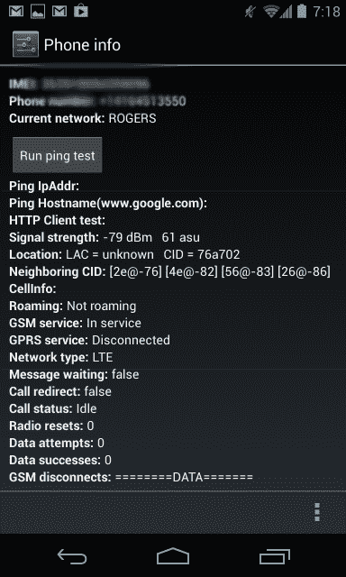
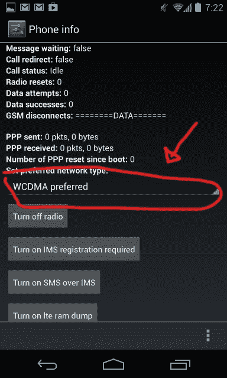
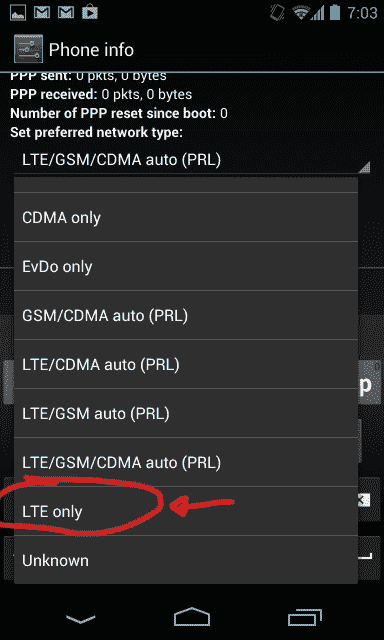
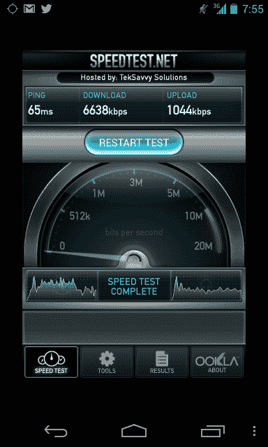
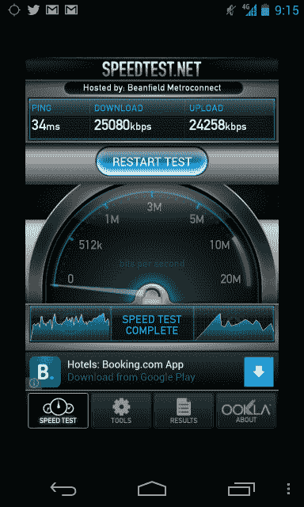

# 如何在谷歌 Nexus 4 TechCrunch 上启用 4G LTE

> 原文：<https://web.archive.org/web/https://techcrunch.com/2012/11/23/how-to-enable-4g-lte-on-the-google-nexus-4/>

今天早上有报道称，谷歌最新的旗舰 Android 智能手机 Nexus 4 通过一个相对简单的软件黑客支持 LTE。经过测试，结果证明确实如此，所以我将向您展示如何在您的设备上启用它。公平的警告:Nexus 4 仅支持 AWS 频段(1700 或 2100MHz)的 LTE，该频段目前用于加拿大的 LTE 网络，以及 T-Mobile 刚刚起步的 4G 网络所服务的一些地区。

## 步骤 1:访问电话测试设置

你的电话拨号器是进入系统菜单的关键，在那里你可以切换你的收音机偏好。只要打开你的手机应用程序，输入 ***#*#4636#*#*** ，它会立即带你到下面看到的必要的偏好面板。如果你不想每次想改变这些设置时都要重新输入这个序列，你也可以从 Google Play 下载并安装[手机信息应用](https://web.archive.org/web/20221208174536/https://play.google.com/store/apps/details?id=myc.phone.PhoneInfo&feature=search_result#?t=W251bGwsMSwxLDEsIm15Yy5waG9uZS5QaG9uZUluZm8iXQ..)(该应用也保持打开，所以只要它最近一直处于活动状态，你就可以通过 Android 的应用切换器调用它)。

## 步骤 2:更改手机的蜂窝网络类型

在此屏幕上，您可以在“首选网络类型”下拉菜单下切换手机连接的网络。有 CDMA、GSM、LTE 等多种组合的选项。

在我的测试中，我发现让 LTE 真正发挥作用并取而代之的唯一可靠方法是将你的首选网络设置为“仅 LTE”使用 LTE、GSM 和 CDMA 之间的自动选择选项似乎只会导致手机默认回到可用的 HSDPA+速度，尽管我看到其他用户在任何包含 LTE 的选项上都取得了成功。

## 第三步:更改你的 APN 设置

深入了解设置、移动网络、接入点名称并更改您的 APN 设置。 [XDA 开发者论坛](https://web.archive.org/web/20221208174536/http://forum.xda-developers.com/showthread.php?t=2007943&page=8)向您展示了多种方式，以及您需要根据您的运营商更改哪些值才能使其工作。您只需将 Rogers 用户的 APN 名称更改为“lteinternet.apn”

## 享受速度的提升

看起来似乎应该有更多，但事实并非如此。更改无线电设置后，您的手机应断开网络连接，然后以 LTE 速度重新连接。我立即进入 Speedtest 查看差异，你瞧，下载速度和上传速度都出现了爆炸式增长。

**HSPA+速度**

**LTE 速度**

## 警告

这很好，在可预见的未来，我将使用我的 Nexus 4 硬切换到 LTE 频段，但需要记住一些事情。首先，这在技术上是一种后门伎俩，尽管它相对简单，不需要任何核心黑客。这意味着，如果有理由的话，谷歌有可能关闭这个漏洞。其次，很难说在一部表面上并非为 LTE 设计的手机上启用 LTE 会如何影响设备的电池寿命。Nexus 4 在这方面的表现本来就不是最强的，所以我有点担心最终的效果，但不足以阻止我使用那些甜蜜的 LTE 速度。

如果出于任何原因，你想在启用后关闭它，只需遵循上述相同的步骤，并选择一个与你的运营商网络兼容的首选连接速度，但不包括 LTE 选项。

**更新:**事实证明，由于某种原因，启用 LTE 会破坏 Google Now 连接网络的能力。这太糟糕了，因为 Google Now 可以说是 Android 4.2 最好的功能之一，但如果你可以没有它，LTE 速度是一个很好的权衡。