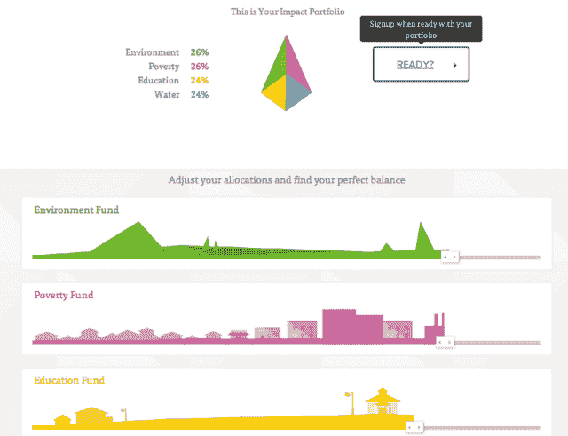
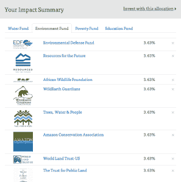
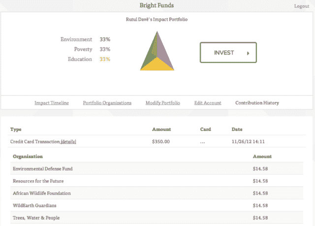

# 非营利共同基金:光明基金希望成为慈善捐赠的先锋

> 原文：<https://web.archive.org/web/https://techcrunch.com/2012/11/26/mutual-funds-for-non-profits-bright-funds-wants-to-be-the-vanguard-for-charitable-giving/>

在紧要关头，人们喜欢捐赠，尤其是当他们相信他们的捐赠(无论是金钱、时间、食物还是财产)会带来真正的改变时。虽然在线慈善和筹款平台[使得向公益事业、慈善机构和非营利组织捐赠](https://web.archive.org/web/20230326183556/https://techcrunch.com/2012/11/21/group-funding-platform-crowdtilt-opens-to-non-profits-now-offers-tax-deductible-donations-receipts/)比以往任何时候都更容易，但基于网络的慈善事业仍有很大的改进空间。

今天，捐赠者，尤其是那些在 Web 2.0 时代成长起来的人，对网上缺乏愉快的捐赠体验感到沮丧。更不用说，随着今天网上信息的普及，捐赠者希望在与非营利组织的交往中承担更多责任，从而更加关注结果。换句话说，他们想知道他们的捐赠是否(以及如何)产生影响。

这是 Rutul Davé和 Ty Walrod 看待非营利筹款空间的方式，也是他们今天推出 Bright Funds 的原因——这是一个旨在改变人们慈善捐赠方式的平台。作为“为良好运营而冒险”新浪潮的一部分，光明基金试图通过将非营利世界的社会目标与私人投资的元素结合起来，创造出它希望成为慈善捐赠的“[先锋](https://web.archive.org/web/20230326183556/http://en.wikipedia.org/wiki/The_Vanguard_Group)”的东西，从而在竞争中脱颖而出

该平台创建了一套由 10 至 15 个非营利组织组成的“共同基金”，并允许用户投资这些基金，同时围绕特定的事业建立个性化的投资组合。在启动时，这家初创公司的共同基金专注于四个领域:扶贫、水、教育和环境。例如，教育基金包括像为美国而教、KIPP 基金会、Jumpstart 和 iMentor 这样的非营利组织，并将其选择的组织分组，如“资源和基础设施”或“无障碍教育”

每个非营利组织都属于其中一个子群(或“层面”)，前提是用户可以更全面地投资教育，触及其每个主要类别，而不是将所有投资集中在一个领域，如资源和基础设施。用户还可以在光明基金提供的非营利基金中挑选，从一个团体投资两个，从另一个团体投资三个，以此类推。

Walrod 告诉我们，这个想法是为了给慈善捐款带来更个性化的感觉，允许用户管理他们在投资组合中的投资，例如，将 60%的捐款分配给水资源，40%分配给教育，就像他们在公共市场投资一样。

反过来，这意味着，在一次交易中(任何金额，光明基金都不限制任何一端的捐款)，用户可以在每个基金的选定非营利组织中平均分配他们的捐款。如果投资者希望将他们对水资源的贡献增加一倍，光明基金会自动将其分散到用户的投资组合中，公司和捐赠者可以进行一次性或经常性投资。

至于成本，在启动时，开设和维护光明基金账户是免费的，捐款完全可以免税。这家初创公司为用户产生收据，一旦投资完成，就可以获得收据，并且可以从任何光明基金的账户中获得。在非营利方面，光明基金从其组织收取 7.5%的“筹款费”，包括信用卡处理和交易费用等。目前，捐赠者还不能直接从他们的银行账户付款，但这家初创公司希望在未来几个月内增加这种支持。

这项服务的另一个很酷的特点是，它提供了一键纳税报告，所以，因为它跟踪每一美元给非营利组织，在年底(或任何时候)，光明基金可以生成一份免费的报告，捐赠者可以用它来记录一年的捐赠。

从这些方面来看，光明基金确实开始感觉像一个非盈利、免税的私人投资和资产管理机构。沃罗德说，他喜欢把光明基金想象成一个经纪人，把用户的捐款想象成他们对共同基金的投资，每一笔捐款都是为“投资目标”量身定制的——在这种情况下，用户想要支持的目标是“投资目标”，而不是你自己的财务目标。

因此，与任何优秀的经纪商、资产管理服务或金融提供商一样，光明基金希望将整个市场固有的噪音转化为信号，展现最佳投资机会。对于聪明的基金来说，这意味着将美国数以百万计的非盈利机构精简到精华部分。

为此，这家初创公司利用独立组织的研究和评论，如 GiveWell、Charity Navigator、Philanthropedia 和美国慈善协会，选出了首批 50 家非营利组织。(然而，从 2013 年开始，它将增加两个额外的基金和一些新的非营利组织。这是很好的第一步，但是克服围绕慈善捐赠的信任缺失可能需要额外的数据来源。

说到这一点:总的来说，用户希望知道他们的捐赠对他们所捐赠的组织或事业产生了怎样的实际影响，因此作为其个人账户的一部分，光明基金提供了一个流媒体订阅源(类似于脸书的新闻订阅源)，让非营利组织能够让他们的捐赠者了解最新的结果。

 例如，如果用户选择向 Water.org 捐赠作为创业公司“水基金”的一部分，Water.org 将能够分享进度报告，向他们显示他们的捐款用于在孟加拉国农村修建一口井，从而使 15 个家庭首次获得了清洁的水。然后，非营利组织可以将捐赠者介绍给这 15 个家庭，让他们感觉自己是这个过程中更积极的参与者，并详细了解他们的慈善机构是如何发挥作用的。

除了这种社交整合(它还允许用户在脸书和包括 Yammer 在内的其他社交网络上与朋友和家人分享他们的投资组合)，Bright Funds 还为雇主提供了一种基于云的安全工具，他们可以将其集成到工资单或员工福利系统中。其想法是让公司能够匹配其员工的捐款，同时限制 IT 成本，使员工能够轻松管理他们的账户，并使企业能够在没有开销的情况下部署这一功能。

到目前为止，Bright Funds 已经筹集了一小轮种子资金，虽然这一轮最初在今年秋天结束，但创始人已经决定继续吸引投资者。称之为桥牌回合。这家初创公司的投资者包括总部位于旧金山的创新和创意实验室 Hattery，以及 Samasource 创始人兼首席执行官莱拉·贾纳(Leila Janah)等天使投资者。贾纳也是光明基金的顾问。

至于她为何对这家初创公司的潜力感到乐观，这位 Samasource 创始人表示:“光明基金将 Mint.com 的知名度和 Vanguard 的信任结合到了一项服务中，这项服务可以改善我们对非营利组织的投资方式，并彻底改变人们向慈善机构捐款的方式。”

