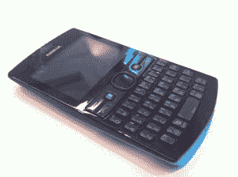
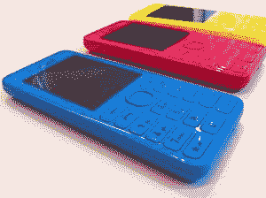

# 手机上的脸书按钮又回来了:诺基亚把社交网络旋钮放到了约 62 美元的 40 系列 Asha 205、205 双 SIM 卡 Qwerty 手机上

> 原文：<https://web.archive.org/web/https://techcrunch.com/2012/11/26/the-facebook-button-is-back-on-phones-nokia-puts-social-networking-knobs-on-62-series-40-asha-205-205-dual-sim-qwerty-handsets/>

在所有 Windows Phone、色彩夸张的 Lumia 炒作中，人们很容易忘记诺基亚销售的是一个成功得多的基于其 40 系列操作系统的手机系列。虽然在其第三财季仅售出 290 万部微软 Lumias，但诺基亚手机在该季度的总销量为 7660 万部——其中 650 万部是其 T2 Asha 全触摸手机。

诺基亚说，全球有 6.75 亿“当前用户”使用基于诺基亚 40 系列的手机。

全触摸 Asha 只是 [Asha 系列](https://web.archive.org/web/20221208235636/http://www.nokia.com/global/products/phones-catalogue/?action=catalogsearch&productfamilyasha=on#nk-main_menu_component)的一部分——总共有 12 款手机。或者直到今天，诺基亚刚刚增加了两个新型号，定于第四季度发布:即 **Asha 205** ，以及一个双 SIM 卡变体(显然足够称为 **Asha 205 双 SIM 卡**)，它有两个 SIM 卡插槽来支持多个 SIM 卡。这些最新的 Ashas 是 Qwerty 设备，而不是触摸屏手机。但与之前的 Qwerty Ashas 不同，如 201 和 302，它们的前面有一个专用的脸书按钮，可以直接跳转到你的社交网络个人资料。

这是诺基亚首次在其手机上添加脸书按钮。

当被问及脸书按钮是谁的主意——诺基亚还是脸书——诺基亚手机部门技术营销总监尼尔·布罗德里告诉 TechCrunch，这个按钮是与脸书“联合合作”开发的。“这在很大程度上是我们与脸书合作开发的。“这是一个共同的合作，”他说，并补充说:“我们与脸书在寻找我们拥有的机会方面进行了非常密切的沟通。”

当然，这不是第一个出现在手机上的脸书按钮。早在 2011 年，HTC 就推出了两款带有专用脸书按钮的手机，HTC ChaCha 和 HTC Salsa——伴随着发布会的是扎克伯格的视频信息,该视频信息将“深度社交整合”作为他选择的移动战略，而不是传说中的“脸书手机”。去年 Orange 和沃达丰也推出了一些带有脸书按钮的自有品牌手机，包括 Orange Alcatel One Touch 908F、Orange One Touch 813F、Orange One Touch 585F 和沃达丰 555 Blue。(最近，Orange 与脸书合作了一项名为“[聚会呼叫](https://web.archive.org/web/20221208235636/https://beta.techcrunch.com/2012/11/21/more-on-party-call-the-group-calling-service-orange-is-planting-in-facebook/)”的社交呼叫服务。)

今年，带有脸书按钮的手机像母鸡的牙齿一样罕见——或者说，直到诺基亚认定脸书品牌的旋钮正是其最新 Asha 手机所需要的。它将这两个人描述为它所制造的“最社会化”的人，并指出他们还预装了一个 Twitter 客户端——由诺基亚与 Twitter“合作”开发——和 eBuddy 聊天应用程序。

与其他 Ashas 一样，这些手机针对预算有限或有其他限制因素需要考虑的移动用户(如高速数据连接受限)，并包括诺基亚的 [Xpress 浏览器](https://web.archive.org/web/20221208235636/http://press.nokia.com/wp-content/uploads/mediaplugin/doc/nokia-xpress-browser-datasheet-final.pdf)等技术，该浏览器在发送网页之前将网页压缩高达 90%，以加快加载速度并减少数据下载，并支持[网络应用](https://web.archive.org/web/20221208235636/http://www.developer.nokia.com/Develop/Series_40/Series_40_web_apps/)，如附近的[【诺基亚】](https://web.archive.org/web/20221208235636/http://store.ovi.com/content/309930)(该应用利用诺基亚的地图资产和手机信号塔定位，为没有 GPS 的手机提供基于位置的服务)。

这两款 205 手机的税前和补贴价格都在 62 美元左右，诺基亚称比之前“最实惠”的 Asha 201 便宜 10 美元左右。

当诺基亚在 2011 年诺基亚世界大会上推出 Asha 系列时，发布重点是发展中国家，而不是西欧等成熟的移动市场。但 Asha 的推出是一件更具全球性的事情——该系列在全球 132 个市场有售，包括英国等欧洲市场(诺基亚声称，现有的 Asha 型号在英国市场“销量”排名前 20 位的手机中占有一席之地。)同样，这些最新的 Ashas 也将在 132 个全球市场推出，尽管诺基亚表示，将在印度、印度尼西亚和尼日利亚举行发布活动。

### 猛击

由诺基亚开发的 Asha 205 设备中包含的一个新功能叫做 Slam。这是为了让手机用户更容易在不同手机之间分享内容——同样，在有限的情况下，不一定要有高速蜂窝网络，甚至不一定要有 Wi-Fi(Asha 205 手机没有 3G 或 Wi-Fi)。

Slam 实际上是一种简化的蓝牙传输，无需在共享内容之前配对手机。系统只检测最接近的兼容设备并自动配对，然后提示用户接受正在共享的任何内容。因此，要通过 Slam 发送内容，你需要在点击“通过 Slam 发送”选项之前，将手机放在好友的手机旁边。

诺基亚说 Slam 可以在带蓝牙 2.1+EDR 的设备上工作——所以发送内容不仅限于今天发布的新设备。据诺基亚称，内容也可以发送到安卓设备上。它说你不需要在手机上安装 Slam 来接收文件；你只需要蓝牙。

### 诺基亚 206，206 双卡

除了 Asha 205 和 Asha 205 双 SIM 卡，诺基亚也在加强其非 Asha 系列 40 设备的产品线，今天还宣布了两款新型号: **206** 和 **206 双 SIM 卡**。这些都是一系列 it 品牌的简单“诺基亚”(加上型号)。直板风格 206 手机有一系列明亮的、受 Lumia 启发的颜色(以及黑色和白色)，并且比这种类型的现有诺基亚手机(如 [X2-02](https://web.archive.org/web/20221208235636/http://www.nokia.com/in-en/products/phone/nokia-x2-02/) )的屏幕略大(~10%)。

诺基亚说，这些手机是为那些想要一个简单的移动设备来通话和发短信的人设计的。没有花哨的脸书按钮，但 206 款设备都包括一个 Twitter 客户端，加上诺基亚 Xpress 浏览器(以及对网络应用的支持)。他们也支持 Slam 共享。

诺基亚说，除了低廉的价格——税前和补贴也是 62 美元——电池寿命也是这些设备的一个关键特征。这 206 款设备提供 47 天的待机时间和 20 小时的通话时间——对于电力不是商品的市场(或场景)来说，这是一个重要的功能。因此，这可能是非洲的农村地区，或在萨默塞特为期三天的音乐节。

当被问及是否有进一步扩大其 S40 产品组合的大计划时，诺基亚表示，预计明年将有“很多东西”基于 40 系列。

诺基亚的释放如下

> 芬兰埃斯波——2012 年 11 月 26 日——新款诺基亚 Asha 205 是首款配备专用脸书按钮的诺基亚设备
> 
> 脸书和诺基亚今天宣布了一项创新，在新款诺基亚 Asha 205 上推出了内置脸书按钮。
> 
> 今天推出的诺基亚 Asha 205 是第一款包含专用脸书按钮的诺基亚手机，旨在为想要最快、一键访问流行的脸书功能的人设计。
> 
> “世界各地的人们都使用脸书移动与朋友联系和分享，”脸书增长、参与和移动业务主管 Javier Olivan 表示。“我们专注于为尽可能多的人提供最好的脸书体验，我们与诺基亚的合作伙伴关系完美地补充了我们的战略，即让世界各地的人们通过丰富的脸书体验与朋友保持联系。”
> 
> “在全球范围内，越来越多的年轻消费者开始使用脸书进行社交、保持联系和结交新朋友。诺基亚 Asha 205 的推出响应了这一不断增长的需求，为他们提供了一个在旅途中访问脸书的独特选择，”诺基亚移动电话部执行副总裁 Timo Toikkanen 表示。“我们已经看到，许多使用诺基亚 Asha 设备的人都非常喜欢社交，我们很自豪能够与脸书合作，通过推出脸书按钮来进一步改善这些消费者的用户体验。”
> 
> 新的诺基亚 Asha 205 使人们能够轻松访问每个手机应用程序的脸书，并使用其最受欢迎的功能之一的消息。在脸书，每部手机都使用短信功能的人现在可以:
> 
> *查看他们的哪些朋友在线，立即开始与他们聊天
> 
> *快速开始发送消息和群聊
> 
> *联系更多他们认识的人，无论他们身在何处，也无论他们使用什么设备
> 
> 使用诺基亚 Asha 205 的人还可以轻松访问其他脸书功能，例如与朋友分享照片和状态更新，这样他们只需轻触一个按钮就可以与周围的人保持密切联系。