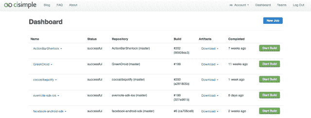

# Cisimple 推出面向移动设备的托管持续交付平台:让开发人员更轻松地构建、测试和部署 TechCrunch

> 原文：<https://web.archive.org/web/https://techcrunch.com/2012/11/27/cisimple-launches-a-hosted-continuous-delivery-platform-for-mobile-makes-building-testing-and-deployment-easier-on-developers/>

Cisimple 是一个新的开发平台，今天发布，它自动化了移动应用的构建、测试和部署过程。该公司开始为 iOS 和 Android 平台提供托管的[持续集成](https://web.archive.org/web/20221005192711/http://en.wikipedia.org/wiki/Continuous_integration)，并计划在未来推出其他平台。

由天使投资人支持的创业公司由[凯文·罗林](https://web.archive.org/web/20221005192711/http://www.linkedin.com/in/krohling)在今年夏天早些时候创立，他有工程背景，最近在 [Card.io](https://web.archive.org/web/20221005192711/https://www.card.io/) 工作，信用卡扫描技术[被贝宝](https://web.archive.org/web/20221005192711/https://beta.techcrunch.com/2012/07/17/paypal-acquires-mobile-payments-startup-card-io/)收购。但 cisimple 的想法是在他担任 Breezy 的首席技术官时产生的，Breezy 是一款允许用户从移动设备上打印的应用程序。Rohling 说:“当我担任 CTO 时，我一直在寻找一种解决方案来帮助我们的团队管理我们移动应用的构建，当我找不到一种解决方案时，我就决定构建 cisimple。”

他说，在 Breezy，他们必须管理多个版本——一些用于大型企业客户，另一些用于应用商店，测试运行的版本，等等。Rohling 解释说:“在多个移动平台上手动完成所有这些工作耗费了团队大量的时间。他表示:有一个叫做持续交付或持续集成的过程，许多工程师自己实施这个过程——它是一个为你做所有这些事情的自动化工具，但它需要很多时间来设置。这就是 Breezy 最终要去设置的。但是这样做通常需要两到三周的工程时间，罗林说。“即便如此，它也不像是一个正在开发的持续平台。你组装的这个工具不会继续增值，”他补充道。

这就是 cisimple 的用武之地。该平台构建在 Mac 基础设施上，为开发人员提供了一种自动构建、测试和部署移动应用的方式。它节省了时间，这意味着开发人员可以更频繁地运行测试。以前，测试可能每周进行两到三次，而使用类似于 cisimple 的东西，可以看到测试每天运行两到三次。

该服务直接与 GitHub 集成，因此在开发人员首次登录时，cisimple 会扫描他们的 GitHub 存储库以查找移动应用程序。一个简单的(懂了吗？)设置流程然后引导开发人员配置他们希望如何构建和部署他们的应用程序(如果需要)。“这意味着，每当您编写代码时，cisimple 可以自动构建您的应用程序，自动运行您的测试，如果您正在使用 TestFlight 之类的东西，我们可以自动将应用程序部署到您的用户，”Rohling 解释道。

Cisimple 目前还集成了测试平台 TestDroid，并计划在不久的将来集成其他服务，包括测试、崩溃报告、国际化、测试版和应用商店分发等服务。长期目标是让 cisimple 像一个仪表板一样，可以挑选开发人员想要使用的服务。罗林说，他希望这项服务尽可能精简。“想想 Heroku——进入并挑选附加产品的能力，这正是我们所计划的。”

也有公司为网络做类似的事情，包括 [Atlassian Bamboo](https://web.archive.org/web/20221005192711/http://www.atlassian.com/software/bamboo/overview) 、 [CloudBees](https://web.archive.org/web/20221005192711/http://www.cloudbees.com/) (针对 Java)、 [Travis CI](https://web.archive.org/web/20221005192711/https://travis-ci.org/) 、 [CircleCI](https://web.archive.org/web/20221005192711/https://circleci.com/) (针对网络的 CI)，但没有一家公司专门专注于移动领域。虽然有些可以在移动设备上运行，但开发者必须拥有自己的服务器，因为这些平台不是建立在 Mac 基础设施上的。另一款 [HostedCi](https://web.archive.org/web/20221005192711/https://hosted-ci.com/) ，其*意为*移动版，仍处于私人测试阶段。

Cisimple 正在推出，但也不会广泛提供——在首次在公司主页注册后，[今天将只允许 200 名用户使用。价格还没有确定，所以这项服务现在对所有人都是免费的，将来对开源开发者也是免费的。总部设在旧金山的该公司现在正准备参与 AngelPad。Cisimple 目前是一个由两名全职员工组成的小团队。罗林和首席技术官大卫·贾斯蒂斯早在佛罗里达奥兰多的 Alinean 工作时就认识了。](https://web.archive.org/web/20221005192711/https://www.cisimple.com/)