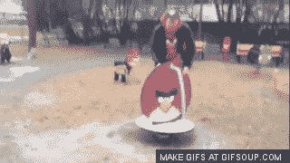
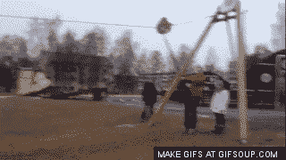
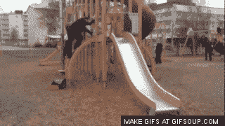
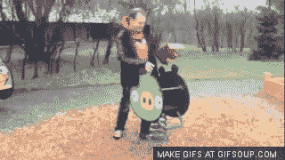
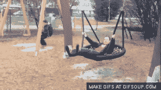
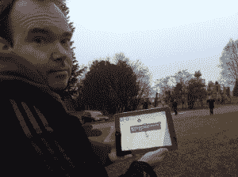
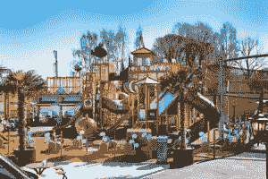

# 以 GIF 动画形式游览愤怒的小鸟游乐场

> 原文：<https://web.archive.org/web/https://techcrunch.com/2012/11/28/angry-birds-gifs/>

上周末，我去了北极圈，试图吃驯鹿汉堡，在不存在的冰洞里游泳，看北极光，当时我们在芬兰的罗瓦涅米参观了一个真正的愤怒的小鸟活动公园。

芬兰和中国只有少数几个公园，但正如我们下面看到的，这并没有阻止 Rovio 的 CMO Peter Vesterbacka 在一些游乐场设备上尽情发挥。

让我们仔细看看 Rovio 的一些现实生活中的游戏机制，并与移动设备上的愤怒的小鸟进行比较。

虽然这不是一个一对一的端口，但似乎活动公园是 iOS 和 Android 愤怒的小鸟体验的一个相当准确的表示。声明:约翰·比格斯完全为这些写了标题。我是一个卑微的礼品制作人。)

 
这里是上弦——旋转会提高他的速度和准确性。

 
他走了。注意形式:腿伸出来，胳膊举起来，准备好来一次重击。

 
他出发了，沿着一条轨迹滑下，这条轨迹可能会准确地击中玻璃、冰和石块，从而实现完美的杀戮。

 
看样子他得了一头猪！彼得兴高采烈地前后摇晃，试图把猪从高高的栖木上打下来。

#### 那么这如何与 Rovio 的业务合作呢？

是的，愤怒的小鸟主题公园在游戏制造商 Rovio 宣布的时候听起来确实很疯狂。但是自从这款游戏在 2009 年发布以来,“疯狂”这个词和 Rovio 几乎成了同义词。

Vesterbacka 最初是通过为公司的联合创始人 Niklas 和 Mikael Hed 制作幻灯片赢得了他的工作，多数股东 Kaj Hed 说公司可以获得 1 亿次下载。该公司超过了这个数字，下载量达到了 10 亿次。

现在，维斯特巴卡说他希望愤怒的小鸟每天有 10 亿粉丝，就像可口可乐一样。他说这个游戏需要成为“流行文化的永久部分”

公园是这一战略的一部分。“想想未来 20 年的市场营销，”维斯特巴卡指着装饰在所有游乐设备上的玻璃纤维鸟和猪说。这些现实世界的公园与游戏紧密相连。他们出现在愤怒的小鸟游戏中的地图上(见下面的照片)，如果孩子们去玩他们，他们会得到特殊的力量，比如更大的弹弓，这在游戏中对他们有帮助。

为了与该公司成为全球品牌的非传统路线保持一致，Rovio 在其园区战略中采取了独特的方法。迪士尼投资约 44 亿美元在上海建一个新的主题公园，Rovio 则不同，它采取了一种更草根的方式。愤怒的小鸟公园从更像你当地游乐场的东西到更昂贵的作品，比如在申克涅米的公园，那里有真正的游乐设施，只在芬兰漫长的夏日开放。

事实上，Rovio 甚至不需要投资建设这些公园。市政府和地方政府向该公司伸出援手，支付象征性的许可费，为他们的公园添加愤怒的小鸟游戏设备。Vesterbacka 不愿透露这些许可费是多少，但罗瓦涅米总共花费了大约 30 万欧元(39 万美元)来建造上面的游乐场。

Rovio 正在与一家名为 [Lappset](https://web.archive.org/web/20230306151327/http://www.lappset.com/) 的家族游乐场制造商合作，该制造商从罗瓦涅米开始为世界各国制造设备已有大约 40 年的历史。首席执行官 Juha Laakkonen 告诉我们，这家 450 人的公司似乎从 Rovio 的合作中受益，收入从前一年的 4500 万欧元(5810 万美元)增长到今年的 5700 万欧元(7370 万美元)。

Vesterbacka 说，由于这些公园的价格较低，该公司可以很快在中国建立数百个公园。

“要让中国的每个人都参观迪士尼乐园，需要 200 年，”他说。“但是我们会在上百个城市里。”迪士尼预计其上海公园每年将接待 730 万游客。

许多愤怒的小鸟公园不收门票。Rovio 受益于低成本或零成本营销，他们将通过商品销售赚回钱。

该公司最近表示，预计未来几年超过一半的业务将来自实物商品。