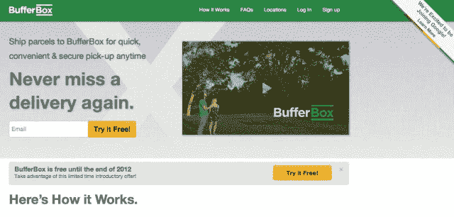

# 谷歌为什么收购 BufferBox？因为整个邮件和包裹递送系统都瘫痪了

> 原文：<https://web.archive.org/web/https://techcrunch.com/2012/11/30/why-did-google-buy-bufferbox-because-the-entire-mail-and-package-delivery-system-is-broken/>

# 谷歌为什么收购 BufferBox？因为整个邮件和包裹递送系统都瘫痪了

今天，谷歌收购了安大略省一家名为 BufferBox 的公司。从某种程度上来说，它有点出界了。由于这是一家谷歌风险投资公司，人们可以猜测谷歌园区的那些人对这项服务非常熟悉，这提供了一种简单的替代方式，可以代替在你家周围等待包裹。

不仅递送包裹是一件扫兴的事，因为东西会丢失，当你回到家时，打开你的邮箱也不是那么有趣。最糟糕的是当你甚至没有邮箱的时候，你回到家发现有 20 封垃圾邮件塞在你的门下。邮件传递系统又破又旧。颠覆的时机已经成熟。有多碎？美国邮政局[在 2012 年损失了 159 亿美元](https://web.archive.org/web/20221124021838/http://cir.ca/s/zJE)。

因此，乍一看，有人可能会说谷歌想与亚马逊和 UPS 这样的航运魔术师竞争，但我认为它比这更深入一些。这感觉不像是“电商”剧。谷歌有在垂直领域磨砺的诀窍，这对于现实世界中的人们来说是一种痛苦。不想开你的车？也许[有一天它会自动驾驶](https://web.archive.org/web/20221124021838/https://beta.techcrunch.com/2012/09/24/how-googles-powerful-lobby-legalized-driverless-cars-in-california/)多亏了谷歌。

回到 BufferBox，目前只在加拿大运营的 YCombinator 公司。这是一个很好的试验领域，远离我们在美国的肮脏的手。谷歌还在堪萨斯城推出了它的光纤产品，远离旧金山和纽约的极客，这样它就可以在向宇宙发布之前完善它的产品。

这是 BufferBox 在其网站上对自己的描述:

> 今天的包裹递送系统已经过时——丢失包裹递送是疯狂的！你白天不在家，所以不要往那里寄包裹了！将它们运送到你最近的缓冲箱中！我们是一个位置便利的包裹提取站网络，让您可以安全地按照您的计划提取包裹！

谷歌挑战邮局？利他？算是吧。商业头脑？你打赌。听起来像是谷歌的拿手好戏。一个公司接管邮件路由系统需要什么？[辉煌的测绘技术](https://web.archive.org/web/20221124021838/https://beta.techcrunch.com/2012/10/29/google-adds-power-outage-information-to-its-hurricane-sandy-crisis-map/)。

有一天，我会看到一个没有邮递员每天上门递送垃圾邮件的世界。这些东西可以放在一个对你来说更方便的地方的盒子里，比如你的办公室。这样，你可以在你想的时候拿起它，然后回到一个舒适的家，打扫干净的门阶。别忘了提一下担心一个包裹被邻居偷走的焦虑。它发生了。

因此，简而言之，人们肯定只想知道谷歌为什么收购 BufferBox，因为谷歌从来没有真正详细说明它为什么收购公司。出于竞争的原因，这并不一定。要知道，谷歌的一切都倾向于作为总体规划的一部分发生，这次特别的收购可能会导致一个*大规模的*总体规划。

还记得[谷歌收购 GrandCentral](https://web.archive.org/web/20221124021838/https://beta.techcrunch.com/2007/06/24/google-to-acquire-grand-central-for-50-million/) 的时候吗？它变成了谷歌语音。这项服务有朝一日可能会与美国电话电报公司和威瑞森竞争。那次收购由谷歌的陈德伟牵头，他现在是谷歌风投的合伙人。他胸怀大志，谷歌也是如此。就在你认为 GrandCentral 的收购不会有结果的时候，谷歌语音推出了。

搜索世界上所有的信息，为所有人提供免费或更便宜的互联网，免费的电话号码和语音邮件，为教育和运行强大开源软件的低收入家庭定价合理的笔记本电脑等设备，使我们在网上所做的一切感觉更亲密和社交的服务，无论是工作中的[还是家庭中的](https://web.archive.org/web/20221124021838/https://beta.techcrunch.com/2012/08/29/google-enters-the-social-enterprise-with-public-debut-of-google-for-businesses-free-through-2013/)，[改造电视](https://web.archive.org/web/20221124021838/https://beta.techcrunch.com/2012/09/11/youtube-iphone-app-ads-exclamation-point/)…有一个明显的模式。谷歌希望帮助重塑和发展世界。

你有谷歌邮件。