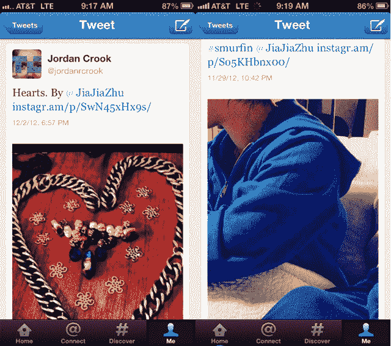

# 关于整合 Twitter 卡的凯文·斯特罗姆:我们希望图片能在 Instagram.com | TechCrunch 上看到

> 原文：<https://web.archive.org/web/https://techcrunch.com/2012/12/05/kevin-systrom-on-pulling-twitter-cards-integration-we-want-images-viewed-on-instagram-com/>

Instagram 已经关闭了 Twitter Cards 集成，让 Instagram 用户在简短的社交网络上拥有他们在 iPhonography 中的杰作的裁剪过的、不太完美的副本。

Instagram 的创始人兼首席执行官凯文·斯特罗姆今天在 [LeWeb 12](https://web.archive.org/web/20230404180455/http://www.leweb.co/) 的舞台上谈到了它，他说“这是我们希望链接到我们内容的地方的一次演变。”

凯文说，尽管 Twitter 的整合将永远以某种方式、形态或形式存在，但这种关系正在发生变化。在脸书收购 Instagram 后，关于照片分享的 API 大战已经白热化，Instagram 需要做出重要决定。

“我们正在努力建立一个令人敬畏的网络存在，这是我们刚刚推出的，”Systrom 说。“我们改进了我们的网站内容，现在我们能够通过收购脸书来充实团队，处理网站内容。”

这个问题似乎显示，在 Instagram 中裁剪的照片在移动设备上是额外裁剪的(见下面我的例子)。然而，Systrom 表示，这种情况不会永远存在。凯文解释说，由于缺乏卡片集成，最终裁剪将停止，照片将不再出现在推文中。相反，所有的点击都将流向 Instagram.com。

Systrom 表示，Twitter 和 Instagram 都希望获得最佳用户体验，但 Instagram 希望控制其内容。这项授权来自凯文本人，而不是扎克伯格。

对于那些不知道的人来说，Twitter Cards 是 Twitter 的一个系统，它允许其他开发者将内容直接嵌入到 Twitter 流中，而不是添加一个链接。

当 MG Siegler 在 7 月份向 Systrom 询问 Instagram 被拒之门外的 Find Friends API 时，Systrom 回应称，媒体总是想将其描绘成“针锋相对”类型的情况，但这是关于 Instagram 的增长，而不是竞争。他甚至提醒 MG，杰克·多西是照片分享应用的首批投资者之一。

与此同时，以下是推特[对此事的官方措辞](https://web.archive.org/web/20230404180455/http://status.twitter.com/post/37258637900/instagram-photo-rendering-issue):

> 用户在 Twitter 上查看 Instagram 照片时遇到问题。问题包括裁剪的图像。这是由于 Instagram 禁用了 Twitter cards 集成，因此照片是使用 cards 前的体验显示的。因此，当用户点击带有 Instagram 链接的推文时，照片看起来被裁剪了。

渲染问题似乎不会通过网络影响 Twitter，但移动应用程序的用户可能会注意到，他们的 Instagram 照片并没有完全按照预期的方式显示。

在推特上:

在 Instagram 上:

*德鲁·奥兰诺夫*补充报道