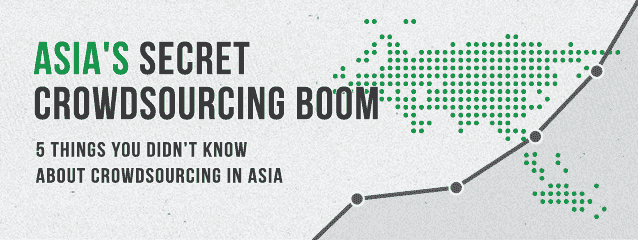

# 众包在亚洲蓬勃发展 TechCrunch

> 原文：<https://web.archive.org/web/https://techcrunch.com/2012/12/08/asias-secret-crowdsourcing-boom/>

**编者按:** *亚历克林奇是 [DesignCrowd](https://web.archive.org/web/20221208111655/http://www.designcrowd.com/) 的创始人兼首席执行官，这是一家总部位于澳大利亚的设计众包服务公司，最近在印度、新加坡和菲律宾推出。在 Twitter 上关注他* [@aleclynch](https://web.archive.org/web/20221208111655/https://twitter.com/aleclynch) 。

当大多数人想到众包时，他们会想到 iStockphoto、Mechanical Turk、Threadless 或维基百科等网站。其他人可能会想到[绿色和平众包壳牌石油广告创意](https://web.archive.org/web/20221208111655/http://www.fuelyourcreativity.com/greenpeace-crowdsources-activism-again-with-shell-oil-ad-contest/)或者[玛丽莎·梅耶尔众包她宝宝的名字](https://web.archive.org/web/20221208111655/http://www.forbes.com/sites/meghancasserly/2012/10/01/marissa-mayer-is-crowd-sourcing-her-babys-name/)。有些人甚至会想到李尔·韦恩与 Mountain Dew 的众包合作。但是没有多少人想到亚洲。事实是，亚洲的众包正在秘密蓬勃发展，亚洲已经悄悄地承担了该领域的领导角色。

许多政治家、经济学家和思想领袖都认为我们正在进入“亚洲世纪”。虽然美国等许多大国近年来一直在衰退和高失业率中挣扎，但许多亚洲经济体却给了全球金融危机一记响亮的耳光，继续保持增长。作为未来的一个迹象，奥巴马总统在连任后仅两周就出访了亚洲三国。

随着这些宏观经济趋势的展开，一个已经在亚洲蓬勃发展并正在加速的新兴在线行业是众包，这是一种新的外包类型(想想“类固醇外包”)，涉及外包任务，如标志设计，通过一个开放的、通常很大的被称为“人群”的群体。

我很幸运能亲眼目睹这一趋势。我在澳大利亚运营一个众包网站，从我的角度来看，中国、印度和澳大利亚的众包活动呈爆炸式增长——该地区以外的许多人并没有意识到这一趋势。

虽然众包在亚洲的兴起没有被广泛报道或讨论，但事实是亚洲正在像其他地区一样接受众包，许多世界上最大或领先的众包网站要么位于亚太地区，要么由亚洲国家的用户提供支持。在这篇文章中，我强调了你不知道的关于亚洲众包的 5 件事，展示了亚洲大陆正在展开的秘密众包热潮。

##### **1。一家中国众包网站是世界上最大的“雇主”**

中文外包/众包服务[猪八戒](https://web.archive.org/web/20221208111655/http://www.zhubajie.com/)，使用与 Elance.com 类似的模式，声称拥有 760 万工人。如果这是真的，这将意味着尽管猪八戒的吉祥物是一只卡通猪，但它仍是世界上最大的在线外包/众包网站，拥有的“员工”比 Freelancer.com(650 万用户)和 Elance.com(200 万用户)加起来还多。猪八戒网甚至可能是世界上最大的雇主，因为它比拥有 320 万员工的美国国防部拥有更多的员工。

虽然这些比较不是苹果与苹果之间的比较——众包网站上的工作人员不是全职员工——但我想你已经明白了。猪八戒大。

猪八戒不是中国唯一的众包网站；有几十个(Epweike.com，680.com 和 Taskcn.com，仅举几例)。事实上，众包在中国已经变得如此普遍，他们已经创造了自己的词来描述它:“威客。”尽管如此，猪八戒和[威客](https://web.archive.org/web/20221208111655/http://en.wikipedia.org/wiki/Witkey)还没有在 TechCrunch 或任何类似的出版物上提及——这使他们成为亚洲保存最好的众包秘密。

##### **2。印度众包电力用户的收入是普通美国人的 40 倍**

虽然中国可能拥有最大的众包网站，但从经济角度来看，印度可能比世界上任何其他国家都更受益于众包。

英语众包网站往往由来自印度的超级用户主导。例如，Elance.com 收入最高的 25 个人中有一半以上来自印度。Elance 上的前三名印度用户总共获得了 1700 万美元，在过去 12 个月中获得了超过 400 万美元。去年，这些印度电力用户人均收入超过 100 万美元，是美国工人平均收入的 40 多倍。

印度的平均年薪是 1410 美元。因此，当[一名印度工人通过众包](https://web.archive.org/web/20221208111655/http://thenextweb.com/dd/2011/04/15/indian-web-designer-earns-10000-in-a-month-through-designcrowd/)可以在一个月内赚到 1 万美元时，印度喜欢它就不足为奇了。结合这一事实，印度是世界上人口第二多的国家，也是说英语的第二大来源，众包在印度的使用激增的原因是显而易见的。

亚洲和东欧的其他国家也有大量经常光顾众包网站的用户群。但印度显然是“众包之王”，这个国家已经完全接受了这种新的外包形式(甚至印度政府最近也众包了货币符号卢比的设计)。

底线是，通过西方众包网站的大量资金(也许是最大份额)实际上正在流向印度和亚洲。当中国网站帮助中国工人从中国企业中赚钱时，印度工人正在向海外出口他们的服务——从北美、英国和澳大利亚企业中赚钱，结果是增长了印度的经济。总而言之，印度可以说是在线众包服务的最大用户(和受益者)。

##### **3。亚洲的众包将翻两番**

令人兴奋的是:亚洲正在升温。未来五年，非洲大陆的众包使用量将翻两番。

大多数人没有意识到，世界上五个最大的英语人口中有三个在亚洲(印度、巴基斯坦和菲律宾)，但这些人中的大多数——渴望工作的潜在众包用户——还没有上线。亚洲的互联网普及率为 27.5%，而美国为 79%。仅在印度，就只有 12%的人口可以上网，尽管这相当于 1.37 亿人。

尽管比例形成鲜明对比，但亚洲有 11 亿互联网用户，北美有 2.74 亿用户。此外，亚洲用户已经主导了众包网站。想象一下，当其他人上网时会发生什么？如果亚洲的互联网渗透率在未来五年翻一番，并且这些亚洲互联网用户对众包的吸收也翻一番，那么亚洲的众包量将翻两番。

但人们很容易关注来自亚洲的令人难以置信的工人/消费者数字，而忘记市场的企业对企业方面。印度有 2600 万家小型和微型企业，比英国、加拿大和澳大利亚的总和还要多。因此，利用亚洲众包服务供需的机会是巨大的，记住，亚洲众包服务的供需即将翻两番。

##### **4。澳大利亚已经成为全球众包中心**

澳大利亚(亚太或“澳大拉西亚”地区的一部分)，通常以其海滩、拳击袋鼠和像“crikey”这样的造词而闻名，现已成为全球众包中心。事实上，众包正在火上浇油，网站不断超越其重量，并在多个众包垂直领域占据市场领先地位。

例如，澳大利亚的 Freelancer.com 似乎已经超越 Elance 和 oDesk，成为中国以外最大的在线外包网站。Envato 的 Themeforest.net[是世界上最大的 WordPress 主题市场，每个月吸引的访客比 iStockphoto 还多(然而它只是 Envato 的 7 个市场之一)！专门从事数据科学众包的澳大利亚](https://web.archive.org/web/20221208111655/http://www.themeforest.net/) [Kaggle](https://web.archive.org/web/20221208111655/http://www.kaggle.com/) ，现在似乎比 InnoCentive 更大，目前拥有世界上最大的单一开放众包项目(一个价值[300 万美元的数据分析竞赛](https://web.archive.org/web/20221208111655/http://www.kaggle.com/host/casestudies/hpn)，预测一年内将被送入医院的患者)。澳大利亚也在设计众包领域占据主导地位，最大的两家公司来自澳大利亚，第二大公司是我的公司 [DesignCrowd](https://web.archive.org/web/20221208111655/http://www.designcrowd.com/) 。

人们有时会问我:“为什么有这么多顶级众包网站出自澳大利亚？”也许是巧合；也许这是澳大利亚实现其科技潜力的罕见例子；或者，这可能是得益于澳大利亚与亚洲的邻近性(和亲和力)。无论哪种方式，澳大利亚似乎都在众包领域扮演着领先的全球角色，并完全有能力利用任何众包热潮(无论是北美、亚洲还是全球)。

##### **5。一场太空众包竞赛已经开始**

虽然众包服务的主要游戏仍然是颠覆传统行业，如平面设计或摄影行业，但一个有趣的副情节是亚洲众包网站之间的竞赛。Shutterstock 和 iStockphoto 已经推出了日文、中文和韩文版本的网站。上个月，我们在[印度](https://web.archive.org/web/20221208111655/http://www.designcrowd.co.in/)、[新加坡](https://web.archive.org/web/20221208111655/http://www.designcrowd.com.sg/)和[菲律宾](https://web.archive.org/web/20221208111655/http://www.designcrowd.com.ph/)推出了 DesignCrowd。

另一个更有趣的趋势是，亚洲众包网站正在进入英语市场。中国的猪八戒网已经谨慎地推出了 Witmart.com，这是其服务的英文版本，允许美国企业接触他们的 760 万中国工人。这不是一项非常受欢迎的服务，但它是一项有趣的发展，也是向亚洲扩张的秘密众包竞赛的一部分(反之亦然)。

##### 结论

亚洲的众包正在蓬勃发展，而且不会很快放缓。众包在亚洲的兴起将会继续，在我看来，更多的人应该抓住这个机会。

如果你正在考虑创办自己的众包企业、在众包公司工作或投资众包业务，那就放眼全球，胸怀大志。想想印度和中国。想想澳大利亚和菲律宾。忘了李尔·韦恩吧，想想江南 Style。众包正在亚洲和世界各地蓬勃发展，这是一个全球性的机会。

*图片来源:[通过 design crowd](https://web.archive.org/web/20221208111655/http://www.designcrowd.com/contest.aspx?id=69689)/[Sherlynn](https://web.archive.org/web/20221208111655/http://www.designcrowd.com/design/1220740)(新加坡设计师)*