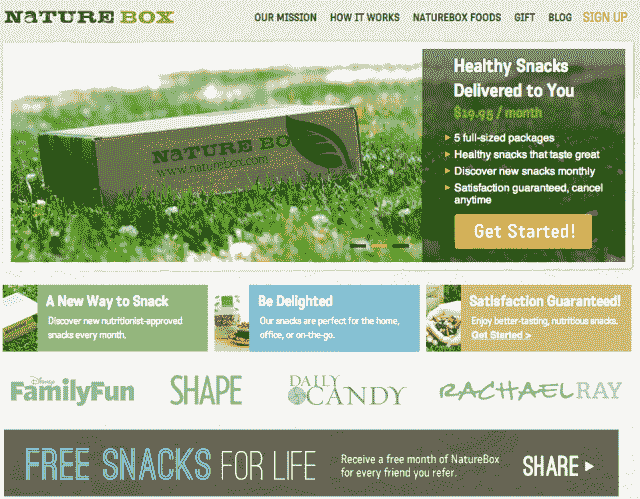

# NatureBox 从 General Catalyst 获得$2M，红点凭借其“健康食品的 Birchbox”做大

> 原文：<https://web.archive.org/web/https://techcrunch.com/2012/12/11/naturebox-lands-2m-from-general-catalyst-redpoint-to-go-big-with-its-birchbox-for-healthy-foods/>

今天早些时候，经过近一年的开发， [Omada Health 推出了在线糖尿病预防服务，以帮助美国对抗肥胖。](https://web.archive.org/web/20221226060711/https://techcrunch.com/2012/12/11/nea-backed-omada-health-launches-its-16-week-digital-health-program-to-bring-diabetes-prevention-online/) [NatureBox](https://web.archive.org/web/20221226060711/http://naturebox.com/) 也希望尽自己的一份力量，并宣布已关闭 200 万美元的种子基金，以加速其业务，并帮助任何人和每个人发现更健康的饮食选择。

这项投资由 General Catalyst Partners 和 Redpoint Ventures 共同牵头，包括一些天使投资者的参与。联合创始人高塔姆·古普塔告诉我们，NatureBox 成立于 2011 年，于 2012 年 1 月推出，其用户群逐月增长了 50%至 100%，现在每月网站访问量超过 25 万次。

但是这个自然盒子到底是什么呢？简而言之，NatureBox 正在寻求为网络创建一个 Trader Joe 's 或者，如果你喜欢的话，为有机食品创建一个 Birchbox。换句话说，该公司分销自己品牌的营养学家认可的健康食品，通过 box 发送给订户。这个想法是为了消除购买健康零食的麻烦(和猜测),使那些通常在商店很难找到的东西在网上很容易被更广泛的受众获得。

NatureBox 的灵感来源于古普塔童年时期与肥胖的斗争，以及他早期在 General Catalyst 担任风投的经历。古普塔 12 岁时体重超过 210 磅，通过健康饮食减掉了 70 磅，19 岁时在风投公司找到了实习机会。到大学四年级时，他已经完全沉浸在风险投资的世界中，并开始专注于电子商务投资。

“NatureBox 的使命对我来说是个人的，”这位联合创始人告诉 TechCrunch。古普塔发现零食实际上代表了一个 640 亿美元的市场，为消费者提供一种方便的方式来获得他们在当地杂货店找不到的更健康的食品，这是一个巨大的市场机会。

根据古普塔的说法，儿童和成年人现在吃零食的数量是 30 年前的三倍，他们每天从零食中消耗的热量占总热量的三分之一。古普塔认为这是导致他自己与肥胖斗争的原因，并认为如果他有更健康的选择，这是可以避免的。

古普塔说，在寻求风险投资之前，他和联合创始人陈(大学时的朋友，房地产投资者)用自己的钱孵化了这家公司，“一开始就产生了可观的收入”。随着新资金的筹集，NatureBox 计划扩大其客户群，并继续发展其健康食品品牌。它还将利用新注入的资本来充实其网站、员工和扩大运营规模，以满足不断增长的需求。

古普塔告诉我们，该公司的“私人标签”零食是每月手工挑选的，放在可回收的零食盒中，每盒包括 15 至 20 份四至六种食物，由营养学家根据季节性健康和健康主题进行“策划”。例如，10 月份，这种盒子被戏称为“抗氧化三连胜”，内含黑皮浆果、生坚果和黑巧克力。这些零食来自美国各地的当地种植者和独立食品供应商。这位联合创始人说，每种零食都不含高果糖玉米糖浆、氢化油、反式脂肪和人工甜味剂、香料和色素。

感兴趣的人可以在 NatureBox.com 了解更多信息。哦，还有另一个想去看看的动机？如果有机食品还不够，该公司每运送一箱食品，比如汤姆斯的鞋子，就会通过合作伙伴组织为美国的饥饿人口捐赠一餐食物。

【T2