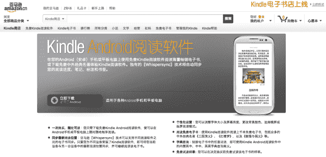

# 继 iOS 和 Android 应用发布之后，亚马逊 Kindle 可能最终进入中国 TechCrunch

> 原文：<https://web.archive.org/web/https://techcrunch.com/2012/12/12/amazon-kindle-might-finally-arrive-in-china-following-ios-and-android-app-launches/>

# 随着 iOS 和 Android 应用程序的发布，亚马逊 Kindle 可能最终会进入中国

期待已久的 Kindle 设备在中国的发布可能最终会成为现实。周三，Kindle iPhone 和 iPad 应用[在中国应用商店](https://web.archive.org/web/20221004124550/https://itunes.apple.com/cn/app/id302584613)上线；[安卓版本也可以下载](https://web.archive.org/web/20221004124550/https://www.amazon.cn/gp/feature.html?docId=98958)。同时，[亚马逊中国的 Kindle 书店](https://web.archive.org/web/20221004124550/http://www.amazon.cn/Kindle%E7%94%B5%E5%AD%90%E4%B9%A6/b/ref=sa_menu_kbo_2?ie=UTF8&node=116169071)现在有大约 22500 种中文图书。

经过多年的猜测，这是中国消费者最终将获得 Kindle 设备的最坚实的证据。亚马逊中国当时的总裁王汉华[在 2011 年末表示，Kindle 产品肯定会进入中国](https://web.archive.org/web/20221004124550/https://beta.techcrunch.com/2012/04/25/yanked-documentation-suggests-that-amazon-may-be-ready-for-a-kindle-debut-in-china/)，但从那以后，观察家们只有传言和线索可循。

早在 4 月份，Kindle 设备的中文帮助文档在亚马逊中国上被发现，随后很快就被撤下(但[是在截图](https://web.archive.org/web/20221004124550/https://beta.techcrunch.com/2012/04/25/yanked-documentation-suggests-that-amazon-may-be-ready-for-a-kindle-debut-in-china/)之前)。然后在 9 月，数字阅读器[的 Nate Hoffelder 在 Kindle Paperwhite 的用户手册的保修信息中发现了一个北京地址](https://web.archive.org/web/20221004124550/http://www.the-digital-reader.com/2012/09/27/kindle-paperwhite-user-manual-confirms-the-rumored-japanese-chinese-kindle-stores/#.UMlkn4V17-m)，它告诉消费者他们可以将损坏的设备送到哪里。而在上个月，Kindle Paperwhite 软件的 5.3.0 版本中包含了简体中文支持[。](https://web.archive.org/web/20221004124550/http://www.amazon.com/gp/help/customer/display.html/?ie=UTF8&camp=1789&creative=390957&linkCode=ur2&nodeId=201064850&tag=thedigrea-20)

亚马逊上周在巴西推出了[Kindle 商店。正如 Ingrid Lunden 指出的,](www.amazon.com.br)[这标志着该公司首次试图通过纯电子书业务打入一个新市场](https://web.archive.org/web/20221004124550/https://beta.techcrunch.com/2012/12/06/amazon-finally-reclaims-its-namesake-launches-in-brazil-with-kindle-store/),这表明亚马逊相信 Kindle 和电子书销售强劲，足以引领其扩张战略。

如果亚马逊真的在中国推出 Kindle 设备，它可能最终能够利用一个巨大的市场机会。根据 Renub Research 的一份报告，[中国是电子阅读器行业的第二大市场，销售额稳步增长，预计到 2014 年将与美国持平](https://web.archive.org/web/20221004124550/http://www.researchandmarkets.com/reports/1595756/ereader_market_and_future_forecast_worldwide)。在苹果第四季度财报电话会议上，首席执行官蒂姆·库克表示[该公司无线产品的销量在该国增长](https://web.archive.org/web/20221004124550/https://beta.techcrunch.com/2012/10/25/apple-q4-ceo-tim-cook-says-china-revenues-were-5-7b-up-26-year-on-year-now-15-of-all-of-apples-sales/) : iPad 销量增长 45%，而 iPhone 销量增长 38%。这一年，苹果在中国的总收入为 238 亿美元，是 2011 年在中国的两倍多。

尽管亚马逊拒绝透露 Kindle 设备和电子书的销售数字，但产品线[继续享有很强的吸引力](https://web.archive.org/web/20221004124550/https://beta.techcrunch.com/2012/11/27/more-on-amazons-kindle-non-numbers-sales-more-than-double-on-last-year-for-thanksgiving-weekend-cyber-monday-biggest-of-all)。但是亚马逊向国际市场逐步推出 Kindle 设备意味着本土竞争对手，如中国媒体集团汉王、当当和盛大有时间通过提供更便宜的设备和电子书来获得动力。