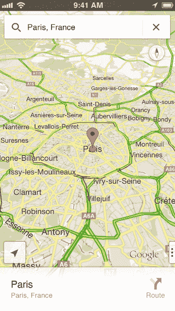
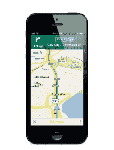

# 谷歌推出 iOS 原生地图，这是对导航、信息表和更多内容的深入探讨

> 原文：<https://web.archive.org/web/https://techcrunch.com/2012/12/12/take-that-apple-maps/>

正如我们[在](https://web.archive.org/web/20230307213726/https://techcrunch.com/2012/09/20/crap-maps/)[时间](https://web.archive.org/web/20230307213726/https://techcrunch.com/2012/09/19/if-i-were-google-i-wouldnt-release-a-native-ios-6-maps-app-for-six-months/)和[时间](https://web.archive.org/web/20230307213726/https://techcrunch.com/2012/10/11/this-is-every-experience-ive-ever-had-with-apples-ios-6-maps/) [再次](https://web.archive.org/web/20230307213726/https://techcrunch.com/2012/09/28/well-played-on-maps-apple-your-move-google/)暗示的那样，谷歌已经在圣诞节前发布了 iOS 的[原生地图应用。这个时机来得太快了，因为许多人已经对苹果提供的内置 iOS 6 地图感到失望。甚至苹果自己的首席执行官](https://web.archive.org/web/20230307213726/https://itunes.apple.com/app/id585027354?mt=8)[也主动为这个不那么完美的产品道歉](https://web.archive.org/web/20230307213726/https://techcrunch.com/2012/09/28/tim-cook-apologizes-for-apple-maps-points-to-competitive-alternatives/)，这种勇敢的行为我真的很赞赏。

今天是关于谷歌地图的。该公司在过去的七年里不断完善其产品，使其内部系统快速运转，以尽可能适应更多的弯路、交通状况和新的公寓楼群。所有的努力都在这个应用上得到了回报。它绝对是华丽的，运行起来像视频游戏一样流畅，是你曾经有过的任何谷歌地图体验的一次彻底的用户体验革新。当你打开应用程序时，新的滑动手势调出菜单，以及显示信息的详细信息都很清楚。这是好事，因为很明显，50%的谷歌地图使用来自移动设备。

现在，这个版本的谷歌地图有一个坏消息:没有骑自行车的方向；离线模式(虽然你一得到路线，就缓存在你的设备上)，室内地图；或报价。这看起来似乎不完整，但显然该团队希望打造一款出色的地图应用，满足 iOS 用户的需求。是的，谷歌不想把所有东西都包得太紧，直到世界有机会玩它。很公平，但是有些事情会很好。

但没错，总体来说，就是那么好。我昨天带着它兜了一圈，并且马上就弄清楚了它的新用户界面。基本上，地图就是 UI。所有菜单都整齐地收拢在一起，用专为 iOS 设计的手势拉起和拉出。如果苹果再多等一会儿，这可能就是 iOS 6 附带的体验了。它还包括一个全新的 SDK，开发者可以开始将它集成到他们的应用中。

我与谷歌移动地图总监 Daniel Graf 进行了交谈，虽然他说谷歌没有尽可能长时间(T3)坚持发布这款地图，但我想说的是，等到苹果臭名昭著的假日应用商店冻结后，情况就不同了。即使是谷歌也不会拒绝所有这些闪亮的天才设备。

### 这是你一直在等待的

正如我提到的，用户界面与你之前看到的 iOS 6 不同，iOS 6 只使用谷歌地图。它也不像你在 Android 上看到的那样。该团队真的蹲下身子，推出了一些东西，利用了 iOS 内置的所有可用的设计元素和手势。由于该应用程序是基于 OpenGL 开发的，因此非常简洁。

“这是有趣的半年，”格拉夫告诉我，显然指的是苹果公司在地图领域独立自主的决定。

结果呢？一款全新的应用程序，具有渐进式用户体验:

> 这里你不会看到任何菜单，地图就是 UI。该地图是完全基于矢量的，非常快，我们在顶部有搜索框。这是谷歌熟悉的两件事，速度和搜索。平移速度非常快，标签很快就会出现。你可以放大，你可以用手势向下移动来获得 3D 效果。

 

另一个很好的特点是，你不必再点击小定位销来获取信息。你所要做的就是在一个名为“信息表”的地图新功能中滑动

### 信息表

 从应用程序底部向上滑动会弹出一个“信息表”，显示从 [Google+ Local](https://web.archive.org/web/20230307213726/http://thenextweb.com/google/2012/05/30/google-overhauls-its-local-search-experience-with-google-local-featuring-zagat-scores/) 传来的信息。当信息页打开时，您仍然可以看到地图，这使得从一个地方到另一个地方的导航变得很容易。比如你想去几个酒吧看看。只需根据您刚刚执行的搜索浏览一些建议。

有一个“环视”模式，显示人们拍摄的照片，以及场馆内的 3D 建模。这些东西，看起来非常图形密集，加载速度非常快。你还会发现人们通过 Google+ Local 提交的评论，Google+Local 现在与 Zagat 绑定在一起。它相当全面，甚至可能变得有点社会化，尽管 Google+还没有完全集成。不过，我认为它会很快跟上。

### 航行

 一旦你找到一个你想去的地方，遗憾的是这还不包括空中旅行，这是谷歌在未来版本中必须包括的另一项内容，你选择你的位置，选择你的起点，然后你会看到你所有的选择。当然，所有的路线都取决于当前的实时交通状况，所以你可能会发现你应该选择一种你从未选择过的工作方式。这需要信任，但是一旦你稍微使用这个应用程序，它就会自然而然地出现。

这都是语音导航的，就像你在 Android 设备上使用导航应用一样。是的，它类似于 Siri，但这个声音对你来说会很熟悉。在旅行时，在路线的底部，只需点击时间和英里数即可循环查看您的旅程，这在 iOS 6 地图中很难做到。基本上，我发现你必须从头开始你的路线才能看到更新的目的地时间。

轻按右侧的三个点以调出路线信息，如列表视图，或者只需向左轻扫两个手指。

以下是从选择目的地到实际开始旅行的导航有多顺畅的快速浏览，这是真实的生活:

### 公共交通和步行方向

iOS 6 地图最让我和其他人烦恼的是，他们放弃了对交通方向的原生支持。基本上，苹果决定给你机会从专注于解决这个问题的开发者那里下载其他应用。但迄今为止，还没有一款出色的应用能真正给我们带来 iOS 6 之前谷歌版苹果地图的体验。

格拉芙告诉我:

> 谷歌覆盖了全球 100 多万个中转站。如果你离目的地很近，该应用会建议你步行，或者如果你想的话，你可以坐火车，并显示价格。你可以在底部滑动不同的选项，调出详细信息。我们给你看公共交通的停车线。

这意味着你不必打开多个应用程序和一个网络浏览器，试图拼凑出你的火车什么时候来，以及你离下车还有多少站。如果你想确保自己不会乘坐过站的子弹头列车或公共汽车，这是很有帮助的。这种事发生在我身上，我不得不下车，从另一条路返回。很烦。

据我所知，步行路线是可靠的，如果你住在人口密集的城市，比如纽约或旧金山，这一点很重要。我发现，当我在建筑物、地下通道和几乎任何有多层或封闭街区的地方行走时，iOS 6 地图变得非常混乱。太糟糕了。

这是一个“在野外”的演示:

### 什么花了这么长时间？

我问了格拉芙几个关于应用程序本身的问题，以及为什么感觉它需要一段时间才能问世:

TechCrunch: 你开发这个应用有多久了？

**丹尼尔·格拉芙:**比你能想象的还要长。原因是地图应用程序不是一个有显示和图像的常规应用程序。就像一个游戏，它的 OpenGSL。这里有一个庞大的团队。我们为此工作了很长时间。就时间而言，没有任何计划，要等一会儿。我们希望做好准备，团队夜以继日地工作，我们希望给我们的用户最好的体验。

用户体验是制作这款应用最难的，也是最重要的。它解决了许多用例，我们不想只是添加另一个菜单按钮。

**TechCrunch:** 苹果现在允许另一款地图应用成为默认应用，Safari 点击无法打开谷歌地图，谷歌对此有何看法？

丹尼尔·格拉夫:我们希望我们的原生 Chrome 和搜索应用程序能让你有机会进入谷歌地图。有了我们的新 SDK，这取决于开发者是否愿意集成到他们的应用中。Safari 不在我们的控制范围内。

———

app 是绝对完美的吗？不。什么都不是。但当你想到谷歌有多少数据可供自己支配，然后想想这些数据通过 3G、LTE 或 Wi-Fi 传输到你的设备的速度有多快，你就会明白首次尝试地图应用是多么令人印象深刻。它比苹果目前的产品更好吗？绝对的。不过，这并不意味着苹果不会继续开发自己的产品。这将需要一些时间来赶上，尤其是在这个版本之后。特别是因为 Graf 告诉我移动团队计划快速迭代，这意味着我们可能会在新年后的某个时候看到更新。

如果你对交通路线或应用程序本身有反馈，无论你在哪里，只需摇动应用程序，反馈窗口就会出现。它甚至会对你所在的位置进行截图，这样谷歌就可以根据你的反馈或交通路线建议提供背景信息。你会注意到，它有谷歌同步功能，当你登录时，它会将你最近的地图搜索保存在你的桌面上。当你跑出门时，这很方便，在这种情况下，我必须给自己发电子邮件链接到方向或我要去的地址。

许多人认为，出于竞争原因，苹果公司不会批准谷歌品牌的原生 iOS 地图应用。这显然不是事实，也从来不是事实。但事实是，对于一些人来说，是时候最终将他们的 iPhone 更新到 iOS 6 了。

**更新:**该应用仍在 App Store 上传播，一些应用出现错误。

**更新 2:** 现在可以[下载](https://web.archive.org/web/20230307213726/https://itunes.apple.com/app/id585027354?mt=8)没问题了。

http://www.youtube.com/watch?v = KEz1sSKCpIc