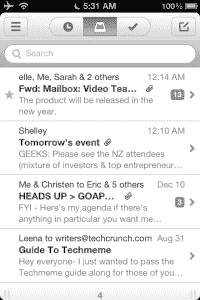

# 来自 Orchestra 的开发者的邮箱是你用过的最好的电子邮件管理应用

> 原文：<https://web.archive.org/web/https://techcrunch.com/2012/12/13/omg-mailbox-is-amazeballs/>

时不时地，我会拿到一个应用程序或一项技术，然后迫不及待地告诉全世界。这是一种用起来很有乐趣的东西，以一种完全直观的方式解决一个主要问题，并使原本困难的任务变得不可思议的简单。有可能从根本上改变我们做事方式的东西。

任务管理应用 Orchestra 的开发者创建的邮箱 T1 就是其中之一。

很难夸大电子邮件问题的严重性。我们中的许多人都很难跟上我们每天收到的成百上千封电子邮件，每封邮件都要求我们采取一些行动:回复、存档或者保存起来以备后用。但是，促进这些行动的工具已经有些坏了，因为大多数应用程序不处理循环处理大量内容所需的决策——有些是好的，有些是坏的，有些是不可能在任何合理的时间内完成的。

很少有真正好的应用程序出现来解决这个问题。很多人喜欢麻雀，但我永远不会对它太兴奋。它提供了一套非常丰富的工具来移动电子邮件，并确保它们得到存档和搜索——基本上改善了 iPhone 的原生邮件应用程序做得不好的事情。但是对我来说，Sparrow 的功能太丰富了。这并没有让查看我的邮件变得更容易，只是给了我更多的事情去做。

 相比之下，邮箱采取了一种非常精简的方法，为处理电子邮件提供了一组有限的选项。它将收到的电子邮件分为三个基本类别:你想保存在收件箱中的邮件，你想保存起来以备后用的邮件，以及你想尽快处理掉的邮件。

整个事情是建立在手势的概念上的，基本上就是在收件箱的电子邮件上向左或向右滑动来做一些事情。想要存档电子邮件吗？向右轻扫就可以做到这一点，从视图中清除它。想删除？尝试向右滑动更长的距离。

但是最有趣的方面是“留到以后”选项。现在没有时间发邮件，但想在某个时候回复？向左滑动。一旦你这样做了，你会遇到几个选项来选择你想让邮件什么时候出现在你的收件箱:当天晚些时候(三个小时后)，明天，周末，下周，等等。然后，它会从收件箱中清除这些电子邮件，但可以从菜单屏幕上轻松访问它们。它同样适用于将电子邮件添加到列表中，如“稍后阅读”或“稍后观看”列表。它只是需要更长的刷卡时间。

除此之外，邮箱中的电子邮件与其他应用程序的工作方式基本相同。可以阅读邮件，回复，回复所有，转发等。如果说有一个功能缺失了，尤其是对高级 Gmail 用户来说，那可能就是将邮件分类的能力。但对我来说，应用程序中存档和搜索的便利性使得标签变得没有必要。

很难对结果提出异议:我经常努力实现零收件箱，但从未真正实现过，如果我的收件箱里同时有超过 25 封邮件，我会变得焦躁不安。但是有了邮箱，我收件箱里唯一保存的邮件是那些目前重要的邮件。我有相当数量的电子邮件会被退回给我，稍后再处理，其余的我可以存档或删除。(我还没有利用列表功能，它似乎更多的是提醒自己在未来某个不确定的时间阅读一篇文章或观看一段视频。)

[Orchestra](https://web.archive.org/web/20230328033147/http://www.orchestra.com/) 被评为 App Store 2011 年年度生产力应用，所以邮箱主要通过处理待办事项等电子邮件来提高生产力也就不足为奇了。它可能不是对每个人都有效，但是我很少见过这样的工具——特别是对于像我这样的人，那些喜欢尽可能少收邮件的人。

该应用程序目前正在测试中，计划在新年的某个时候发布。想看更多吗？观看此视频:

[维梅奥·http://www.vimeo.com/54553882 w = 500 & h = 281]

[介绍邮箱](https://web.archive.org/web/20230328033147/http://vimeo.com/54553882)

或者看看这些来自测试版用户的好评:

[推特 https://twitter.com/dtrinh/status/278031156740501504 align = ' center ']

[推特 https://twitter.com/Sahil/status/278206697061892096 align = ' center ']

[推特 https://twitter.com/hunterwalk/status/278618559821778945 align = ' center ']

[推特 https://twitter.com/kevinkaiser/status/278631494648471552 align = ' center ']