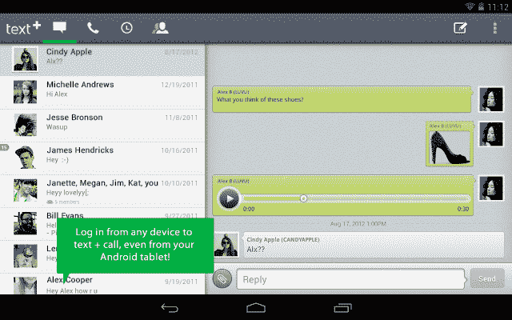

# 拥有 4600 万美元存款的 textPlus 打算进军海外，在 Android | TechCrunch 上推出廉价的国际通话服务

> 原文：<https://web.archive.org/web/https://techcrunch.com/2012/12/13/with-46m-now-in-the-bank-textplus-looks-to-go-big-abroad-launches-cheap-international-calling-on-android/>

对于以前被称为 GOGII 的艺术家来说，这是重要的一年。早在 10 月份，这家总部位于南加州的初创公司[从 Raine Group、Kleiner Perkins、Matrix Partners 和 GRP 获得了 1800 万美元的 D 轮融资，使其总投资超过 4600 万美元。这一轮是对其旗舰产品](https://web.archive.org/web/20230328040304/http://thenextweb.com/mobile/2012/10/16/textplus-rebrands-raises-18-million-series-d/) [textPlus](https://web.archive.org/web/20230328040304/http://www.textplus.com/) 持续成功的证明，这是一款免费的短信应用程序，迄今为止在美国和加拿大已有 4000 万次下载，其中一半是在 2012 年一年。为了表彰这种非凡的采用，这家初创公司在 10 月份将品牌从 GOGII 更名为 textPlus。

但更名也表明了该公司不断变化的重点，特别是在短信以外的世界。今年年初，这家初创公司推出了一款[免费通话应用](https://web.archive.org/web/20230328040304/http://www.textplus.com/2011/12/evolution-of-textplus-now-with-free-calls/)，表明其也有意涉足语音领域。

随着移动领域已经超越了群发消息的时尚，textPlus 转而寻求更广泛的平台(或 PaaS)业务。创始人斯科特·拉赫曼(Scott Lahman)表示，他希望 textPlus 成为一种端到端的移动通信服务，让智能手机全球化，让平板电脑成为功能齐全的手机，而不是简单地成为一款具有短信、彩信或群发信息功能的应用——没有传统上与这种服务相关的摩擦和成本。

为了追求廉价和简单的国际通话，该公司今天宣布，美国和加拿大的 Android 用户可以以每分钟 2 美分的价格拨打任何国际手机或座机号码。这位创始人声称，平均而言，textPlus 的费率(每分钟)比典型的国际电话费率低 10 倍。和以前一样，在世界任何地方，与其他 textPlus 用户的网络通话都是免费的。

因此，在实践中，这意味着美国和加拿大的 Android 用户可以继续使用他们相同的 textPlus 手机号码，允许一个帐户在他们所有的设备上工作。此外，用户可以获得免费点数或从应用程序内部购买点数来拨打这些国际电话。这项服务适用于安卓系统的 WiFi、3G、4G 和 LTE 网络。

例如，通过保持较低的国际费率，或至少在拨打加拿大、墨西哥、英国和中国的电话时保持竞争力，拉赫曼希望帮助重新定义通过任何移动设备进行简单、廉价和无国界的全球通信意味着什么。“无论你有海外的朋友和家人，还是在国际间旅行，我们都想让你的手机全球化，而没有高昂的费用，”他说。

结合其新的 Android 支持，TextPlus 今天还推出了对其 iOS 应用程序的重大更新，允许用户在旅途中访问集成的短信和语音功能。这位创始人表示，textPlus 的速度也有了显著提升，现在提供了一个统一的收件箱，让用户可以随时随地发短信、聊天和分享。

拉赫曼说，面向 iOS 用户的国际通话将于 2013 年初启动。

更多信息，[请点击](https://web.archive.org/web/20230328040304/http://www.textplus.com/)找到 textPlus。

