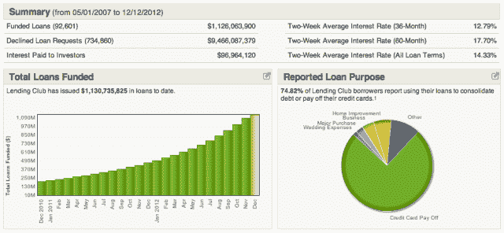
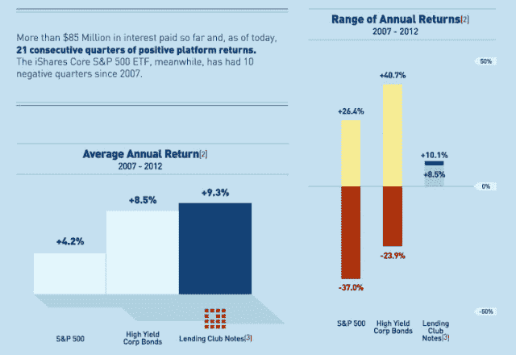

# 随着 IPO 的临近，Lending Club 将前财政部长拉里·萨默斯(Larry Summers)纳入其重量级董事会

> 原文：<https://web.archive.org/web/https://techcrunch.com/2012/12/13/with-an-ipo-on-its-radar-lending-club-adds-former-treasury-secretary-larry-summers-to-its-heavyweight-board/>

今天，拉里·萨默斯(Larry Summers)成为支持 [Lending Club](https://web.archive.org/web/20230323022047/http://www.lendingclub.com/) 的最新知名人士，这是一家快速增长的 P2P 贷款公司，旨在将信誉良好的借款人与聪明的投资者联系起来，这位前美国财政部长加入了该公司日益壮大、明星云集的董事会。这位经济学家也曾担任哈佛大学第 27 任校长和奥巴马总统时期的国家经济委员会主任，加入摩根士丹利前董事长兼首席执行官约翰·麦克和凯鹏华盈合伙人玛丽·米克尔等人的行列，后者于 6 月加入董事会。

Lending Club 首席执行官雷诺·拉普朗什、Norwest Venture Partners 的杰夫·克罗、Canaan Partners 的丹尼尔·西波林和摩根塔勒风险投资公司的丽贝卡·林恩位列其余几位。

举例来说，萨默斯最近似乎在科技行业扮演了更积极的角色，去年他以“特别顾问”的身份加入了[安德森·霍洛维茨](https://web.archive.org/web/20230323022047/http://bhorowitz.com/2011/06/29/meet-our-new-special-advisor-larry-summers/)，并担任了[在 payments darling，Square 的董事会成员](https://web.archive.org/web/20230323022047/https://techcrunch.com/2011/06/22/square-adds-former-u-s-secretary-of-the-treasury-larry-summers-to-board/)，以及[在雄心勃勃的新大学颠覆者 Minerva Project](https://web.archive.org/web/20230323022047/https://techcrunch.com/2012/04/03/minerva-gets-25m-from-benchmark/) 担任顾问。

但这一任命还不止于此，它有助于将董事会贷款俱乐部在过去几年中建立起来的背景。大约五年前，当 P2P 贷款开始建立时，人们非常兴奋。通过将银行完全排除在等式之外，将投资者与需要贷款的人直接联系起来，p2p 贷款几乎立刻就有了巨大的吸引力(对消费者和投资者而言)。

然而，由于美国证券交易委员会的严格(尽管是必要的)审查，该行业及其参与者进展缓慢。Lending Club 和 [Prosper](https://web.archive.org/web/20230323022047/http://www.prosper.com/) 是该领域的两家先行者，它们在这些调查中幸存下来，并一直在悄悄地发展壮大。

如今，该行业不再被视为危险的投资场所，正获得主流支持。事实上，[正如 Peter Renton 最近详细讨论的那样](https://web.archive.org/web/20230323022047/https://techcrunch.com/2012/05/29/peer-to-peer-lending-crosses-1-billion-in-loans-issued/)，随着 100%的年增长率，p2p 贷款是增长最快的新型投资之一。利用这种新资产类别的出现，以及围绕它涌现的生态系统，Lending Club 今年尤其开始实现真正的曲棍球棒式增长。自然，这并没有被忽视。拉里出场了。

公平地说，董事会任命通常不值得太多关注(也不应该如此)。这通常只是一个展示宣传力量和分享一些虚荣数据的机会。然而，在这种情况下，有一些非常好的理由相信 Lending Club 已经到了一个拐点。

证据呢。今年 2 月，Lending Club 促成了总额为 5 亿美元的贷款。该公司花了 4.5 年时间才实现这一目标。11 月初，[这家初创公司宣布](https://web.archive.org/web/20230323022047/https://techcrunch.com/2012/11/06/the-p2p-lending-experiment-lending-club-surpasses-1b-in-personal-loans-hits-profitability/)轻松获得了 10 亿美元的便利贷款。换句话说，它在 9 个月内实现了 4.5 年增长的两倍。

此外，今年 6 月，Lending Club 从凯鹏华盈(Kleiner Perkins)融资 1750 万美元，使其外部投资总额接近 1 亿美元。随着 Lending Club 的增长反映出对 p2p 贷款的宏观兴趣日益增加，机构投资者开始买入:汤森路透(Thomson Reuters)董事最近决定加倍投资 Lending Club 的消费者信贷基金。

得益于机构投资者对 p2p 贷款越来越大的兴趣、其自身的财务缓冲以及更多贷款发放和服务带来的收入增加，该公司在 11 月宣布，其现金流首次为正。反过来，这使得 Lending Club 今年增加了 50 多名员工，包括前 Visa 全球发展主管和摩根士丹利首席技术官 John McIlwaine 以及 E-Trade 总法律顾问 Russel Elmer。

也有一些宏观趋势在帮助创业。在经济下滑的情况下，投资者希望在保持稳定回报的同时获得更大的稳定性。与高收益债券等传统期权相比，P2P 贷款有可能为投资者提供更高的透明度、更短的期限和更低的信用风险。在 Lending Club 的情况下，这家初创公司的投资者人数已经增加到 45，000 人，他们的平均回报率在 5.7%至 13%之间。与高收益债券或 S&P 的传统投资相比，p2p 提供了更稳定、更定期回报的潜力——这是每个投资者都希望看到的。

Lending Club 董事会成员、摩根塔勒风险投资公司合伙人丽贝卡林恩(Rebecca Lynn)表示，私人投资经理、对冲基金和基金经理已经开始创建专门投资 p2p 借贷平台的基金。她说，这是导致 Lending Club 最近加速增长的部分原因，随着该资产类别本身获得机构投资者更多的兴趣，这种情况可能会继续下去。

自然，这种模式有很多固有的破坏，其中大部分对银行不利，因为 p2p 平台开始去中介化银行，将它们挤出消费贷款。这就是现在有萨默斯这样的人加入是至关重要的。这位前财政部长现在只在两家初创公司的董事会任职。另一个是 Square，他加入该公司是为了帮助公司度过曲棍球棒式增长固有的压力和机遇。Square 和 Lending Club 都处于旧模式和新兴模式的交汇点，如果它们希望继续玩曲棍球棒，就必须平衡这两者。

此外，鉴于其目前的轨迹，Lending Club 开始为潜在的 IPO 做准备是很有意义的，据报道，[可能会在未来 18 个月左右的时间里发生在](https://web.archive.org/web/20230323022047/http://news.cnet.com/8301-11386_3-57557468-76/lending-club-plans-ipo-maybe-within-18-months/)。让前财政部长来帮你找到公开市场的出口？可能不是“无价”，但它肯定不会伤害。

p2p 贷款仍然存在很多风险，重要的是要记住 Lending Club 和 Prosper 都经营无担保贷款。这甚至还没有开始触及监管的问题，这可能会对空间的地形产生巨大的影响。尽管如此，p2p 贷款也已经成为一个热门的国际话题，英国政府最近的举措证明了这一点——国内外都已经达到了临界点。

…

 为了将 Lending Club 的声明放在背景中，并更好地了解围绕 p2p 贷款(以及整个金融服务)出现的不断增长的生态系统，TechCrunch 向摩根塔勒合伙人丽贝卡·林恩(Rebecca Lynn)提出了几个问题，她曾于 2009 年在 Q1 领导该公司投资 Lending Club。林恩很友好地回应了，下面转述了一些问题:

**你为什么投资 Lending Club？**

我有一个关于传统银行业去中介化的论文已经有很长时间了——这甚至是我在摩根塔勒之前工作的 NextCard 的一个关键信念。传统银行效率极低。想想看:你存钱，得到不到一个点，如果你是一个信用良好的借款人，你经常要支付超过 16%的贷款利率。这是一个很大的差距。即使是像 CapitalOne 这样非常高效的公司，运营成本也只有 7%左右。这些可以通过 Lending Club 等更高效的模式来降低，这种效率可以以借款人利率降低、投资者回报提高的形式传递回来。

时机也很好。2009 年的 Q1，信贷市场崩溃，Lending Club 有了一个很好的机会来满足需求。我认为，市场的复苏还需要几年时间，这将为 Lending Club 提供时间来确保一个良好的立足点。也就是说，我们对投资非常谨慎。我们聘请了一位专家来详细检查这个投资组合。一切都检查过了，我们跳进来。

【Lending Club 如何避免被新来者超越？

*对新进入者来说，这个市场确实有三个障碍。首先，由于监管要求，启动成本很高。其次，新进入者必须建立良好的业绩记录，以赢得投资者的信心。Lending Club 有 5 年历史，贷款 10 亿美元。最后，随着时间的推移，必须积累大量数据，才能得到正确的信用模型。这不是一个可以在一夜之间启动的生意。*

【Lending Club 如何保持目前的增长轨迹？

Lending Club 首先追逐最大的信贷市场，即信用卡市场。在 2.5 万亿美元的美国消费者债务中，大约有 8500 亿美元是信用卡债务。Lending Club 最大的借款人细分市场是优质借款人，他们将自己的可变利率信用卡整合成固定利率产品来偿还债务。Lending Club 可以拓展许多其他垂直市场，但目前它仍专注于这个非常大的市场。

**作为一名投资者，金融服务这个传统上被视为僵化、发展缓慢且不那么令人兴奋的行业有什么让你兴奋的地方？**

*在每个投资周期中，金融服务行业都会诞生数十亿美元的公司。一些例子:BillMeLater、GreenDot、PayPal、NextCard、ETrade、Scottrade、Intuit、Checkfree 和 Financial Engines。*

金融服务业的各个方面都在发生着很多事情。让我简单介绍几个:在直接贷款领域，Lending Club、Prosper 和 SoFi 等公司专注于向优质消费者提供贷款，并为投资该平台的人创造回报。也有许多公司专注于使用新型数据，而不仅仅是 FICO，以更好的方式承保消费者和小企业。

在消费者领域，初创公司包括 ZestCash 和 Lendup，它们的目标是次级消费者。在商业方面，你有甲板上的资本和 Kabbage。

除了 Square，还有包括 Revel 和 Clover 在内的许多公司都在致力于销售点的改造。包括简单银行(Bank Simple)、Moveinbank 和 Perkstreet 在内的一些公司正在彻底改造银行业。

移动钱包不仅是苹果、谷歌和贝宝的热门领域，也是我们投资组合公司之一 Pageonce 和 Levelup 的热门领域。Braintree、Dwolla 和 Stripe 也在帮助开发者和在线企业接受移动支付。

最后，你还有 Kickstarter 和 Indiegogo 等众筹创业公司。SEC 尚未确定这些公司需要遵守的一套规则。我肯定我在这里漏掉了很多内容，但是你会明白金融服务现在是一个非常活跃的领域。