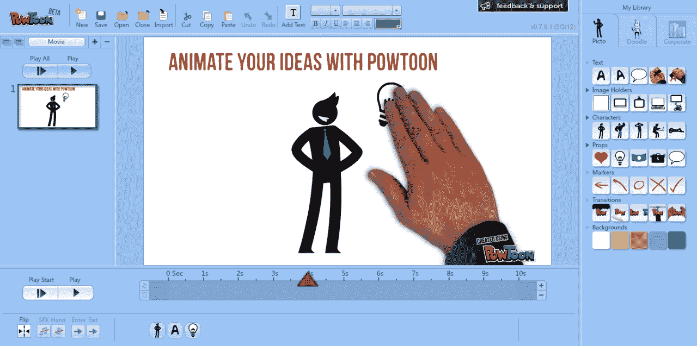

# DIY 动画平台 PowToon 以其视频创作软件 TechCrunch 获得 60 万美元

> 原文：<https://web.archive.org/web/https://techcrunch.com/2012/12/14/diy-animation-platform-powtoon-grabs-600k-for-its-video-creation-software/>

[PowTon](https://web.archive.org/web/20221207081300/http://www.powtoon.com/)是一个动画平台，可以让任何人动态制作营销视频，该平台宣布已经筹集了 60 万美元的外部资金。投资并不是来自传统的风险投资支持，而是来自[创业头脑](https://web.archive.org/web/20221207081300/http://startupminds.com/)，一种新的洛杉矶加速器，具有非传统的投资策略，投资金额从 2.5 万美元到 60 万美元不等。加速器也没有时间限制，外部参与的程度由公司出资决定。

Startup Minds 于 2012 年初由[博士、大卫·戈宁](https://web.archive.org/web/20221207081300/http://www.linkedin.com/in/davidgonen)(Ringadoc 和好奇思维孵化器[的联合创始人)及其家族创立。戈宁博士说，他在寻找一种负担得起的方式为他的投资组合公司制作演示文稿时，偶然发现了 PowToon。“有限的选择创造负担得起的和非传统的营销抵押品是令人瞠目结舌的，”戈宁说，目前的景观。](https://web.archive.org/web/20221207081300/https://beta.techcrunch.com/2012/06/07/ringadoc-virtually-connects-you-with-a-doctor-anytime-raises-750k-seed-from-founders-funds-ff-angel/)

对于那些不熟悉该产品的人来说,[powdon 提供了一个 DIY 解决方案](https://web.archive.org/web/20221207081300/https://beta.techcrunch.com/2012/06/26/now-everyone-can-make-marketing-videos-powtoon-launches-diy-presentation-tool)来制作那些几乎无处不在的营销视频，这些视频以解释某种想法或解决方案的卡通人物为特色。你知道这种类型——正如人们常说的[“解释者”视频](https://web.archive.org/web/20221207081300/http://www.powtoon.com/blog/362/how-to-make-an-explainer-video/)，它试图使用简单、有趣的脚本来建立一个核心概念。这些视频经常被用于向用户[和投资者](https://web.archive.org/web/20221207081300/https://beta.techcrunch.com/2012/08/01/what-startups-should-do-before-they-get-into-the-vcs-office)展示的创业演示中。

通过 PowToon 的免费增值服务，用户可以访问通过 PowToon Marketplace 销售的设计师、动画师、配音演员和声音艺术家提供的模板和其他内容。它的 DIY 平台允许非专业人士将物体拖放到幻灯片上，选择动画和时长，然后添加文本和配乐。最终结果可以上传到 YouTube 或在脸书和推特等社交网络上分享。

这家总部位于英国的公司由连续创业者伊利亚·斯皮塔尼克(首席执行官)于 2011 年 10 月创立，他还经营着绿波孵化器和首席运营官·丹尼尔·扎图兰斯基。它之前从 Spitalnik 的 Greenwave 和基马风险投资公司获得了一小笔投资，但直到今天主要是靠创业。

自从测试版发布以来，PowToon 已经被用于在其平台上创建超过 75，000 个演示，并增加了每月订阅计划和按使用付费选项。它还通过与发现教育(Discovery Communications 的子公司)的战略合作伙伴关系，将用户群扩大到创业公司和营销人员之外的教育领域。“发现协议”是与“发现教育家网络”的合作项目，在该项目中，PowToon 以补贴的方式提供给教育界的思想领袖。

额外的资金将主要用于开发 PowToon 软件的新功能和迭代。“我们尽可能用最少的资金来发展公司，同时保持自力更生的风格和企业理念。“我们只想要一个投资者，我们的桌子上有来自不同来源的投资金额倍数的条款清单，但我们最终决定选择 StartupMinds，因为它们似乎非常适合我们，”Spitalnik 说。这笔资金将用于扩大团队，改善和增加 PowToon 的功能集。目前，PowToon 的核心团队是四人，而它刚刚增长到七人。该公司现在希望将这一数字增加到 10。

【YouTube http://www.youtube.com/watch?v=XokhlijAAI0？feature = player _ 嵌入式]